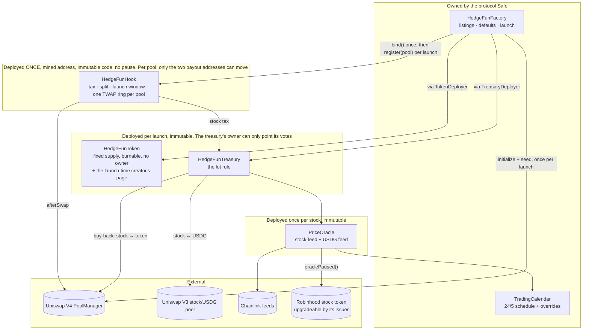
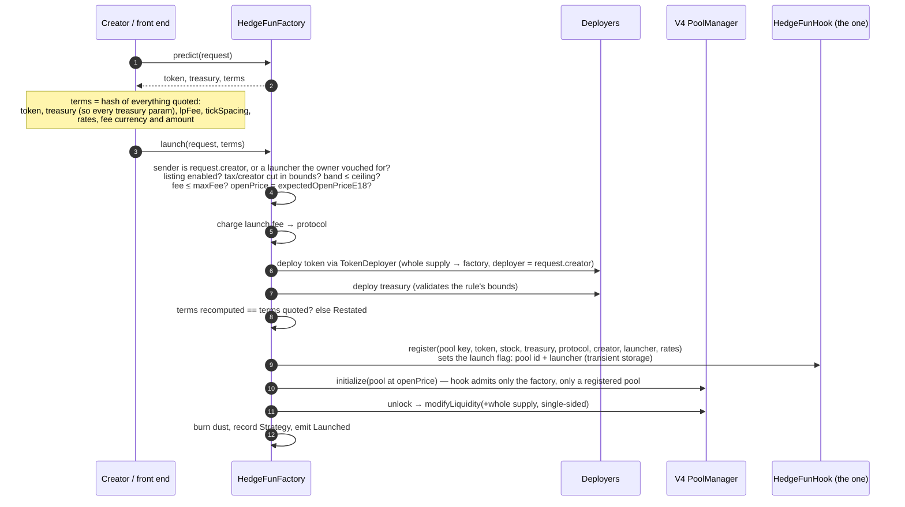
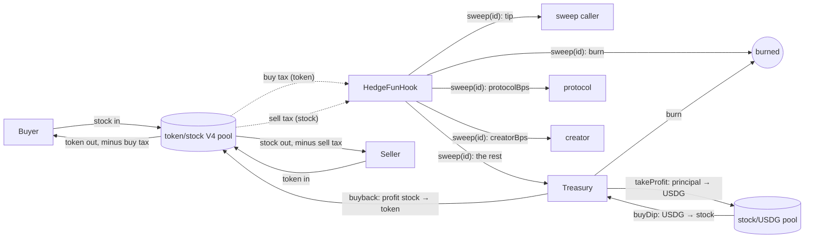
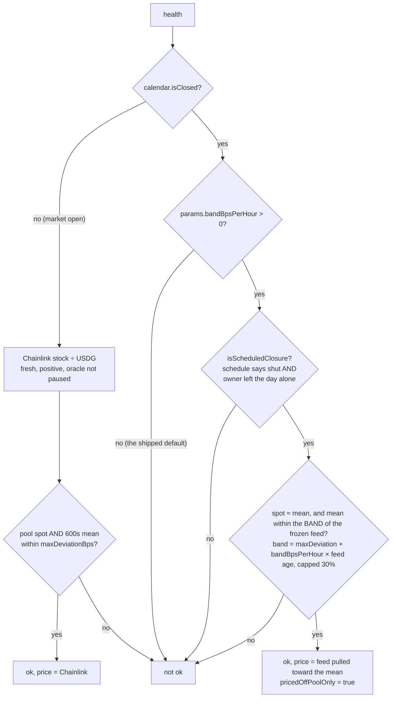

> Historical source record from `keyuyuan/hedgefund` at `48a41e2d53c8d24505e3313ae01a01c153b9e721`; see [archive scope](../README.md). Dates, fee settings, permissions and validation results describe the original reviewed versions, not the current organization release.

# Architecture

How the strategy-token launchpad is put together, how value moves through it, and which
parts can never change. Read this before touching `src/`.

For exact signatures, selectors, errors and constants see the generated
[REFERENCE.md](./REFERENCE.md). For *why* each defence exists see [SECURITY.md](./SECURITY.md).

## The product in one paragraph

A creator fills in a form and gets three things of their own: a **fixed-supply ERC-20**
(the strategy token), a **treasury** that trades one listed Robinhood stock token under a
rule published at launch, and a `<token>/<stock>` **Uniswap V4 pool** seeded with the
*entire* token supply as single-sided liquidity that nobody can ever withdraw. The pool is
registered on **the one `HedgeFunHook`** every strategy shares, which taxes swaps of the
token at the rates frozen for that pool. The tax funds the treasury; the treasury's
realised profit buys the token back and burns it. After launch a strategy has no keeper and
no parameter that can change; its token has no owner, and its treasury's owner can only
point its votes. The hook answers to the factory's owner for exactly two things per pool —
the address paid the protocol's cut, and, after a public 14-day vetoable wait, the address
paid a vanished creator's. The treasury answers to it for one: `setVoteDelegate`, whom the
stock it holds votes through — reserved, not live, since the stock token has no vote surface
today — which moves no asset and cannot reach the rule
([What is mutable, and by whom](#what-is-mutable-and-by-whom)).

**One hook, not one per launch.** Uniswap Labs' routing allowlist is per hook *address*, and
a hook carrying a returns-delta flag is reviewed one address at a time. One address can be
reviewed once; one per launch never would be. What a pool does is unchanged — only the
container is shared — and what that costs is in
[SECURITY.md](./SECURITY.md#one-hook-address-holds-every-strategys-stock-side-payouts).

Holders have **no claim on the treasury** — no redemption, no price floor. It is not an
asset-backed token and must never be described as one.

## Contracts

| Contract | File | One line |
|---|---|---|
| `HedgeFunFactory` | `src/HedgeFunFactory.sol` | Owner lists stocks and sets defaults; anyone launches once `publicLaunch` is on. Seeds the pool inside its own `unlockCallback`. |
| `BoundDeployer`, `TreasuryDeployer`, `TokenDeployer` | same file | Hold the treasury's and the token's creation code, because whatever a contract can `new` counts against its own 24,576 bytes. Each binds to exactly one factory — in that factory's constructor — and only that factory may call `deploy`; a constructor that refuses comes back as `TreasuryDeployFailed()` / `TokenDeployFailed()`. The token moved out when it gained metadata: 6.6 KB the factory did not have to spare. (There is no hook deployer any more: the hook is deployed once, by the deploy script.) |
| `HedgeFunLaunchRouter` | `src/HedgeFunLaunchRouter.sol` | **Periphery.** One transaction: `factory.launch`, the launcher's own first buy of the token, and a first lot of stock for the treasury. No owner, no state, no privilege; the factory does not know it exists. |
| `HedgeFunTradeRouter` | `src/HedgeFunTradeRouter.sol` | **Periphery.** USDG in, strategy token out (and back) in one transaction: the `<stock>/USDG` hop through a Uniswap V3 pool the caller picks -- any fee tier, but it must be the V3 factory's own pool -- then the strategy's V4 pool. Exact-input both ways, `minOut` and a deadline on what finally arrives; the V3 hop is all-or-nothing (`PartialFill`); the V4 pool's key is read from the treasury, never supplied by the caller; taxes land exactly as on a direct swap. No owner, holds nothing, the factory does not know it exists. |
| `HedgeFunToken` | `src/HedgeFunToken.sol` | OpenZeppelin ERC-20, whole supply minted once to the factory, `burn` for self only. No owner. Carries its creator's page in pons' shape — `logo`, `description`, `Socials{twitter, telegram, discord, website, farcaster}`, `extraURI`; readers `logo()`, `description()`, `socials()`, `getTokenInfo()` with pons' selectors, so a tool written for a pons token reads this one unchanged. `deployer` (immutable, the launch's `q.creator`) or its one `editor` writes it with `setMetadata`; `setEditor` and `lock()` are the deployer's; `lock()` is for ever. None of it can reach a balance, an allowance or the supply. |
| `HedgeFunHook` | `src/hooks/HedgeFunHook.sol` | **One instance for every strategy**, state per pool in `mapping(PoolId => Pool)`. `afterSwap` tax (exact-input; exact-output only for a buy at the flat rate), the four-way split, the buy-side launch window, the launch/buy-back sell spike, and each pool's own TWAP ring. Bound once to the factory; only the factory may `register` a pool, and `initialize` and `addLiquidity` are admitted only from the factory, only for a registered pool. |
| `TwapRing` | `src/libraries/TwapRing.sol` | 1024-slot observation ring (V4 pools have none of their own). |
| `HedgeFunTreasuryBase` | `src/HedgeFunTreasuryBase.sol` | The **rule**: lots, `book`, `takeProfit`, `stopLoss`, `buyDip`, `buyback`. Also `owner()` (the factory's, read live) and its one call, `setVoteDelegate`. |
| `HedgeFunTreasury` | `src/HedgeFunTreasury.sol` | What the base leaves abstract: `health()`, `pricedOffPoolOnly()` and the stock↔USDG swap, on a **V3** pool through `PoolTrader`. The only treasury there is. |
| `PoolTrader` | `src/PoolTrader.sol` | V3 swap execution, the 600 s TWAP, the spot-and-mean deviation gate. |
| `PriceOracle` | `src/PriceOracle.sol` | USDG price of one stock token; fails closed on a shut calendar, `oraclePaused()`, or a stale/zero/future round. |
| `TradingCalendar` | `src/TradingCalendar.sol` | Computed 24/5 US-equity calendar (DST and NYSE holidays are rules, not a list) plus per-day owner overrides. |

## A launch, step by step

Things worth knowing about this sequence:

- **Addresses are predictable, and that is deliberate.** `predict(q)` answers where the
  token and the treasury will land. Their CREATE2 salt is `(symbol, creator, nonce)`, so a
  launch that cannot go through is retried under a new `nonce`. The hook is `factory.hook()`,
  always; the pool is `(token, stock)` in address order at the defaults' `lpFee` and
  `tickSpacing`, and its `PoolId` is the keccak of that five-word key.
- **The token's page is written in the launch transaction, or later by the creator.**
  `launchWithMetadata(q, terms, info)` (factory) and `HedgeFunLaunchRouter.launchWithMetadata` carry
  the creator's first entry and the factory writes it through the token's one-shot
  `initMetadata` -- so the coin is never live with an empty card: the opening seconds are
  when screeners and bots index a token, some never read again, and a second signature gets
  dropped. The strings are NOT in `Request`, not in the token's constructor and not in
  `terms`: predicted addresses do not move, and a plain `launch(q, terms)` is what it was.
  The factory's write works once, only while nothing has been written, and only from inside a
  launch that `q.creator` (or a launcher that insists on the same) sent; after it the factory
  has no say in the page at all. The token records
  `q.creator` as its immutable `deployer`, and that address — or the one `editor` it
  appoints — calls `setMetadata` whenever it likes, until the deployer `lock()`s the entry.
  It is keyed to the **launch-time** creator on purpose, not the hook's payout `creator`:
  the owner's 14-day takeover moves fees, and moving fees must not rewrite a page. After a
  takeover the page's editor and the payee differ, and a front end shows both. A creator
  that is a contract which cannot make the call leaves the entry empty for ever; the token
  is otherwise unaffected. It lives on the token and not in a registry because a launched
  token is immutable, third-party tools read the token, and a v1 token born without it
  could never gain it.
- **A launch is sent by its creator.** `launch` reverts `BadRequest` unless `msg.sender` is
  `q.creator` or a launcher the owner has vouched for with `setLauncher` — `HedgeFunLaunchRouter`,
  which itself insists `q.creator` is *its* caller. Anyone could once launch in anyone's
  name, and the salt is `(symbol, creator, nonce)`: a bot that copied an announced launch
  got the opening's tax-exempt buying, left a strategy that looked like the victim's own,
  and made the victim's launch collide and revert (audit X5-2).
- **`terms` is the launcher's commitment.** `predict(q)` also returns
  `terms = keccak256(token, treasury, lpFee, tickSpacing, rates, launchFeeCurrency,
  launchFeeAmount)`, and `launch(q, terms)`
  recomputes it after deploying and reverts `Restated` on any difference. The treasury's
  address is a hash of its constructor arguments, so `terms` pins the listing's oracle and
  pool, both gates, both chunks, the cooldown and every other treasury parameter; the rates
  pin the tax, the split, the tip, the spike and the launch window. The mined per-launch hook
  salt used to be this commitment by accident; with no salt left the launcher states it
  outright. Without it the owner could move `protocolBps` in the block before a launch it
  had seen coming. There is nothing to mine at launch any more.
- **The hook's permissions are in its address.** V4 reads a hook's permission bits from
  the low 14 bits of its address. This hook needs `BEFORE_INITIALIZE | BEFORE_ADD_LIQUIDITY
  | AFTER_SWAP | AFTER_SWAP_RETURNS_DELTA` = `0x2844`, so the deploy script mines a CREATE2
  salt for it **once** (~16k hashes). The two `before` flags exist to keep everyone except
  the factory out — see [SECURITY.md](./SECURITY.md#the-hook-admits-only-its-seeder).
- **`maxFee` and `expectedOpenPriceE18` travel in the `Request` struct**, not as `launch()`
  arguments, because `launch()` is one stack slot from the compiler's limit. The opening
  price is in no address and no rate, so `terms` does not pin it; `maxFee` is a ceiling on a
  number, and `terms` pins the fee's *currency* beside it, because 1e16 of a stock is a very
  different thing from 1e16 of USDG under a standing approval (audit R5-4). A mismatch
  reverts `Restated`.
- **A constructor's revert reason does not survive CREATE2.** A bad rule shows up as the
  opaque `TreasuryDeployFailed()` (`0xb94a14a6`). `_setDefaults` and `setListingGates` therefore mirror
  every treasury-constructor bound so the owner cannot set a value that bricks every launch.
  One bound depends on the creator's own numbers and cannot be mirrored: `tp1` and `dip`
  must be at least `2 × (maxSlippageBps + pool fee)`, and `maxSlippageBps` is per listing —
  so a front end must read `factory.listingGates(stock)` — `(maxDeviationBps,
  maxSlippageBps, sellChunkUsdg)` — falling back to the defaults when the pair is `(0, 0)`,
  before it offers a rule. The hook's own bounds are checked by `register`,
  whose reason does survive.
- **A buy inside the launch transaction, by the launcher, is the creator's.** `register`
  writes two words of transient storage: the pool id, and the address that called the
  factory. A buy of that pool pays the flat tax instead of the launch-window rate only while
  both hold — this pool's launch transaction **and** the swap's `sender` is that very
  address. The EVM clears both when the transaction ends, so there is no list of addresses.
  The transaction alone was not enough (audit X5-1): a 4337 bundle, a relayer batch or a
  public multicall puts strangers' calls inside the creator's transaction. `HedgeFunLaunchRouter`
  uses exactly this.
- **The seed is permanent.** V4 keys a position to `(msg.sender, tickLower, tickUpper,
  salt)`; the sender is the factory, and the factory's only `modifyLiquidity` call sits
  inside `unlockCallback` behind a `_seeding` flag set in exactly one place, with a
  positive delta. There is no removal path under any name, for anyone.

## How the money moves

The launch pool is `<token>/<stock>`, never `<token>/USDG`, so the sell tax arrives already
denominated in the stock the treasury trades.

Everything on the hook is addressed by **`PoolId`** — `hook.poolOfTreasury(treasury)` gives
it, `script/LaunchStrategy.s.sol` prints it, and it is the keccak of the five-word pool key.
The treasury-facing calls (`noteEvent()`, `meanTick(uint32)`, `observationCount()`) take no
id: the hook resolves the pool from `msg.sender`, so a treasury can only ever reach its own.

- **The tax lands on the swap's unspecified leg**, because V4 lets `afterSwap` return a
  delta on that currency and no other. On an **exact-input** swap that is the output: a buy
  is taxed in the **token**, a sell in the **stock**. On an **exact-output** swap it is the
  *input*, which inverts the design — so exact-output is accepted for **a buy at the flat
  rate and nothing else**: taxed `r / (1 − r)` of the stock going in, and split like a
  sell's tax. An exact-output sell, and an exact-output buy while the launch window is up,
  reverts `ExactOutputRefused`; a sell spike does not refuse a buy, whose rate is flat then
  ([SECURITY.md](./SECURITY.md#exact-output-is-accepted-for-a-buy-at-the-flat-rate-and-nothing-else)).
- **Token-denominated tax is burned**, all of it (less the sweep tip).
- **Stock-denominated tax is split.** It accrues **per pool** (`accrued(id)`), because the
  PoolManager keeps ERC-6909 claims per `(hook, currency)` and every pool on one stock
  shares that currency. `sweep(id)` redeems exactly that pool's accrual and, in **one**
  `try`ed leg, credits the treasury, `protocol` and `creator` on the hook's ledger and then
  tries to pay each at its own address, each in its own `try`; the caller's tip goes last.
  In the ordinary case a creator — an EOA or a multisig, it makes no difference — does
  nothing and is simply paid on every sweep.
- **A payout that cannot be delivered stays theirs.** It is parked on the ledger, per pool
  and per role (`owedTreasury(id)`, `owedProtocol(id)`, `owedCreator(id)`; `owed(id, who)`
  sums the roles an address holds in that pool). `claimFor(id, who)` (anyone) pushes it to
  `who`; `claim(id, to)` (the creditor only) sends it wherever they name — which is how a
  creator whose address the stock's issuer has deny-listed still gets paid, and how a
  creator who still has their key moves to a new wallet with nobody's permission. A tip
  that cannot be delivered is parked for that pool's treasury.
- **No amount is ever inferred from a balance.** The hook's address now holds parked stock
  for every pool on that stock, so a sweep splits exactly what it redeemed and nothing else.
  `totalOwed(stock)` is everything parked in one stock over every pool on it. Stock above it
  — a donation, the wei a rebase rounds away — is nobody's: never split, never tipped, never
  claimable. If the issuer burns the hook's stock, every parked claim **on that stock** is
  written down pro rata through a per-stock index, with no loop
  ([SECURITY.md](./SECURITY.md#the-split-pays-the-treasury-first-and-keeps-a-ledger-nobody-has-to-rescue)).
- **The two payout addresses are the only thing about a pool with an owner**, and the owner
  is the factory's, read live (`owner()`). `setProtocol(id, next)` moves that pool's
  protocol payout at once. For a creator who has vanished: `proposeCreator(id, next)` starts
  a 14-day clock (`TAKEOVER_DELAY`; `pendingCreator(id)`, `pendingCreatorAt(id)`, event
  `CreatorProposed`), one `vetoCreator(id)` from the creator's address cancels it and bars
  any new proposal for 180 days (`VETO_QUIET`, `noProposalBefore(id)`; the creator may also
  call it with nothing pending, as proof of life), and only after the wait — and within
  `ACCEPT_WINDOW`, 14 days more, by the same owner that proposed — may the owner
  `acceptCreator(id)`. What is parked goes with the role — which is why the ledger is by
  role: keyed by address, moving the protocol's payout would carry off the creator's cut
  wherever one address held both. The owner cannot withdraw stock, and no rate is reachable.
- The tax is booked inside the swap as ERC-6909 claims on the PoolManager and only becomes
  real tokens during `sweep(id)`. Each currency settles on its own leg, so a stock that is
  paused or blocklisted cannot strand the token leg; and a stock leg that cannot redeem
  still pays out whatever is already parked and has become payable.
- **Buys carry a launch window.** For `snipeSeconds` after a pool is registered the buy rate
  starts at `snipeBps` and falls in a straight line to the flat tax (`buyRateBps(id)`);
  shipped as 99% over 3 s, which in whole-second timestamps is 99% / 66% / 33% / flat. The
  premium is taken in the token and burned. The launcher's own buy inside the launch
  transaction is exempt.
  It is a speed bump, not a fence
  ([SECURITY.md](./SECURITY.md#the-launch-window-is-a-speed-bump-not-a-fence)).
- **The sell rate spikes** at launch and after each buy-back, decaying linearly to the
  flat rate over `spikeSeconds` (`sellRateBps(id)`). It is timed in *seconds* because this
  chain produces a block every ~0.1 s. At most one spike per `2 × spikeSeconds`, so the rate
  always spends at least as long flat as spiked.
- The treasury's own swaps in the launch pool (the buy-back) are never taxed.

## The rule

The treasury starts with 0 stock and 0 USDG. Its books are **balances**: stock that
arrives (as sell tax, or sent by a creator who wants to fund the strategy) is
`unbookedStock()` until someone calls `book()`; USDG that arrives *is* `reserveUsdg()`.
Funding a treasury is one-way — there is no withdrawal for anyone.

| Call | Who | Fires when | Does |
|---|---|---|---|
| `book()` | anyone, unpaid | unbooked stock ≥ `minLotUsdg`, `health()` true, price is **not** pool-only | costs the unbooked stock as a **lot** at the current price |
| `takeProfit(id)` | anyone, bounty in stock | price ≥ lot cost × (1 + `tp1`) — then again at `tp2` for the second half | **offers at most `sellChunkUsdg` per call**, and of that only the **principal** for USDG; the **profit stays in stock** as `buybackStock`. The pool fills as far as the slippage limit allows; the lot gives up only what sold. Call again for the rest |
| `stopLoss(id)` | anyone, bounty in USDG | `stopBps != 0`, price ≤ cost × (1 − `stop`), price is **not** pool-only | sells the lot, **at most `sellChunkUsdg` offered per call**, sized from what filled; burns nothing |
| `buyDip()` | anyone, bounty in USDG | price ≤ `lastSalePrice` × (1 − `dip`), where `lastSalePrice` is the last sale or dip buy -- or, before either, **the price of the first lot ever booked** | spends `lotBps` of the USDG reserve (the treasury's plain USDG balance: a take-profit's principal, or USDG anyone sent it, e.g. `HedgeFunLaunchRouter`'s `seedUsdg`); the fill becomes a new lot. May fill short, but a dust fill reverts |
| `buyback()` | anyone, bounty in token | `buybackStock > 0`, cooldown elapsed | swaps a chunk of profit stock for the token in the launch pool and burns it; re-arms the sell spike |

Every state-changing entry point is `nonReentrant`, and each pays its bounty **after**
every effect is written.

A lot never sells below its own cost at the rule's price, and the constructor requires
`tp1` and `dip` to be at least `2 × (maxSlippageBps + poolFeeBps)` so that "above cost" is
still above cost after execution. `maxSlippageBps` is the listing's own where the owner has
set one (`listingGates`), so this floor moves with the listing.

**Sales fill as far as the pool lets them.** A sale is an exact-input swap whose price
limit is `oracle × (1 − maxSlippageBps)`: the pool computes its own depth, takes what fits
above the limit and hands the rest back. Every effect — the lot, the event, the bounty — is
sized from what actually sold; what did not sell stays in the lot at its cost. (On a
`takeProfit` a short fill of `sold` principal gives up `sold × p / cost` of the lot, rounded
down.) Two promises hold on whatever filled: no part of it past the limit, and the whole of
it no worse than slippage-plus-pool-fee on average. A sale that sells **nothing** reverts
`Slippage`, so a call that moved no stock leaves no state, spends no closed-market pace and
pays nobody. A sale used to have to fill whole or revert, which made a lot bigger than the
pool's depth inside the band unsellable (measured 2026-09-21 at ~0.85% of room: about $4.4k
on USAR, $19k on META, $51k on CRCL, $83k on GME's 0.05% pool, $120k on AMZN) — that is
gone, and with it the chunk's old job.

**`sellChunkUsdg` is what one call OFFERS** (frozen per treasury; per listing via
`setListingGates`, else the default, shipped 2,000 USDG; never below `minLotUsdg`). On an
open market it is a **price-quality** knob and no longer a safety one: an oversized chunk
cannot brick a sale, it walks the pool to the limit and sells the whole call at about half
the slippage on average. Measured on a 2,400-stock lot against ~500 stock of depth inside
1%, with no effective chunk: the treasury's shortfall was 55–104 bps (always ≤ slippage +
pool fee), and a caller who merely back-ran their own call earned +107 USDG on a 0.3% pool
and +240 on a 0.05% one; pushing first earned less. The operator's rule: no more than the
measured depth **between the deviation edge and the slippage limit**, so a caller who shoves
the pool to the gate's edge first still cannot make the call fill short (round 6: at 2,000
USDG against ~500 stock inside 1% the self-sandwich lost 27–32 USDG; oversized, it made
89–100) ([OPERATIONS.md](./OPERATIONS.md#sizing-a-listings-sell-chunk)). **A short fill leaves the
pool on the limit**, which is outside the tighter deviation gate: every rule call on that
treasury reads `Unhealthy` until arbitrage re-pegs the pool. With a `tp2`, the first
step sells half of what the lot held **when tp1 first fired**, across as many calls as that
takes (`lots(i)` returns `(qty, cost, half, tp1Left)`); the tp1 condition is asked again on
every call, so a price that falls back leaves the remainder waiting. **While the market is
open** there is no cooldown between chunks and none is needed: nothing fills below an
*absolute* price, `oracle × (1 − maxSlippageBps)`, and `health()`'s tighter deviation gate
is asked before every call — so a caller (a keeper, in one transaction) who loops small
chunks walks the pool down until the gate refuses, about the depth inside
`maxDeviationBps`, no lower than one sale could ever have gone. A big treasury sells by
many small calls, not one big chunk, and still needs arbitrage to re-peg the stock pool
between runs. **Across a closure, on a banded treasury** (`pricedOffPoolOnly()`), the chunk
is still a **safety** knob: the price is the pool's own and a pool can be pinned (TR-1), so
there `takeProfit` sells at most one chunk per `POOL_ONLY_SALE_INTERVAL` (1 hour;
`lastPoolOnlySaleAt`), and what one sale gives a pin is `min(chunk, depth)` now that a sale
fills short instead of reverting (audit R5-3: 64 chunks in one transaction sold 1,137 stock
at the pin). That is why a launch with `bandBpsPerHour > 0` is born with
`min(listing's chunk or the default, the default)` — a per-listing chunk can lower a banded
treasury's chunk, never raise it.

**A dip rung buys what the pool can give, and is then spent.** `buyDip()` offers `lotBps` of the reserve (less its
bounty) at a price limit `oracle × (1 + maxSlippageBps)`, keeps whatever fills, and sets `lastSalePrice` to the price it
acted at -- **whether the fill was whole or short.** The unspent reserve is not retried at that rung; it waits for the
next one, `dipBps` lower. Sales are the other way round: a short `takeProfit` records what tp1 still owes in `tp1Left`
and sells the rest at the same rung on the next call. So on a pool thinner than a lot, a creator's "spend `lotBps` per
dip" is an upper bound, not a promise. Measured on the mainnet sandbox (2026-09-22, a 10,000-test-dollar pool, 1%
slippage): the rung at 105 was due 93.12 of a 186.24 reserve and spent 82.65 (89%); the remaining 10.5 waits for 99.75.
It is conservative by design -- the treasury never averages down twice at one level, and never pays more than 1% over
Chainlink -- and the bounty is paid on what filled, not on what was offered, so shoving the pool to the gate's edge
cannot make a caller's rung pay out for a purchase that barely happened. A fill under `minLotUsdg` reverts outright,
which keeps the rung for a real one.

### Which price the rule trades at

- **Open market:** the price is Chainlink's, and the pool's spot *and* its 600-second mean
  must both agree with it within `maxDeviationBps`. Swap limits derive from the oracle or
  the mean, never from spot.
- **Closed market:** by default the rule **sleeps** and wakes on Chainlink at the open. A
  treasury may instead be born with a **staleness band**, `bandBpsPerHour`: chosen by the
  creator, at most `factory.bandCeiling[stock]` (the owner's per-stock ceiling — **0 unless
  the owner raises it**, never above 200), read once at birth, immutable after. Across a
  *scheduled* closure the pool's 600 s mean may then pull the served price away from the
  frozen feed by up to `maxDeviationBps + bandBpsPerHour × feed age`, capped at 30%; inside
  `maxDeviationBps` the price is simply the feed. The audited open-market gate always runs
  first, the band exists **only** under `isScheduledClosure`, and `book()` and `stopLoss()`
  refuse a pulled price. On an open day a quiet feed gets no band at all: these feeds print
  on any 0.5% move, so quiet means the price has not moved. See [SECURITY.md](./SECURITY.md#tr-1-the-staleness-band-bounds-the-pin-it-does-not-remove-it)
  for what a band risks.
- **`buyback()` is different.** It trades the token pool, which never closes. It sizes its
  chunk from `tryPrice()` or, failing that, from the last price the rule acted on if that
  is at most `MAX_SIZING_AGE` (5 days) old — and what it executes at is bounded by the
  hook's own 600 s mean (or, in a launch's first window, a one-way ratcheting anchor).

### One stock venue: V3

Two different pools, and only one of them is V4. The strategy **token's** own pool is
Uniswap V4, on our hook, always. The **stock** leg — stock↔USDG — trades on a Uniswap **V3**
pool, and that is the only stock venue there is. A V4 stock venue (`StrategyTreasuryV4`,
`listV4`) existed and was removed on 2026-09-21 rather than finished: it shipped disabled,
the first batch of listings is all V3, and it was the weaker treasury — a V4 pool keeps no
observations, so its stock leg had spot against Chainlink and nothing else, and could not
trade a closure at all. What it costs: depth is per ticker, and a stock whose depth is
V4-only cannot be listed — COIN has no V3 liquidity at all, and SPY is ~13x deeper on V4.
Bringing it back is a v2 item, and it means a new factory and therefore a new hook address
([ROADMAP.md](./ROADMAP.md)).

## What is mutable, and by whom

| Thing | Who can change it | Reaches |
|---|---|---|
| `publicLaunch` | factory owner | future launches |
| `listings[stock]` (oracle, pool, open price, enabled) | factory owner | future launches only — a launched treasury keeps its birth oracle and pool |
| `defaults` (22 fields) | factory owner | future launches only |
| `bandCeiling[stock]` — the most `bandBpsPerHour` a creator may ask for on that stock | factory owner | future launches only — a launched treasury keeps the band it was born with |
| `listingGates[stock]` — that stock's `maxDeviationBps` / `maxSlippageBps` in place of the defaults (`(0, 0)` = use the defaults), and its `sellChunkUsdg` (`0` = the default; otherwise ≥ `minLotUsdg`, checked when set and again at launch). `setListingGates(stock, dev, slip, sellChunkUsdg)` | factory owner, never the creator | future launches only, and not one already quoted: all three are constructor arguments, so they are in the treasury's address, which is in `terms`, and a launch quoted before the change reverts `Restated` — or, if the new slippage lifts the rule floor past the creator's `tp1`/`dip`, the opaque `TreasuryDeployFailed()` first (R5-5). If `minLotUsdg` is later raised past a listing's chunk, `predict` and `launch` revert `BadRequest` for that stock until the chunk is reset |
| `launchers[address]` — periphery allowed to call `launch` for its own caller (`HedgeFunLaunchRouter`) | factory owner, `setLauncher` | future launches only. A vouched launcher **must** refuse any `q.creator` but its caller, or the creator check means nothing |
| `TradingCalendar.override_[day]` | calendar owner | **every strategy priced through that calendar** — but only to halt; see below |
| A launched pool's `protocol` (who is paid the protocol's cut, and what is parked for it) | factory owner, read live by the hook: `setProtocol(id, next)`, instant | that one pool; one transaction per pool |
| A launched pool's `creator` (who is paid the creator's cut, and what is parked for it) | factory owner, slowly: `proposeCreator(id, next)`, 14 days, then `acceptCreator(id)` — unless the creator (or the owner) calls `vetoCreator(id)` first; a creator's veto also blocks re-proposal for 180 days. The creator themselves needs nobody: `claim(id, to)` pays any address they name | that one pool |
| Whom a launched treasury's stock votes through (`setVoteDelegate(delegatee)`; event `VoteDelegateSet(by, delegatee, accepted)`) | factory owner, read live by the treasury (`owner()`) | that one treasury's votes and nothing else: one `try`ed `stock.delegate(d)`, `nonReentrant`, no state kept (only the guard's own slot), no asset, allowance or rule reachable. **Reserved, not live**: the stock token has no vote or delegate surface today, so the call emits `accepted = false`. It exists because the token is upgradeable by its issuer and a launched treasury is not |
| A launched token's page: `logo`, `description`, `socials`, `extraURI` (`setMetadata`), its one `editor` (`setEditor`), and `lock()` | the token's `deployer` — the **launch-time** creator, immutable — or the editor it appointed (`setMetadata` only), **until locked**, then nobody. Never the factory's owner, never the payout creator a takeover installed | that one token's metadata and nothing else: no balance, allowance or supply is reachable from it. Every write is a `MetadataSet` event carrying the whole new value, and `updatedAt` moves |
| Which factory the hook answers to (`bind()`, once) | **nobody**, after the factory's constructor | — |
| Token (supply, balances' rules, `deployer`), treasury, a pool's rates, split, tip, launch window, treasury address, the rule (gates and chunks included), the seeded liquidity | **nobody** | — |
| The stock token's code, deny-list, pause, `adminBurn` | **the issuer**, one key, no timelock | everything that holds the stock — see [STOCK_TOKEN_ASSESSMENT.md](./STOCK_TOKEN_ASSESSMENT.md) |

**The protocol can stop the rule trading — on any day — and cannot change what price it
trades at.** `setOverride(day, 1)` makes `isClosed` true, so `tryPrice()` fails and every
treasury's `health()` is false; and because the closed-market path asks
`isScheduledClosure` (shut by the schedule **and** untouched by the owner), a forced-shut
day cannot open it either. That is the brake the [emergency kit](../emergency/README.md)
is built on.

## Chain facts that shaped the design

| Fact | Consequence |
|---|---|
| ~0.1 s blocks (~860k/day) | anything "per block" is 10×/second: the spike decays in seconds; "same second" is ten blocks, so the TWAP ring keeps the **last** write of a second |
| USDG has 6 decimals, stock tokens 18 | every price conversion carries a `10^(18−6)` scale; both token orderings are tested |
| Chainlink equity feeds are 24/5, deviation-triggered at 0.5%, **no heartbeat off-hours** | across a weekend every feed freezes ~52 h; the calendar gate, not the age gate, holds a weekend. A quiet feed in open hours means the price has not moved 0.5% |
| Feed `description()` comes in three formats | resolve feeds by address, never by name |
| No L2 sequencer-uptime feed exists for this chain | `updatedAt` is the only liveness signal |
| V4 pools have no observation ring | the hook keeps one per token pool (`TwapRing`); the stock leg trades on V3, whose pools keep their own |
| `block.timestamp` is whole seconds | a 3-second launch window has exactly three steps above the flat rate, so the decay is linear; a curve would be a claim the clock cannot keep |
| Uniswap Labs' routing allowlist is per hook address | one `HedgeFunHook` for every strategy, at one mined address |
| `HedgeFunFactory` is 5,626 B from EIP-170 with `optimizer_runs = 1` (`TreasuryDeployer`: 821 B) | the treasury's and the token's creation code each live in their own deployer, and `TreasuryDeployer` is the tight one: the treasury itself has ~970 B to grow. v2's answer is minimal-proxy clones ([ROADMAP.md](./ROADMAP.md)) |
