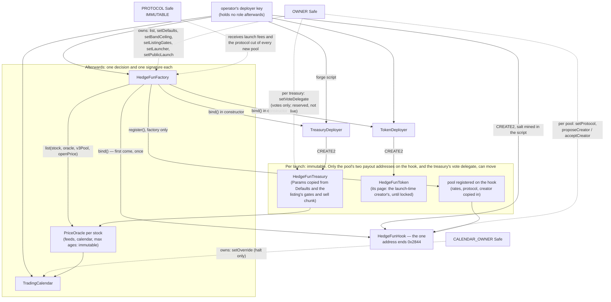
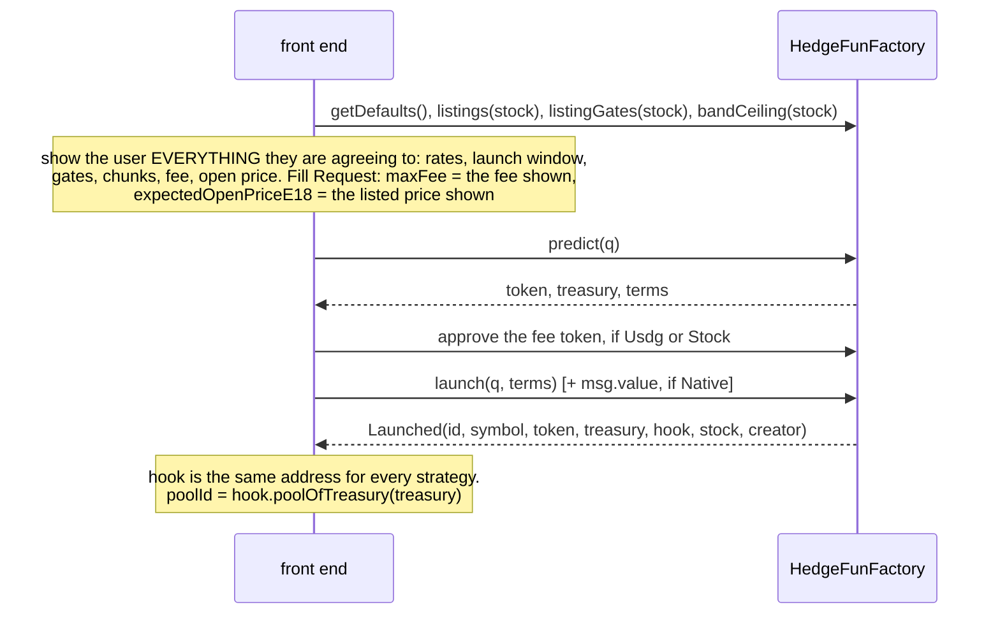

> Historical source record from `keyuyuan/hedgefund` at `48a41e2d53c8d24505e3313ae01a01c153b9e721`; see [archive scope](../README.md). Dates, fee settings, permissions and validation results describe the original reviewed versions, not the current organization release.

# Deployment guide

How to rehearse and execute a deployment of the launchpad on Robinhood Chain (chain id 4663) from
[`script/DeployStrategyLaunchpad.s.sol`](../script/DeployStrategyLaunchpad.s.sol), and what the Safe signs
afterwards. To build and test first, read [DEVELOPMENT.md](./DEVELOPMENT.md).

## Production deployment — 2026-09-22

**Every production address, including the TradeRouter, the twelve oracles and each listing's parameters, is in
[ADDRESSES.md](./ADDRESSES.md).**

**Core contracts deployed; public launch is still closed.** The operator broadcast the six-contract deployment
from commit `3dc07eb` at block **69,454,565** on chain **4663**. The address record is in
[PR #69](https://github.com/keyuyuan/hedgefund/pull/69), which updates `emergency/addresses.json`.
These are production addresses; do not substitute the sandbox hook `0x45783cf9…E844`.

| contract | production address | runtime bytes |
|---|---|---:|
| HedgeFunFactory | `0x58F6Ced8d02cD2567f1458801440Bc4eb67fA961` | 18,929 |
| HedgeFunHook | `0x2A16d0973385952cFBE750D37f803d0958472844` | 18,481 |
| TradingCalendar | `0xFE9E85f0C258Fc2757eB6Acd1ca032Ec860487F5` | 4,751 |
| HedgeFunLaunchRouter | `0x470F5DeB0897118F6575F72183781C6a0610E1FA` | 7,667 |
| TreasuryDeployer | `0x05BC7875a7d61C3bbA2D7737D40C81aF5fD10DBE` | 23,501 |
| TokenDeployer | `0x9C0440dCc1b651C4707aa44E0eA083Fa4E0E8A6b` | 9,245 |

Read-only verification at block **69,459,976** on 2026-09-22 confirmed the sizes above, the hook's binding to the
factory, and `owner == protocol == calendar.owner == 0x2910117dd2cB431173Ae9Fb6eAF30726321d1693`.
`pendingOwner` is zero, `publicLaunch` is **false**, `strategyCount` is **0**, the production LaunchRouter is
**not yet authorized**, and all nine stocks in the original first batch have zero oracle and pool addresses in `listings`.
This is a dated snapshot: repeat section 9 before acting. All six contracts have Sourcify creation and runtime
`match` verification (not `exact_match`; see section 5). Blockscout source display and Uniswap routing approval
are separate checks; neither follows from a Sourcify match.

Remaining launch work:

- [ ] Finalize each stock's V3 pool, gate parameters, sell chunk and oracle age limits, then deploy and verify its
      `PriceOracle`. The planned first batch is the twelve stocks in section 7.2 after the owner's 2026-09-22
      addition of AMD, MU and INTC. Roster approval does not complete deployment, execution validation or Safe listing.
- [ ] Have the Safe sign and verify `list`, the approved `setBandCeiling` / `setListingGates` values, and
      `setLauncher` for the production LaunchRouter. These settings are not applied by the deployment script.
- [ ] Deploy and verify a production `HedgeFunTradeRouter` if the frontend will use the USDG buy/sell path;
      the sandbox TradeRouter is not wired to this factory.
- [ ] Complete an owner strategy's full mainnet cycle, close the public-launch audit blockers, and rehearse the
      emergency kit (sections 7.7–7.8). Deploying contracts does not satisfy these gates.
- [ ] Complete the hook routing submission and approval in section 10 before relying on Uniswap routing.
- [ ] Execute `setPublicLaunch(true)` only after the section 7.7 gates are met, then read the flag back.

**Nothing here can be patched after the fact.** The factory has no proxy, and neither has the one `HedgeFunHook`
every strategy's pool runs on. Every strategy the factory launches is a token, a treasury and a pool registered on
that hook, with no code path to patch any of them; the token has no owner, the treasury's owner can only point
its votes (`setVoteDelegate`), and the hook answers to the factory's owner for each pool's two payout addresses only. One address typed wrong on deployment day is the launch-fee
recipient forever and the tax recipient every strategy launched from that factory is born with — movable afterwards
only pool by pool, and only if `OWNER` was typed right. The only remedy for a bad deployment is to abandon it and deploy again, before anyone has
launched from it — and, since the hook's address is what Uniswap is asked to allowlist
([section 10](#10-getting-the-hook-routed-by-uniswap)), before that address has been submitted anywhere.

**Who signs.** Nothing in this repository signs or broadcasts a mainnet transaction, and no document here will
show you a private key. The deployment is broadcast by an operator with their own throwaway deployer key, which
ends up holding **no role**. Every transaction after that (oracles aside, which anyone may deploy) is signed by the
Safe's owners in the Safe UI.

Every command below was executed with Foundry 1.5.0 and the output is real, trimmed. The rehearsal (section 4) was
run on 2026-09-20 against `main` at `e0d31d9`, again on 2026-09-21 on the singleton-hook tree
(`feat/singleton-hook`), because the singleton changed what the deploy prints, what `predict` returns and what
`launch` takes, and **a third time on 2026-09-21 on the final code** (partial fills, per-listing chunk, the vote-only
owner, the V4 venue removed, token metadata behind a `TokenDeployer`). Where a block's output is not from the third
run it says so; what the third run did not exercise is listed at the end of section 4 rather than quoted from an
earlier one.

## 1. What gets deployed

One script run, six contracts, in this order (`TreasuryV4Deployer` went with the V4 stock venue on 2026-09-21;
`TokenDeployer` arrived the same day, when the token gained metadata and its creation code no longer fitted in the
factory):

| # | contract | constructor input | afterwards |
|---|---|---|---|
| 1 | `TreasuryDeployer` | none | holds the treasury's creation code. Unbound until step 4 |
| 2 | `TokenDeployer` | none | holds the token's creation code, same `BoundDeployer` pattern. Unbound until step 4 |
| 3 | `HedgeFunHook` — **the** hook, one for every strategy | PoolManager | deployed through the canonical CREATE2 deployer (`0x4e59b4…956C`, what forge turns `new X{salt: s}` into when broadcasting) under a salt the script mines **before** it broadcasts anything (~16k hashes), so its address ends in the permission bits `0x2844`. The script reverts `HookNotWhereMined` if it lands anywhere else. Unbound until step 4. **This is the address a router allowlists** |
| 4 | `HedgeFunFactory` | nine arguments: `owner`, PoolManager, V3 factory, USDG, `protocol`, `treasuryDeployer`, `tokenDeployer`, the hook, `Defaults` | its constructor requires code at all three and calls `bind()` on both deployers and on the hook, so all three answer to this factory alone, permanently. Any one bound by someone else first makes this constructor revert (`AlreadyBound`) |
| 5 | `TradingCalendar` | `calendarOwner` | **skipped** when `CALENDAR` names an existing one |
| 6 | `HedgeFunLaunchRouter` | the factory | periphery: no owner, no state. Replaceable by deploying another. **It cannot launch until the owner vouches for it** — `factory.setLauncher(launchRouter, true)`, a Safe transaction the script does not and cannot send (section 7.6) |
| — | `HedgeFunTradeRouter` | the factory | periphery: no owner, no state. What a front end calls so a buyer needs USDG, not the stock. **Not deployed by this script**: `forge create src/HedgeFunTradeRouter.sol:HedgeFunTradeRouter --constructor-args <factory>`, by anyone, any time after. Replaceable by deploying another |

The two deployers exist because whatever a contract can `new` counts against its own 24,576 bytes: the factory
cannot embed the treasury's creation code (~18 KB) or the token's (~8 KB with metadata) and stay under the limit. A
launch that either refuses reverts `TreasuryDeployFailed()` (`0xb94a14a6`) or `TokenDeployFailed()` (`0x3e11a3a5`). The script hard-codes three chain addresses: PoolManager `0x8366a39CC670B4001A1121B8F6A443A643e40951`,
V3 factory `0x1f7d7550B1b028f7571E69A784071F0205FD2EfA`, USDG `0x5fc5360D0400a0Fd4f2af552ADD042D716F1d168`.

**`bind()` on the hook is open to whoever calls first.** The hook goes out in one transaction and the factory, which
binds it, in the next. A stranger who binds the hook in between makes the factory's deployment revert — nothing is
lost but gas, but that hook is dead: run again with `HOOK_SALT_START` moved past the salt that was printed, which
lands a **different address**. Hence the rule in section 10: deploy and bind before the address is shown to anyone.



### What is fixed forever, and what is not

| thing | fixed? |
|---|---|
| `protocol` in the factory | **immutable.** It receives every launch fee, forever, and it is the tax recipient every **new** pool is born with. In the factory there is no second chance. On a pool already launched there is one: the factory's owner can move that pool's payout with `setProtocol(id, next)`, one transaction per pool ([OPERATIONS.md](./OPERATIONS.md#moving-a-payout-address)) |
| the factory's PoolManager, V3 factory, USDG, treasury deployer, token deployer and **hook** | immutable |
| which factory the hook answers to | fixed by the first `bind()`, forever. A new factory needs a new hook, a new address, and a new allowlist review |
| every `PriceOracle`'s stock, two feeds, `calendar`, `maxStockAge`, `maxUsdgAge` | immutable. A better oracle means a new oracle and a re-listing; strategies already launched stay on the old one |
| every treasury's `Params` (the creator's rule, including its `bandBpsPerHour`, plus the execution defaults of the moment and the listing's gates and `sellChunkUsdg` of the moment — a banded launch never gets more than the default chunk) and every pool's `Rates` (the launch window included) and `treasury` | immutable |
| whom a launched treasury's stock votes through | **not immutable**, and it is not state of ours at all: `setVoteDelegate(delegatee)` by the factory's owner makes one `try`ed `stock.delegate(delegatee)` and writes nothing in the treasury. Reserved, not live — the stock token has no vote surface today. It reaches no asset and no part of the rule. The authority follows a two-step factory ownership handover; factory renunciation is disabled |
| a launched token's page — `logo`, `description`, the five links, `extraURI`, and its one `editor` | **not immutable until its `deployer` calls `lock()`**, then immutable for ever. The `deployer` is the launch's `q.creator`, itself immutable; it or its editor rewrites the page with `setMetadata`. **Nothing of the protocol's can touch it**, and it can touch no balance and no supply. A payout takeover (next row) does not move it |
| every launched pool's `protocol` and `creator` — the two payout addresses | **not immutable**, and with the vote delegate and the token's page above the only things on a launched strategy that are not. The factory's owner (read live by the hook) moves `protocol` at once with `setProtocol(id, next)`; it moves `creator` only through `proposeCreator(id, next)` → 14 days → `acceptCreator(id)`, and a single `vetoCreator(id)` from the creator cancels that and bars a new proposal for 180 days. It cannot withdraw stock or touch a rate. Both powers follow a two-step factory ownership handover; factory renunciation is disabled |
| the seeded liquidity | cannot be removed by anyone, the factory's owner included |
| the factory's `owner` and the calendar's `owner` | **not immutable**: both use `Ownable2Step` for `transferOwnership` → `acceptOwnership`. Factory `renounceOwnership` reverts `OwnershipRenunciationDisabled`; the calendar still permits renunciation, which deletes its owner controls for good. What is permanent is which *calendar address* an oracle points at, and therefore that whoever owns that calendar can halt every strategy priced through it. The owner can halt; it cannot change the price the rule trades at |
| factory defaults, listings, `bandCeiling[stock]`, `listingGates[stock]` and `launchers[address]` | the owner may change them; the change reaches **future launches only** — and a launch already quoted reverts `Restated` rather than going through on the new values |

## 2. Environment variables

The script reads these and nothing else. "Later" means `factory.setDefaults(...)`, signed by the owner, affecting
future launches only.

### Roles

| variable | default off 4663 | on chain 4663 | controls | changeable later |
|---|---|---|---|---|
| `OWNER` | the broadcaster | **required**; must not be the broadcaster; must have code | the factory's owner | by `transferOwnership` + `acceptOwnership` |
| `PROTOCOL` | `OWNER` | **required**; same three checks. Never falls back to `OWNER` | launch-fee recipient, and the tax recipient each new pool is born with | in the factory: **never**. On a launched pool: by the owner, `setProtocol(id, next)`, one pool at a time |
| `HOOK_SALT_START` | `0` | optional | where the hook-salt search starts. Only ever needed after a hook was squatted (`AlreadyBound`): set it past the salt the failed run printed | — |
| `CALENDAR` | unset (deploy a new one) | optional; if set it must have code, and `CALENDAR_OWNER` is then ignored | reuse an existing `TradingCalendar` | an oracle's calendar: never |
| `CALENDAR_OWNER` | `OWNER` | **required unless `CALENDAR` is set**; same three checks. Never falls back to `OWNER` | owner of the calendar this run deploys | by ownership transfer |

An unset variable and an empty one are treated alike.

**The address for all three roles: `0x2910117dd2cB431173Ae9Fb6eAF30726321d1693`.** Re-verified on chain
**2026-09-21**: Safe **1.4.1** on the canonical singleton `0x29fcb43b46531bca003ddc8fcb67ffe91900c762`, **3-of-4**,
**no modules**, **no transaction guard**, nonce 3 at that check. The subsequent 3-of-4 test transaction
on 2026-09-22 advanced nonce **3 → 4** and included the Ledger signer; the deployment read-back above still saw
nonce 4. Owners at the configuration check:

| owner | note |
|---|---|
| `0x6912835fD94B7DC209d5ecc6e3783C472B35490b` | |
| `0x4Ab357B850C7Cb8a103C531303d5Ae38ff66D703` | **Ledger hardware key**, added 2026-09-21; signed the 3-of-4 test transaction on 2026-09-22 |
| `0xfE2338496CA51F6Aa17EEE558e0a358D229F1BBA` | |
| `0xF9D23C24062CE1543087Cecc53e03EAA67DB9692` | |

**Both pre-conditions this section used to list are now met.** The heavily used key `0x719A...F13b`, which was also an
owner of the market-making Safe, is **no longer an owner** (`isOwner` answers false), and the Safe has executed real
transactions -- the nonce moved 1 -> 3 -- so the threshold is known to be reachable. The threshold was raised from 2
to 3 in the same pass.

Signing readiness and the remaining 3-of-4 recovery constraint:

- **The Ledger signing test is complete.** Transaction
  [`0xebb2bf18…8279`](https://robinhoodchain.blockscout.com/tx/0xebb2bf18ddb19c3b6bf45527d77a8bbf20d991a2628fb0cf960e6cc725088279)
  was signed by `0x4Ab3…D703` (Ledger), `0x6912…490b` and `0xF9D2…9692`, as checked by the deployment session.
  A signer's EOA transaction count alone does not prove whether it has signed Safe transactions.
- **Losing any two keys bricks the Safe**, and with `renounceOwnership` disabled there is no way to hand the factory
  to nobody either. Know where all four keys and their backups are before listing anything.

One Safe for three roles is a deliberate trade: one signer set to convene in an emergency, and the emergency kit
assumes a single Safe owns the factory and every calendar; against that, three signatures reach both the accumulated
revenue and every owner lever. `OWNER` and `CALENDAR_OWNER` can move to a separate Safe later (`Ownable2Step`);
**`PROTOCOL` in the factory cannot, ever** -- launch fees and every new pool's birth recipient stay there, and what
stays changeable is who controls that Safe. (Pools already launched can be repointed one at a time with
`setProtocol(id, next)`; that is a chore per strategy, not a reason to be casual about the address.) Re-run the
section 5 checks on the day: an address written here is a claim about 2026-09-21, not about today.

### Defaults

| variable | default | meaning | factory bound (`_setDefaults`) |
|---|---|---|---|
| `SUPPLY` | `1000000000e18` | token supply, all of it seeded | non-zero |
| `LP_FEE` | `0` | **must be 0 on every chain** | 0 |
| `TICK_SPACING` | `60` | launch pool tick spacing | at least 1 |
| `MIN_TAX_BPS` / `MAX_TAX_BPS` | `100` / `1500` | bounds on a creator's tax | min ≤ max ≤ 1500 |
| `PROTOCOL_BPS` | `2000` | protocol share of the stock-side tax | with the next: sum ≤ 10000 |
| `MAX_CREATOR_BPS` | `3000` | ceiling on a creator's own share | |
| `SPIKE_BPS` | `9000` | sell tax at launch and after a buy-back | ≤ 9000 |
| `SPIKE_SECONDS` | `120` | linear decay of the spike | |
| `SWEEP_TIP_BPS` | `50` | tip to whoever calls `sweep(id)` | ≤ 100 |
| `SNIPE_BPS` | `9900` | **buy** rate in the second a pool is launched; a buyer keeps 1%. The premium is taken in the token and burned. `0` turns the launch window off | ≤ 9900 |
| `SNIPE_SECONDS` | `3` | linear fall from `SNIPE_BPS` to the flat tax. Whole-second timestamps make 3 s exactly 99% / 66% / 33% / flat. Buys inside the launch transaction are exempt. A `uint8`: at most 255 | |
| `BOUNTY_BPS` | `50` | bounty to whoever calls the rule | ≤ 200 |
| `MAX_SLIPPAGE_BPS` | `100` | execution bound off the oracle — **the default**; a stock the owner has given its own gates uses those (section 7.5) | 1…300 |
| `MAX_DEVIATION_BPS` | `50` | pool-vs-oracle health gate — likewise the default | at least 1, **strictly below** slippage |
| `MAX_BUYBACK_IMPACT_BPS` | `300` | price impact cap per buy-back | 1…1000 |
| `BUYBACK_COOLDOWN` | `60` | seconds between buy-backs | |
| `MIN_LOT_USDG` | `5e6` | smallest lot, USDG 6 decimals | non-zero |
| `BUYBACK_CHUNK_USDG` | `500e6` | most one buy-back spends | non-zero |
| `SELL_CHUNK_USDG` | `2000e6` | most one `takeProfit` / `stopLoss` call **offers** the pool, at the rule's price — **the default**; a stock the owner has given its own chunk uses that (section 7.5). A sale fills as far as the slippage limit allows and keeps the rest, so on an open market this costs price, not safety; on the closed-market path it is still the cap on what one hourly sale gives a pinned pool, which is why a banded launch never gets more than this default | ≥ `MIN_LOT_USDG` |
| `LAUNCH_FEE_CURRENCY` | `2` | 0 None, 1 Native, 2 Usdg, 3 Stock | |
| `LAUNCH_FEE_AMOUNT` | `25e6` | in the fee currency's own units: wei for Native, 6 decimals for USDG, 18 for a stock | |
| *(no variable)* `bandCeiling[stock]` | `0` for every stock | **not set by this script at all.** A per-stock `setBandCeiling` the Safe signs later, if ever. Section 7.4 | |
| *(no variable)* `listingGates[stock]` | `(0, 0, 0)` for every stock = use the defaults above (gates as a pair, the sell chunk on its own) | **not set by this script at all.** A per-stock `setListingGates(stock, dev, slip, sellChunkUsdg)` the Safe signs later: a measured basis report attached when it loosens the gates, a depth measurement when it sizes the chunk. Section 7.5 | gates as the two defaults: `0 < dev < slip ≤ 300`; chunk `0` or ≥ `MIN_LOT_USDG` |

All of these are changeable later, for future launches. Two warnings. Every narrowed value goes through a range
check and an oversized one reverts `OutOfRange(name, value, max)` before anything is broadcast (audit R5-6: a bare
`uint16(...)` used to **wrap** — `SNIPE_SECONDS=300` became 44, `PROTOCOL_BPS=67536` became 2000, and the factory
accepted both without a word); `TICK_SPACING` is capped at 32,767. That check is on the type, not on sense: still
read the defaults back after the run (section 9). And these defaults are the ones the fork suite proves end to
end; a different set is an untested set.

## 3. The guards

| error | refuses | applies |
|---|---|---|
| `MissingEnv(name)` | `OWNER`, `PROTOCOL`, or (with no `CALENDAR`) `CALENDAR_OWNER` unset or empty | chain 4663 |
| `IsBroadcaster(name, who)` | any of those three equal to the broadcasting address | chain 4663 |
| `NotAContract(name, who)` | any of those three, or `CALENDAR`, with no code at the address | chain 4663 |
| `Is7702Delegation(name, who, delegate)` | any of those four whose code is an EIP-7702 designator (`0xef0100` ++ delegate, 23 bytes): that is an EOA, whatever `code.length` says | chain 4663 |
| `NotASafe(name, who)` | `OWNER`, `PROTOCOL` or `CALENDAR_OWNER` that does not answer `getThreshold()` and `getOwners()`, or answers incoherently (`threshold == 0`, no owners, `threshold > owners`) | chain 4663 |
| `SafeThresholdTooLow(name, who, threshold, owners)` | a Safe with `threshold < 2`. A 1-of-n Safe is an EOA with extra steps | chain 4663 |
| `LpFeeMustBeZero(lpFee, why)` | `LP_FEE != 0`. An LP fee accrues to the seeded position, which nobody can ever collect from. The factory refuses it too, but as a bare `BadRequest` after the deployers and the hook have already gone out | every chain |
| `OutOfRange(name, value, max)` | a defaults variable that does not fit the type it is narrowed to (`uint16`, `uint32`, `uint8` for `SNIPE_SECONDS`), or `TICK_SPACING` > 32767 | every chain |
| `NoHookSalt()` | 2,000,000 salts from `HOOK_SALT_START` without an address ending `0x2844` (expected after ~16k; this has never fired) | every chain |
| `HookNotWhereMined(expected, got)` | the hook landed somewhere other than the mined address — the CREATE2 deployer is not the canonical one on this node. Fires **during** the broadcast | every chain |

They run before `vm.startBroadcast()`, so a refusal costs nothing. Real output, dry runs against mainnet (no
`--broadcast`, nothing signed):

```text
$ forge script script/DeployStrategyLaunchpad.s.sol --rpc-url robinhood --sender 0xf39F…2266
Error: script failed: MissingEnv("OWNER")

$ OWNER=0xf39F…2266 forge script … --sender 0xf39F…2266
Error: script failed: IsBroadcaster("OWNER", 0xf39Fd6e51aad88F6F4ce6aB8827279cffFb92266)

$ OWNER=0x000000000000000000000000000000000000dEaD forge script … --sender 0x…bEEF
Error: script failed: NotAContract("OWNER", 0x000000000000000000000000000000000000dEaD)

$ LP_FEE=500 forge script … --rpc-url http://127.0.0.1:8545
Error: script failed: LpFeeMustBeZero(500, "LP_FEE must be 0: fees would strand in the uncollectable seed (FA-5). …")
```

**The guards key on `block.chainid == 4663`, and a plain `anvil --fork-url` of this chain reports 4663.** So a bare
fork gets the mainnet guards (`MissingEnv("OWNER")`, confirmed). For a first rehearsal start anvil with
`--chain-id 31337`, which restores the permissive defaults (everything falls back to the broadcaster). Leaving the
flag off and supplying the real Safes is the better, final rehearsal.

### Two things the guards cannot check

**1. They check that an address answers like a Safe, not that it is yours, or a good one.** This used to be a
bare `code.length != 0`, and on this chain that is not even "is a contract": accounts with an EIP-7702 delegation
have code. The publicly known anvil test accounts carry a 23-byte delegation designator on Robinhood Chain mainnet,

```text
$ cast code 0x70997970C51812dc3A010C7d01b50e0d17dc79C8 --rpc-url robinhood
0xef01008a5b10eb2faf57665f63709ec4b3943a3b005df6
```

and a dry run naming that address (an EOA whose private key is printed in Foundry's documentation) as `OWNER`,
`PROTOCOL` and `CALENDAR_OWNER` **passed every guard**. It is refused now:

```text
$ OWNER=0x7099…79C8 PROTOCOL=0x7099…79C8 CALENDAR_OWNER=0x7099…79C8 forge script … --rpc-url robinhood --sender 0x…dEaD
Error: script failed: Is7702Delegation("OWNER", 0x70997970C51812dc3A010C7d01b50e0d17dc79C8, 0x8A5B10Eb2Faf57665f63709Ec4B3943a3B005DF6)
```

What is left is a guard against a **mistake**, not against an operator who wants to cheat it: any contract can
answer two view calls. It does not know whether the Safe is *yours*, whether a **module** is enabled (a module acts
past the threshold — `getModulesPaginated`), whether a guard or an unusual fallback handler is set, or whether the
owners are hot keys shared with another Safe. Verify each Safe by hand (section 5), and read the printed plan.

**2. The broadcaster check compares against `msg.sender` inside the script.** Without `--sender`, forge runs the
script as its default sender `0x1804c8AB1F12E6bbf3894d4083f33e07309d1f38`, which is not the key that will sign. The
check then compares the wrong address and cannot catch `OWNER` being your deployer key. **Always pass
`--sender <deployer address>`**, in the dry run and in the broadcast.

## 4. Rehearsal on a local fork

Executed end to end on 2026-09-20, again on 2026-09-21 on the singleton-hook tree, and **a third time on 2026-09-21
on the final code**: deploy, read-back, oracle, listing, `setListingGates`, `setLauncher`, `setPublicLaunch`,
`predict`, a launch with capital through the router, the read-back of strategy 0, the token's metadata (by the
creator, by a stranger), the treasury's vote hatch (by the owner, by a stranger), a `sweep`, and a stranger launching
in the creator's name. Every address, gas figure and output below is from the third run unless the block says
otherwise. What it did not exercise is listed at the end of this section. The local signer is anvil's unlocked dev
account, addressed with `--unlocked --sender`, so no key appears anywhere. `--unlocked` works only against a node
that holds the account, which a real RPC never does.

**Fork the chain's own RPC**, not `publicnode`: publicnode answers historical `eth_getCode` with
`403 Archive requests require a personal token`, which kills a fork at its first transaction. **Work briskly**: the
chain's own RPC keeps only minutes of history (state 7 minutes old was served, 13 minutes old refused), and a fork
is pinned to a block. Reads anvil has already cached keep working. Fourteen minutes into this rehearsal a first-time
read failed with `failed to get account for 0x…: historical state … is not available`; when you see that, restart
anvil and run the steps again. For a long session fork
`https://rpc-robinhood.blockmachine.io`, which serves history and rate-limits hard.

```bash
# terminal 1
anvil --fork-url https://rpc.mainnet.chain.robinhood.com --chain-id 31337 --port 8545
```

```bash
# terminal 2
export L=http://127.0.0.1:8545
export ME=0xf39Fd6e51aad88F6F4ce6aB8827279cffFb92266      # anvil account 0: local fork only
cast chain-id --rpc-url $L                                # 31337

forge script script/DeployStrategyLaunchpad.s.sol --rpc-url $L --broadcast --unlocked --sender $ME
```

The log, 2026-09-21, final code:

```text
== Logs ==
  === strategy-token launchpad ===
  chain id 31337
  owner    0xf39Fd6e51aad88F6F4ce6aB8827279cffFb92266
  protocol 0xf39Fd6e51aad88F6F4ce6aB8827279cffFb92266 (IMMUTABLE in the factory: launch fees, and the tax recipient every pool is born with)
  calendar owner 0xf39Fd6e51aad88F6F4ce6aB8827279cffFb92266 (a TradingCalendar is deployed for it)
  hook     0x56F1BB2AB27D0e7a4FC5544c2A2b024df24Fa844 (mined; ONE for every strategy -- the address a router allowlists)
  0x…                                          <- the hook salt
  treasuryDeployer   0x2098cb47B17082Ab6969FB2661f2759A9BF357c4
  tokenDeployer      0xF01f4567586c3A707EBEC87651320b2dd9F4A287
  hook               0x56F1BB2AB27D0e7a4FC5544c2A2b024df24Fa844 bound to 0xCaC60200c1Cb424f2C1e438c7Ee1B98d487f0254      <- "bound to" must be the factory on the next line
  factory            0xCaC60200c1Cb424f2C1e438c7Ee1B98d487f0254
  calendar           0xABc84968376556B5e5B3C3bda750D091a06De536
  launchRouter       0xFf8FA9381caf61cB3368a6ec0b3F5C788028D0Cd
  --- read back ---
  …
  launch fee amount: 25000000
  publicLaunch: false

Estimated total gas used for script: 23712704
ONCHAIN EXECUTION COMPLETE & SUCCESSFUL.
```

(There is a `tokenDeployer` line and no `treasuryV4Deployer` line. The `protocol` line is about the factory: a
launched pool's payout can be moved by the owner with `setProtocol(id, next)`. The `supply / lpFee / tickSpacing:`
line prints two numbers, not three; tick spacing is missing from the log. Read it from `getDefaults()`. 23.7M gas
for the script, against 28.5M the run before: a ~24 KB V4 treasury deployer fewer, an 8.8 KB token deployer more.)

Read it back (both code sizes are the third run's; `hook()` and `factory()` as commented; the defaults are the
script's):

```bash
export F=0xCaC60200c1Cb424f2C1e438c7Ee1B98d487f0254 CAL=0xABc84968376556B5e5B3C3bda750D091a06De536 H=0x56F1BB2AB27D0e7a4FC5544c2A2b024df24Fa844
cast codesize $F --rpc-url $L                                   # 18107
cast codesize $H --rpc-url $L                                   # 18362
DEFAULTS_T='(uint256,uint24,int24,uint16,uint16,uint16,uint16,uint16,uint32,uint16,uint16,uint8,uint16,uint16,uint16,uint16,uint32,uint256,uint256,uint256,uint8,uint256)'
cast call $F "getDefaults()($DEFAULTS_T)" --rpc-url $L
# supply, lpFee, tickSpacing, minTax, maxTax, protocolBps, maxCreatorBps, spikeBps, spikeSeconds, sweepTipBps, snipeBps, snipeSeconds,
# bountyBps, maxSlippageBps, maxDeviationBps, maxBuybackImpactBps, buybackCooldown, minLotUsdg, buybackChunkUsdg, sellChunkUsdg, feeCurrency, feeAmount
# (1e27, 0, 60, 100, 1500, 2000, 3000, 9000, 120, 50, 9900, 3, 50, 100, 50, 300, 60, 5e6, 5e8, 2e9, 2, 2.5e7)
cast call $F "hook()(address)" --rpc-url $L                     # == $H
cast call $H "factory()(address)" --rpc-url $L                  # == $F: the hook is bound, to this factory
cast call $H "poolManager()(address)" --rpc-url $L              # 0x8366a39CC670B4001A1121B8F6A443A643e40951
echo $H | tail -c 5                                             # the low 14 bits are 0x2844: ends 2844, 6844, a844 or e844 (here: a844)
```

Oracle, listing, launch (NVDA; addresses from `data/chainlink_feeds.json` and `data/rh_stock_tokens.json`):

```bash
export NVDA=0xd0601CE157Db5bdC3162BbaC2a2C8aF5320D9EEC NVDA_FEED=0x379EC4f7C378F34a1B47E4F3cbeBCbAC3E8E9F15
export USDG=0x5fc5360D0400a0Fd4f2af552ADD042D716F1d168 USDG_FEED=0x61B7e5650328764B076A108EFF5fa7282a1B9aD2
export POOL=0xd4EB21209C4D6093f80B5b84f5C45cc093EA14a3          # NVDA/USDG V3, 0.05%

forge create src/PriceOracle.sol:PriceOracle --rpc-url $L --unlocked --from $ME --broadcast \
  --constructor-args $NVDA $NVDA_FEED $USDG_FEED $CAL 93600 93600
# Deployed to: 0xE55cc27460B55c8aC7E73043F38b537758C9E51e
export ORACLE=0xE55cc27460B55c8aC7E73043F38b537758C9E51e

cast call $ORACLE "tryPrice()(bool,uint256)" --rpc-url $L       # true / 224917682475401967842  (224.92: Monday 2026-09-21, market open)
                                                                # the Sunday run: false / 0
cast call $ORACLE "lastPriceAt()(bool,uint256,uint256)" --rpc-url $L   # the Sunday run: true / 222449204879685818907 / the feed's updatedAt  (Friday's close, 222.45)

cast send $F "list(address,address,address,uint256,bool)" $NVDA $ORACLE $POOL 50000000000 true \
  --rpc-url $L --unlocked --from $ME                            # status 1 (success)
cast call $F "listings(address)(address,address,uint256,bool)" $NVDA --rpc-url $L
# (0xE55c…E51e, 0xd4EB…14a3, 50000000000 [5e10], true)          oracle, v3Pool, openPriceE18, enabled: four words now

# the listing's own sell chunk, before anyone launches on it (section 7.5). (0, 0) keeps the default gates
cast send $F "setListingGates(address,uint16,uint16,uint64)" $NVDA 0 0 25000000000 --rpc-url $L --unlocked --from $ME   # status 1
cast call $F "listingGates(address)(uint16,uint16,uint64)" $NVDA --rpc-url $L                                          # (0, 0, 25000000000)
```

`tryPrice() == false` on a weekend is correct behaviour, not a broken oracle. Listing and launching do not need a
live price; the rule does.

The launch fee is 25 USDG, so the launcher needs USDG. On the fork, borrow it from the pool:

```bash
cast rpc anvil_impersonateAccount $POOL --rpc-url $L
cast rpc anvil_setBalance $POOL 0xde0b6b3a7640000 --rpc-url $L
cast send $USDG "transfer(address,uint256)" $ME 25000000 --from $POOL --unlocked --rpc-url $L
cast rpc anvil_stopImpersonatingAccount $POOL --rpc-url $L
cast send $USDG "approve(address,uint256)" $F 25000000 --from $ME --unlocked --rpc-url $L
```

Predict (2026-09-21), **after** `setListingGates`: the chunk is a treasury constructor argument, so it is in the
treasury's address and in `terms`. There is nothing to mine: `predict` answers the token, the treasury and the
`terms` to hand back.

```bash
REQ_T='(string,string,address,address,uint16,uint16,uint32,uint32,uint16,uint16,uint16,uint16,uint96,uint256,uint256)'
Q="(\"Rehearsal NVDA\",\"RNVDA\",$NVDA,$ME,1000,1000,500,1000,500,0,2000,0,0,25000000,50000000000)"   # ...lotBps, bandBpsPerHour, nonce, maxFee, openPrice

cast call $F "predict($REQ_T)(address,address,bytes32)" "$Q" --rpc-url $L
# 0xbA53a5844E379776171BD23e31cfE2b8F8c7999E      token     (from the TokenDeployer now; its address hashes q.creator in, as the token's `deployer`)
# 0xb709bD3D852F50157E69e290F9E7892180Ab79B9      treasury
# 0xd52f74321b9f8e7d60d2001205ced348db10c1a87804b63df62eb54c273dc72b      terms: keccak(token, treasury, lpFee, tickSpacing, rates, feeCurrency, feeAmount)
export TERMS=0xd52f74321b9f8e7d60d2001205ced348db10c1a87804b63df62eb54c273dc72b
```

**Launch, plain.** `$ME` is `q.creator`: a launch is sent by its creator. This form was **not separately run on
2026-09-21** (the same `Q` launches once, and the run spent it on the launch with capital below), so no gas figure
is quoted for it. Pass `--gas-limit`, for the reason in the box below.

```bash
cast send $F "launch($REQ_T,bytes32)" "$Q" $TERMS --from $ME --unlocked --rpc-url $L --gas-limit 12000000     # expect status 1
```

**Or launch with capital**, through the router the deploy printed (`launchRouter`) — this is what the 2026-09-21
runs did: 1 NVDA first buy, 2 NVDA seed, `mustBook = true`. Same `Q`, same `TERMS`; the approvals (25 USDG, 3 NVDA)
go to the **router** instead of the factory, the launcher must be `q.creator`, and the launcher needs the stock as
well (borrow it from the pool the same way as the USDG).

```bash
export R=0xFf8FA9381caf61cB3368a6ec0b3F5C788028D0Cd
cast send $F "setLauncher(address,bool)" $R true --from $ME --unlocked --rpc-url $L      # status 1. The owner vouches for the router; on mainnet this is a Safe transaction
cast send $F "setPublicLaunch(bool)" true --from $ME --unlocked --rpc-url $L             # status 1. After setLauncher, never before (section 7.6)
cast send $USDG "approve(address,uint256)" $R 25000000 --from $ME --unlocked --rpc-url $L
cast send $NVDA "approve(address,uint256)" $R 3000000000000000000 --from $ME --unlocked --rpc-url $L
cast send $R "launch($REQ_T,bytes32,(uint256,uint256,uint256,bool,uint256))" "$Q" $TERMS \
  "(1000000000000000000,1,2000000000000000000,true,0)" --from $ME --unlocked --rpc-url $L --gas-limit 8694868
# eth_estimateGas 6,955,894; sent with 1.25x that. status 1, gasUsed 6830498
```

6.83M, up from 5.75M the run before: the token's init code is 8 KB now, and a launch deploys it.

> **Do not send a launch with exactly the node's gas estimate.** Found in the second run and not contradicted by the
> third, which sent 1.25× its estimate of 6,955,894 and used 6,830,498. In the second run the first attempt at this
> launch was sent with the `eth_estimateGas` figure, 5,874,408, and **failed**: status 0, all of it consumed (5,863,564 used), empty revert
> data. The identical call with headroom succeeded at 5,752,452. Three later launches on the same fork succeeded at
> exactly their estimate (estimate 5,818,900, used 5,708,608), so it is borderline, not systematic — which is worse,
> because it passes in testing. Why: a launch deploys a ~18 KB treasury and a ~7 KB token, each three call frames deep, each frame keeps back
> 1/64 of the gas it was given, and the estimate is taken against a block that is not the one the transaction lands
> in. **`cast send` users pass `--gas-limit`; a front end sends at least 1.25× the estimate** (section 8). Unused gas
> is refunded; a failed launch costs the creator all of it and the launch second.

Read strategy 0 back:

```bash
cast call $F "strategies(uint256)(address,address,address,address,address)" 0 --rpc-url $L
# token 0xbA53…999E and treasury 0xb709…79B9 equal the two predicted addresses; the third value is $H, as for every strategy
export TOKEN=0xbA53a5844E379776171BD23e31cfE2b8F8c7999E TREASURY=0xb709bD3D852F50157E69e290F9E7892180Ab79B9

export PID=$(cast call $H "poolOfTreasury(address)(bytes32)" $TREASURY --rpc-url $L)     # every hook call below takes this
# 0x8a3df6285444314ed14601b4ad5f2fe796105cb0d3e1d34773c05ea35c36eb8f
# creator's tokens 17,645,616.398907594668366371e18: 1.76% of supply for 1 NVDA at the 5e10 open
# treasury lotCount 1, bookedStock 2e18, health() true / 224.92 · router balances: NVDA 0, USDG 0
cast call $H "accrued(bytes32)(uint256,uint256)" $PID --rpc-url $L
# (1960624044323066074262930, 0): the first buy's tax, in the token; no stock yet

# from the second run, not repeated in the third (the hook is byte for byte the same, 18362):
cast call $H "isRegistered(bytes32)(bool)" $PID --rpc-url $L                             # true
cast call $H "rates(bytes32)((uint16,uint16,uint32,uint16,uint16,uint16,uint16,uint8))" $PID --rpc-url $L
# (1000, 9000, 120, 2000, 1000, 50, 9900, 3)   tax, spike, spikeSeconds, protocol, creator, tip, snipe, snipeSeconds
cast call $H "buyRateBps(bytes32)(uint256)" $PID --rpc-url $L   # 1000: the 3 s window was long over. 9900 in the launch second, 6600, 3300, then 1000
cast call $H "sellRateBps(bytes32)(uint256)" $PID --rpc-url $L  # 6600: the spike decaying. 9000 at launch, falling to 1000 over 120 s
```

The creator's 17,645,616 tokens are **the same amount every earlier rehearsal bought** (to within 16 wei), and that
is the point of reading it: the buy inside the launch transaction paid the flat 10%, not the window's 99%.

**The token's page.** The token records the launch's `q.creator` as its `deployer`; that address writes the page,
and nobody else can (section 8):

```bash
export SWEEPER=0x70997970C51812dc3A010C7d01b50e0d17dc79C8      # the stranger: anvil's account 1, local fork only
cast call $TOKEN "deployer()(address)" --rpc-url $L             # 0xf39Fd6e51aad88F6F4ce6aB8827279cffFb92266 == $ME, the creator
cast send $TOKEN "setMetadata(string,string,(string,string,string,string,string),string)" \
  "ipfs://logo" "<description>" '("<twitter>","<telegram>","<discord>","<website>","<farcaster>")' "<extraURI>" \
  --from $ME --unlocked --rpc-url $L                            # status 1, gasUsed 221010
cast call $TOKEN "logo()(string)" --rpc-url $L                  # "ipfs://logo"
cast call $TOKEN "setMetadata(string,string,(string,string,string,string,string),string)" \
  "x" "x" '("","","","","")' "" --from $SWEEPER --rpc-url $L    # a stranger: 0x3d693ada = NotAllowed()
```

**The treasury's owner, and its one call.** The treasury was born with 1 lot, 2e18 booked, healthy at 224.92:

```bash
cast call $TREASURY "owner()(address)" --rpc-url $L             # 0xf39F…2266: the factory's owner, read live
cast send $TREASURY "setVoteDelegate(address)" <delegatee> --from $ME --unlocked --rpc-url $L    # status 1, gasUsed 43287
# the event is VoteDelegateSet(by, delegatee, accepted = FALSE): the real NVDA token has no `delegate`. That is what
# "reserved, not live" means -- the call succeeds, nothing happens, and the log says so
cast call $TREASURY "setVoteDelegate(address)" $SWEEPER --from $SWEEPER --rpc-url $L     # a stranger: 0x30cd7471 = NotOwner()
```

(anvil mines a block per transaction with the wall clock's timestamp, so by the time you read `buyRateBps` by hand
the three seconds are over. `cast rpc evm_setNextBlockTimestamp` before the launch if you want to see them.)

Sweep, from another account — it is permissionless, and the sweeper keeps the 0.5% tip:

```bash
cast send $H "sweep(bytes32)" $PID --from $SWEEPER --unlocked --rpc-url $L --gas-limit 3000000   # status 1, gasUsed 114848
# totalSupply -> 998,049,179.074898549256104366e18: the accrued tax burned, less the sweeper's tip
```

One negative check (2026-09-21): a stranger launching in somebody else's name, straight at the factory (audit X5-2).

```bash
cast call $F "launch($REQ_T,bytes32)" "$Q" $TERMS --from $SWEEPER --rpc-url $L     # q.creator is $ME, the sender is not
# 0x41cc6b21 = BadRequest()   (the check comes before the addresses are looked at, so the spent $Q will do)
```

Failure modes. On 2026-09-21 the `q.creator` row straight to the factory was run (above), and so were a stranger's
`setMetadata` and `setVoteDelegate`. The first row, the `TreasuryDeployFailed()` row and the two router rows are
written from the code; the `hook deploy` row is gone because a launch deploys no hook; the
rest are from the 2026-09-20 run and their causes are unchanged. Each with `cast call` in place of `cast send`:

| what was wrong | what came back |
|---|---|
| `TERMS` from before a `setDefaults`, a re-listing or a `setListingGates` — or simply the wrong 32 bytes | `0x5945191f` = `Restated()` (cast prints a garbled `YE`) |
| `expectedOpenPriceE18` not the listed price | `Restated()` |
| `tp1Bps = 200`, under the floor of 210 for this pool | `0xb94a14a6` = `TreasuryDeployFailed()` — from the code, not re-run; the 2026-09-20 run saw the string `treasury deploy`, which no longer exists |
| the same request a second time | `0x3e11a3a5` = `TokenDeployFailed()`: the token's CREATE2 address is taken (from the code, not re-run; the 2026-09-20 run saw `execution reverted`, data `0x`, when the factory still did the `new` itself) |
| no USDG allowance left | `0x13be252b` = `InsufficientAllowance()`, from USDG |
| a stranger, `publicLaunch` false | `0xddafad98` = `NotOpen()` |
| sent with exactly the node's gas estimate | sometimes: status 0, every unit of gas consumed, revert data `0x` (the box above) |
| through the router, `q.creator` is not the sender | `NotYourLaunch()` |
| straight to the factory, `q.creator` is not the sender | `0x41cc6b21` = `BadRequest()` (run 2026-09-21) |
| through a router the owner has not vouched for | `BadRequest()` |
| `setMetadata` by anyone but the token's `deployer` or `editor` | `0x3d693ada` = `NotAllowed()` (run 2026-09-21) |
| `setVoteDelegate` by anyone but the factory's owner | `0x30cd7471` = `NotOwner()` (run 2026-09-21) |

Finally, point the emergency kit at the rehearsal. Copy `emergency/addresses.example.json` somewhere outside the
repository, set `chainId` 31337, `rpc` to `$L`, `safe` to `$ME`, the factory, the calendar and `"NVDA"`, then (output
from the **2026-09-20** run, addresses and all — the drill was not repeated on the final code. Today's `status` has no
`v4ListingEnabled` line, prints `V3 pool <address>` per listing, and adds each stock's band ceiling, gates and sell
chunk; the kit's own proof, `FOUNDRY_PROFILE=emergency forge test --mc EmergencyTest`, is 7/7 on the final code):

```text
$ python3 emergency/build.py --addresses /path/to/rehearsal-addresses.json status
chain 31337   block 68308503   Sun 2026-09-20 22:50:23 UTC   (READ-ONLY: eth_call only)
factory  0x1E2e…C47d   owner == safe: yes
  publicLaunch      False   <- only the Safe can launch
  v4ListingEnabled  False
listings
  NVDA  …  ENABLED   V3 0xd4EB…14a3
calendars
  0x52c9…436f  owner == safe
    used by: NVDA listing oracle, strategy #0
    Eastern time now Sun 18:50 -> trading date 20716 (Sun 2026-09-20);  isClosed(now) = True
strategies (1)
  #0   RNVDA      treasury 0xb461…99d3  health = false price 0
```

**Not exercised on the final code**, so nothing above is evidence for it: a stranger's buy inside the 3 s launch
window (anvil mines on demand, so the launch second cannot be hit by hand; `test/SnipeTax.t.sol` covers it, under
`isolate`), a plain `factory.launch`, `HedgeFunTradeRouter`, a partial-fill sale (`test/PartialFill.t.sol`), `setEditor` and
`lock()` (`test/StrategyTokenMetadata.t.sol`), the emergency drill — the kit block above is the 2026-09-20 run, whose
addresses are that run's — and Blockscout verification.

The rehearsal leaves `broadcast/` and `cache/` behind. Both are git-ignored.

## 5. Pre-flight checklist

```bash
export RPC=https://rpc.mainnet.chain.robinhood.com
```

- [ ] `main` is green in CI, **including the `fork` job and the latest scheduled run**. A red scheduled run means the
      issuer changed the stock token's code: stop. **CI has never run** (the repository's Actions billing is
      unpaid), so today this line means: run the four commands below locally on the exact commit, and know that
      nothing is watching the stock tokens for you between runs.
- [ ] `forge --version` is 1.5.0. `forge build --sizes` exits 0; runtime bytes and margins as measured on
      `bytecode_hash = "none"`: **`TreasuryDeployer` 23,501 B (margin 1,075)** -- the tight one -- `HedgeFunFactory`
      18,929 (5,647), `HedgeFunTreasury` 18,289 (6,287), `HedgeFunHook` 18,481 (6,095), `TokenDeployer` 9,245,
      `HedgeFunToken` 7,260, `HedgeFunLaunchRouter` 7,667, `HedgeFunTradeRouter` 5,627, `PriceOracle` 2,170,
      `TradingCalendar` 4,751.
- [ ] `forge test`: **1,223 passed, 0 failed, 32 skipped** (1,255 tests, 64 suites) -- the skips are the fork suites,
      which self-skip unless `RH_FORK=1`. Fork suite (`RH_FORK=1 forge test --mc Fork`): **all 31 passed, 0 skipped**,
      6 suites. Run it **`-j 1`**: the chain's own RPC rate-limits a parallel run into failures that look like bugs,
      and `publicnode` now answers 403 to every archive read, so the `robinhood` alias is the one to use
      ([DEVELOPMENT.md](./DEVELOPMENT.md#the-four-ways-tests-run)).
      `FOUNDRY_PROFILE=emergency forge test --mc "^EmergencyTest$"`: **7 passed**.
      `forge test --mc DeployScriptGuardsTest`: **23 passed**. A lower count than these means a suite did not run,
      not that it shrank.
- [ ] The commit being deployed is recorded, and the working tree is clean.
- [ ] **Source verification: go through Sourcify, not Blockscout.** Exercised on the 2026-09-21 mainnet sandbox deploy
      (sandbox commit `8bb330e`; production commit `3dc07eb` has identical `src/`): all six contracts -- `TradingCalendar`, `HedgeFunFactory`, `HedgeFunHook`,
      `HedgeFunLaunchRouter`, `TreasuryDeployer`, `TokenDeployer` -- verified on Sourcify with **creation and runtime
      both matching**. Run from a checkout of the deployed commit, after `forge clean && forge build`:

      ```bash
      forge verify-contract <address> <path>:<Contract> --chain-id 4663 --verifier sourcify
      ```

      Sourcify reads the creation transaction itself, so no constructor arguments are passed, and it handles the
      immutables in the factory, hook and router. Check the result with
      `curl https://sourcify.dev/server/v2/contract/4663/<address>`: expect `"match":"match"`, which is Sourcify's
      partial match, not `"exact_match"` -- with `bytecode_hash = "none"` there is no metadata hash to prove, and that is
      the trade made for builds that reproduce from any clone. **`--verifier blockscout` does not work:**
      `robinhoodchain.blockscout.com` answers its API with a Cloudflare challenge page instead of JSON, and whether that
      Blockscout instance picks the source up from Sourcify has not been confirmed. **Verifying publishes the source
      permanently** (Sourcify pins to IPFS) and the repository is private: that is a decision about *when* the code
      becomes public, not a formality.
- [ ] `AUDIT.md`'s "Blockers before the first launch" are closed on that commit, **and every round-5 finding in its banner is fixed or knowingly accepted on that commit**: the singleton hook is the one contract every strategy shares and can never be replaced under them. No external review has been done; that is a known, stated risk.
- [ ] Nobody outside the team has been shown a hook address. The one that counts is the one this deployment prints as `bound to` the factory (section 10).
      **The sandbox already occupies the first hook address.** Every deploy of the same commit mines the same first salt
      that carries `0x2844` -- salt 4605, `0x45783cf9...E844` -- and the 2026-09-21 mainnet sandbox took it. The miner
      now skips any address that already has code, so the production deploy lands on the next free salt without
      `HOOK_SALT_START`; before that fix it would have failed on a `CreateCollision`. Check the printed `hook` is **not**
      `0x45783cf9...E844`: that one is the sandbox's, verified on Sourcify and indexed by DexScreener, and must never be
      the address submitted for routing.
- [ ] **Each Safe is a Safe.** For `OWNER`, `PROTOCOL`, `CALENDAR_OWNER`:

  ```bash
  cast code $SAFE --rpc-url $RPC | cut -c1-8        # must NOT be 0xef0100 (that is an EIP-7702 EOA)
  cast call $SAFE "VERSION()(string)" --rpc-url $RPC
  cast call $SAFE "getThreshold()(uint256)" --rpc-url $RPC
  cast call $SAFE "getOwners()(address[])" --rpc-url $RPC
  # modules act PAST the threshold. Expect an empty list for anything that will be a permanent address:
  cast call $SAFE "getModulesPaginated(address,uint256)(address[],address)" 0x0000000000000000000000000000000000000001 10 --rpc-url $RPC
  # transaction guard (expect zero):
  cast storage $SAFE 0x4a204f620c8c5ccdca3fd54d003badd85ba500436a431f0cbda4f558c93c34c8 --rpc-url $RPC
  # and each owner is a plain key, not a contract or a 7702-delegated account:
  for o in <owner addresses>; do cast code $o --rpc-url $RPC; done          # expect 0x for each
  ```

  Threshold at least 2, owners are who you expect, and the address came from the Safe UI on chain 4663, not from
  a message. Three things that have each gone wrong once:
  - **A Safe address can exist before the Safe does.** The Safe UI hands out a counterfactual address and deploys
    the contract on activation or first transaction. Until then `cast code` returns `0x` — on every chain. The
    script refuses it (`NotAContract`), which is correct: writing an undeployed address into `PROTOCOL` would be
    betting every strategy's tax on that Safe later deploying to exactly that address.
  - **A module is a second way in.** A Safe with the Zodiac Roles modifier enabled lets a hot keeper key execute
    within its scope without the owners signing. Right for a trading bot, wrong for an address that collects forever.
  - **Owners shared with another Safe share its fate.** If one key is an owner of two 2-of-3 Safes, leaking it puts
    an attacker one key away in both. Check each owner's `cast nonce`: a high one is a hot, everyday key.
  Before relying on it, execute one real transaction from the Safe, so you know the threshold can actually be met. `PROTOCOL` must be able to **receive** the native token and ERC-20s: with a Native launch fee, a
  `protocol` that rejects value makes every launch revert.
- [ ] The three hard-coded addresses have code on chain: `cast code 0x8366a39CC670B4001A1121B8F6A443A643e40951 --rpc-url $RPC | head -c 20`, and the same for the V3 factory and USDG.
- [ ] The deployer key is fresh, holds only gas (the pre-singleton rehearsal estimated 23.8M gas; the hook adds a deployment), and appears in **no** role variable.
- [ ] Dry run against mainnet, **no `--broadcast`**, with the real variables and `--sender <deployer>`. Read every printed line. `owner`, `protocol` and `calendar owner` are the Safes, character by character.
- [ ] A full rehearsal on a fork **without** `--chain-id 31337`, with the real Safe addresses, using `anvil_impersonateAccount` for the Safe's transactions.
- [ ] A second person has read the variables and the dry-run output independently.
- [ ] At least a threshold of signers is reachable for the hours after deployment.

## 6. Deployment

The operator runs this, with their own key management (a hardware wallet via `--ledger`, or an encrypted keystore
via `--account <name>`). Never put a raw key on a command line or in a file in this repository.

```bash
OWNER=<owner Safe> PROTOCOL=<protocol Safe> CALENDAR_OWNER=<calendar Safe> \
forge script script/DeployStrategyLaunchpad.s.sol --rpc-url robinhood \
  --sender <deployer address> --ledger --broadcast
```

Save the printed addresses — the **hook** and its salt among them — and
`broadcast/DeployStrategyLaunchpad.s.sol/4663/run-latest.json`, then run section 9 before anything else. If the run
dies with `AlreadyBound`, someone bound the hook between its deployment and the factory's: nothing is lost but gas,
that hook is dead, and the next run needs `HOOK_SALT_START=<printed salt + 1>` to land a fresh address. If anything reads wrong, **stop and redeploy**. An unused factory costs only gas to abandon.
A factory with one launch on it cannot be abandoned by the people who launched.

## 7. After deployment: each step a separate decision the Safe signs

The factory is inert at this point: nothing is listed, and `publicLaunch` is false. Prepare each Safe transaction
with the Transaction Builder, simulate it, and sign it in the Safe UI.

### 7.1 A `PriceOracle` per stock

```solidity
PriceOracle(address stock, address stockFeed, address usdgFeed, address calendar, uint256 maxStockAge, uint256 maxUsdgAge)
```

- `calendar`: the one printed by the deploy. It is immutable in the oracle, and its owner can halt this stock's
  strategies forever after.
- `maxStockAge`: non-zero and **at most 48 hours**; the constructor refuses more, because 72 hours would serve
  Friday's close at Sunday's open. The test suites use 26 hours (93,600 s) for both ages. Choosing the real
  values is a decision for the Safe's signers: too short parks the rule on a quiet day, and the value can never be
  changed.
- **Resolve the feed by address**, from `data/chainlink_feeds.json`, cross-checked against Chainlink's own
  directory. `description()` comes in three formats on this chain (`RHNVDA / USD`, `Robinhood AAPL / USD`,
  `Robinhood SGOV-USD`), and the directory's name for a feed need not match what the contract answers. Then check it:

  ```text
  $ python3 tools/verify_feeds.py NVDA AAPL GOOGL SPCX
  sym   description()              feed/USDG    age      pool      mark pool-feed mark-feed
  NVDA  RHNVDA / USD                  222.45    50h    221.37    221.62    -0.48%    -0.37% STALE
  AAPL  Robinhood AAPL / USD          335.39    55h    334.50    334.41    -0.27%    -0.29% STALE
  GOOGL Robinhood GOOGL / USD         350.47    50h    349.97    349.82    -0.15%    -0.19% STALE
  SPCX  Robinhood SPCX / USD          152.83    47h    153.62    153.73    +0.52%    +0.59% STALE
  0 ticker(s) with >1% disagreement between the three prices
  ```

  (`STALE` because this ran on a Sunday. Run it during a session before you deploy an oracle.) The feed, the pool
  and an independent venue must agree; a feed that disagrees is the wrong feed or a broken one.
- Anyone may deploy an oracle; it has no owner. What matters is that the Safe's signers verify its six immutables
  before listing it (section 9).

**The first batch's oracle arguments.** The original nine were resolved on 2026-09-21; NVDA and the additions
AMD, MU and INTC were rechecked on chain 2026-09-22 at block **69,466,392** (sources and pools in section 7.2).
Every token has 18 decimals
and every feed 8; USDG itself has 6, its USD feed 8. None of these is typed anywhere in the contracts: the treasury and
`PoolTrader` read both tokens' `decimals()`, and the oracle reads both feeds', once, at construction -- so the numbers
below are a check, not an input.

| stock | token (18 dp) | `stockFeed` (8 dp) | feed `description()` |
|---|---|---|---|
| NVDA | `0xd0601CE157Db5bdC3162BbaC2a2C8aF5320D9EEC` | `0x379EC4f7C378F34a1B47E4F3cbeBCbAC3E8E9F15` | RHNVDA / USD |
| SPCX | `0x4a0E65A3EcceC6dBe60AE065F2e7bb85Fae35eEa` | `0xB265810950ba6c5C0Ff821c9963014a56fD8Bffb` | Robinhood SPCX / USD |
| CRCL | `0xdF0992E440dD0be65BD8439b609d6D4366bf1CB5` | `0x6652eDf64bA3731C4F2D3ce821A0Fb1f1f6b482a` | Robinhood CRCL / USD |
| GOOGL | `0x2e0847E8910a9732eB3fb1bb4b70a580ADAD4FE3` | `0xF6f373a037c30F0e5010d854385cA89185AE638b` | Robinhood GOOGL / USD |
| AMZN | `0x12f190a9F9d7D37a250758b26824B97CE941bF54` | `0xD5a1508ceD74c084eBf3cBe853e2C968fB2a651C` | Robinhood AMZN / USD |
| GME | `0x1b0E319c6A659F002271B69dB8A7df2F911c153E` | `0x27C71df6A64fB476468EdF256CF72c038baB5B67` | Robinhood GME / USD |
| META | `0xc0D6457C16Cc70d6790Dd43521C899C87ce02f35` | `0x7C38C00C30BEe9378381E7B6135d7283356D71b1` | Robinhood META / USD |
| USAR | `0xd917B029C761D264c6A312BBbcDA868658eF86a6` | `0xA994d3684e8400A6c8078226925779FdeE682DD9` | **Robinhood USAR-USD** |
| MSTR | `0xec262a75e413fAfD0dF80480274532C79D42da09` | `0x396118bdFB181e6240E74D243F266B061c0edc3D` | Robinhood MSTR / USD |
| AMD | `0x86923f96303D656E4aa86D9d42D1e57ad2023fdC` | `0x943A29E7ae51A4798823ca9eEd2ed533B2A22C72` | RHAMD / USD |
| MU | `0xfF080c8ce2E5feadaCa0Da81314Ae59D232d4afD` | `0x425EEFdCf05ed6526C3cE61Af99429A228a6d596` | RHMU / USD |
| INTC | `0xc72b96e0E48ecd4DC75E1e45396e26300BC39681` | `0x3f390C5C24628Ac7C489515402235FeAD71D1913` | RHINTC / USD |

`usdgFeed` for all twelve: `0x61B7e5650328764B076A108EFF5fa7282a1B9aD2`.
**The `stockFeed` addresses are Chainlink proxy inputs, not deployed HedgeFun `PriceOracle` addresses.**
NVDA, AMD, MU and INTC all still had zero oracle/pool entries and `enabled == false` in the production Factory
at block 69,466,392. Deploy and verify each stock's `PriceOracle` with the production calendar before listing it.

**USAR is the trap**: its feed answers
`USAR-USD`, not `USAR / USD`, so a lookup by name finds nothing and fails silently -- it did exactly that while this
table was being built. Copy addresses from here, never search by name.

Two things these decimals imply. The oracle's price is **USDG per whole token, scaled by 1e18** -- NVDA at $227.29
reads `2.2729e20`, not `2.27e18` -- and the treasury converts with `SCALE = 1e18 x 10^18 / 10^6 = 1e30`, so one NVDA
at that price is `227,287,878` USDG units (227.29 USDG). And because each is read once and frozen, **an issuer upgrade
that changed a token's `decimals()` would leave every treasury on it converting with the old scale.** That is one more
face of the upgradeable-issuer risk, not something any contract here can detect.

### 7.2 `list(stock, oracle, v3Pool, openPriceE18, enabled)`

The factory checks three things: `v3Factory.getPool(usdg, stock, pool.fee()) == v3Pool` (else `WrongPool`), so
only the canonical pool for that fee tier is accepted; `oracle.stock() == stock`; `openPriceE18 != 0` (else
`BadRequest`). It does **not** check depth, the observation ring, or that the feed is right. A V3 pool whose ring
cannot serve the 600-second window (about 660 slots) makes every later launch fail as `TreasuryDeployFailed()`.
Re-listing a stock (a new pool, oracle or open price) voids the `terms` of every launch quoted against the old
listing: those revert `Restated`, by design.

`openPriceE18` is **stock per token**, 1e18-scaled. The fork suite uses `5e10`: 5e-8 NVDA per token, about $11k
fully diluted at 1e9 supply. The first buyer buys from that price, so set it on purpose.

**Which stocks.** The 2026-09-20 measurement by `python3 tools/listability.py` (it rewrites `data/listability.json`)
found 194 registry tokens, 35 with a Chainlink push feed and 25 listable on V3 at that snapshot.
**The planned first batch is now twelve: NVDA, SPCX, CRCL, GOOGL, AMZN, GME, META, USAR, MSTR, AMD, MU, INTC.**
The owner approved adding AMD, MU and INTC on 2026-09-22; NVDA was already in the nine approved on 2026-09-21.
The semiconductor group is **NVDA + AMD + MU + INTC**. Five of the twelve have the band replays recorded in
section 7.4; the other seven start at `bandCeiling = 0` until their own replay is completed.

The original nine's TVLs below are historical selection context, not current execution capacity. The three new
rows use the 2026-09-22 snapshot at block 69,460,250. Re-measure the chosen pool before configuring a listing.

| stock | pool TVL | `setBandCeiling` | why it is in |
|---|---|---|---|
| NVDA | $6.2M | **0** -- no replay yet | deepest book on the chain, the feed ticks often |
| SPCX | $2.6M | **0** -- no replay yet | second deepest |
| CRCL | $1.7M | **10** | deep, and the only replay that needed more than 5 |
| GOOGL | $1.3M | **0** -- no replay yet | deep, frequent feed |
| AMZN | $0.97M | **5** | replayed |
| GME | $0.98M | **5** | replayed; a meme name, which is the point of the product |
| META | $0.22M | **5** | replayed; thin, so size its sell chunk down |
| USAR | $0.08M | **5** | replayed; **the thinnest by far** -- one sale absorbs ~$4k, so either a small chunk or a band of 0 |
| MSTR | $0.48M | **0** -- no replay yet | the one name whose own story is a treasury; **1% pool only, see below** |
| AMD | $0.16M | **0** -- no replay yet | semiconductor addition; review a smaller sell chunk and actual fills |
| MU | $1.01M | **0** -- no replay yet | semiconductor addition; memory exposure, with a measured 0.3% V3 book |
| INTC | $0.20M | **0** -- no replay yet | semiconductor addition; review a smaller sell chunk and actual fills |

**Semiconductor address reference — chain 4663, rechecked 2026-09-22 at block 69,466,392.** Token and feed
addresses are in section 7.1. The V3/USDG pools below are measured candidates for the per-stock execution tests,
not already configured production listings:

| stock | V3 stock/USDG pool | fee |
|---|---|---|
| NVDA | `0xd4EB21209C4D6093f80B5b84f5C45cc093EA14a3` | 0.05% |
| AMD | `0x48D284A2A4d3DC1b3Da08231Fe44317e7e7Aa51f` | 0.30% |
| MU | `0xd057B1Bc54917855BBee58eAd58647f47caB35E5` | 0.30% |
| INTC | `0x2e5a92f5013a64661A49312111be2e8aBd33F56a` | 0.30% |

All four tokens are ACTIVE in the [official asset API](https://api.robinhood.com/rhj/assets), with chain-4663
addresses matching this table. Feed proxies match the
[Chainlink directory](https://reference-data-directory.vercel.app/feeds-robinhood-mainnet.json); its names use
`Robinhood <ticker> / USD`, while these four proxies' `description()` returns `RH<ticker> / USD`.
The read-back checked token `symbol()` and 18 decimals, feed 8 decimals, pool `token0` / `token1` and fee,
and `v3Factory.getPool(stock, USDG, fee)` against each pool above. USDG is token0 in all four.

Keep the existing 50 bps deviation / 100 bps slippage defaults for evaluation; this roster change does not approve
wider gates or a closed-market band. AMD and INTC need smaller-chunk evaluation and all three additions need
fresh-price checks, real treasury fork buy/sell and partial-fill tests, issuer/custody checks, and a verified oracle
before the Safe configures them. Confirm actual observation cardinality **at least 660** and a successful
`observe([600, 0])`; `observationCardinalityNext` alone is not sufficient. Add the new stocks to the emergency
address record in the same change that prepares their production listing (see below).

**MSTR needs its own gates before it is listed, and creators on it face a higher floor.** Its only usable book is
the 1% fee tier (`0x17578c0e...`, $475k); the 0.3% pool holds $7.7k and the others nothing, so there is no cheaper
tier to prefer. Two consequences, both of which the listing must handle rather than discover:

- A 1% pool sits further from Chainlink than a 0.05% or 0.3% one. The default `maxDeviationBps` of 50 would close
  `health()` much of the time and park the rule. So `setListingGates(MSTR, dev, slip, chunk)` with a wider pair --
  but **measure this pool's own distance from the feed first**, the same discipline as a band replay, and set the
  pair just above what it needs. `_gatesOk` requires `dev < slip <= 300`.
- The treasury's floor is `tp1Bps, dipBps >= 2 x (maxSlippageBps + poolFeeBps)`, and the pool fee here is 100 bps.
  At the default slippage of 100 that is a 4% minimum take-profit; at a slippage of 200 it is 6%. A creator on MSTR
  simply cannot ask for a tight rule, and a launch that tries fails as the opaque `TreasuryDeployFailed()`. **The
  launch form must compute this floor from the listing and refuse below it in the UI**, on every stock, not just
  this one.

Depth is NOT the filter it was once written up as. A thin pool can be held for one TWAP window cheaply, and the
cost of walking a pool +30% can never exceed 1.3x the stock it holds. **The depth figures this repository used until
2026-09-21 ($54M NVDA, $13M SPCX, $5.9M AAPL, $3.9M GOOGL, $309k AMD) were wrong by 8-25x**: they assumed the active
tick's liquidity extends across the whole move, and every one of them exceeds its pool's ENTIRE TVL in
`data/listability.json`. The exact tick-walk puts +30% at about $2.33M (NVDA), $0.76M (SPCX), $0.47M (GOOGL),
$0.24M (AAPL) ([`audit/round-1`](../audit/round-1-2026-09-21/ISSUES.md), F-03). No listed pool is deep enough for
depth to be the defence. What bounds a pin's take is the band and the pace (7.4) and the listing's sell chunk (7.5).

QQQ, SPY, SGOV and USO are deep enough but their feeds tick so rarely that the rule would sit parked for hours a day,
which is why they are not in the batch. AAPL was in an earlier draft of this list on the strength of the wrong depth
figures; at $0.59M it is an ordinary member of the queue, not a first choice.

**Pick the pool per stock, and do not take it from `data/listability.json`.** That file's `best_v3_pool` is whichever
pool holds the most liquidity; a listing wants whichever pool tracks Chainlink best, which is not the same and is
often a different fee tier (GME is listed on its 0.05% pool even though its 1% pool is deeper). Run
`script/V3Survey.s.sol` per stock and check the pool you actually intend to list: actual
`observationCardinality >= 660` and a working 600-second observation window are required; merely increasing
`observationCardinalityNext` does not populate historical observations.

Depth is a property of today and a launch is forever: re-run the measurement before every listing.

Listings are not enumerable on chain. **Add every listed stock to `emergency/addresses.json` in the same PR.**

### 7.3 The stock leg is V3 only

There is no `listV4` and no `setV4ListingEnabled` any more: the V4 **stock** venue was removed on 2026-09-21
(it shipped disabled, the first batch is all V3, and a V4 pool keeps no observations, so its stock leg had spot
against Chainlink and nothing else and could never trade a closure). A strategy token's own pool is still Uniswap
V4 on our hook; that is a different pool. What this costs: a stock whose depth is V4-only cannot be listed — COIN
has no V3 liquidity, SPY is ~13x deeper on V4 — until v2, which needs a new factory and therefore a new hook address
([ROADMAP.md](./ROADMAP.md)).

### 7.4 Every stock's `bandCeiling` ships `0`

Nothing in the deploy script sets it, on purpose. With a ceiling of 0 no creator can ask for a staleness band, so
every treasury on that stock is Chainlink-only: it sleeps through weekends and holidays and wakes at the open.
`setBandCeiling(stock, bps)` (the contract allows ≤ 200; **the Safe never signs above 10** -- nothing measured
needs more, and the external audit asked for the constant itself to be 10) lets **future** launches on that stock choose a `bandBpsPerHour` up to it, and
a treasury born with a band keeps it forever. Across a scheduled closure the pool's 600-second mean may then pull
the price off the frozen feed, by at most `maxDeviationBps + band × feed age`. After a real weekend gap, whoever can
hold the pool for one window chooses where inside that band the rule trades: +3,311 USDG to the attacker on an
AMD-sized pool, and no band width changes the break-even — it caps the loss per event
([`AUDIT.md`](../AUDIT.md), TR-1; [SECURITY.md](./SECURITY.md#tr-1-the-staleness-band-bounds-the-pin-it-does-not-remove-it)).
Replay it first with `tools/band_backtest.py`, every time, per pool.

**The five that were replayed.** Fourteen days of each pool's own history (two weekends and Labor Day; charts
and tables in [`band/`](./band/)), sampled every 900 s (CRCL 300 s). "k needed" is the smallest `bandBpsPerHour` that
would have kept a closure sample inside the band -- `(|spot / feed − 1| − maxDeviationBps) / feed age` -- recomputed
independently of the tool, to the same decimal:

| stock (pool) | closure basis, bps: median / p99 / max | k needed, bps/h: p99 / max | `setBandCeiling` | launch `bandBpsPerHour` |
|---|---|---|---|---|
| CRCL (0.30%) | 45 / 357 / 369 | 5.7 / 5.9 | **10** | 10 |
| USAR (0.30%) | 18 / 215 / 220 | 3.7 / 3.8 | **5** | 5 -- or 0: an $80k pool, one sale absorbs ~$4k |
| GME (0.05%) | 17 / 118 / 147 | 1.2 / 1.8 | **5** | 5 |
| AMZN (0.30%) | 14 / 115 / 116 | 1.3 / 2.4 | **5** | 5 |
| META (0.30%) | 24 / 73 / 85 | 0.8 / 0.9 | **5** | 5 |

**The other seven in the batch -- NVDA, SPCX, GOOGL, MSTR, AMD, MU, INTC -- have no replay, so they list at `bandCeiling = 0`**: their
treasuries follow Chainlink only and sleep through closures. That is the safe default and costs nothing but closure
hours. Raising any of them later is a `setBandCeiling` the Safe signs, and it reaches FUTURE launches only, so a
strategy launched before the replay keeps its 0 for good. Replay first, every time.

Availability saturates almost at once -- at k = 5 every closure sample of four of the five was inside the band, CRCL
92% (100% at 10) -- and a larger k buys nothing but a wider pin: at the end of a 72-hour closure the band is
`50 + k × 72` bps, so ~4.1% at 5, ~7.7% at 10 and ~18.5% at 25. So the number is set just above what the stock's own
closures needed. With the shipped pace (one sale an hour, 2,000 USDG a sale) a pinned weekend gives up at most ~98k
USDG of notional, i.e. ~4k USDG at k = 5 and ~7.5k at CRCL's 10, and only if that much stock is due. It is frozen at
birth, and too small a k merely sleeps through some closure hours: if in doubt, lower. What this table is NOT: two
weekends and a holiday is a small sample; it uses spot where the contract uses the 600-second mean (slightly kinder);
and it narrows which prices a pin can reach, it does not remove TR-1. Before each `list`, read
`pool.slot0().observationCardinalityNext` -- a band needs at least 660.

### 7.5 Every stock's `listingGates` ship `(0, 0)`, and its sell chunk `0`

Nothing in the deploy script sets them. `(0, 0)` means treasuries on that stock are born with the factory's default
`maxDeviationBps` / `maxSlippageBps` (50 / 100 as shipped). One pair for every listing forced every stock onto
whichever pool fitted it — measured, a 1% fee-tier pool sits a median 56 bps from Chainlink, a 0.05% or 0.3% one
about 15 — so `setListingGates(stock, dev, slip, sellChunkUsdg)` gives one stock its own pair, for **future**
launches, under the same bounds as the defaults (`0 < dev < slip ≤ 300`); `(0, 0)` clears it.

The fourth argument is the stock's own `sellChunkUsdg`, and it falls back on its own: `0` = the default
(2,000 USDG), anything else ≥ `minLotUsdg`. **Size it for every listing, before the first launch on it**: a sale
fills as far as the slippage limit allows, so an oversized chunk does not block a sale, it sells every call at the
limit — and parks the rule until the pool is re-pegged, having paid its caller a bounty (audit T6-1). The rule: no more
than the pool's measured depth **between the deviation edge and the slippage limit**
([OPERATIONS.md](./OPERATIONS.md#sizing-a-listings-sell-chunk)). A launch with a band never gets more than the
default, whatever the listing says.

It is the owner's and never the creator's, because `maxSlippageBps` is the most a sandwich takes from the holders'
treasury on every trade it ever makes. Two consequences to plan for:

- it moves the creator's rule floor, `tp1`, `dip` ≥ `2 × (slip + pool fee)`: at `slip = 200` on a 1% pool that is
  600 bps. A rule under the floor fails as an opaque `TreasuryDeployFailed()`, so a front end must read `listingGates`;
- a launch quoted before the change reverts `Restated`. Announce it, do not spring it.

**Loosening a listing is never signed without a measured basis report attached.** The runbook is
[OPERATIONS.md](./OPERATIONS.md#loosening-a-listings-gates).

### 7.6 `setLauncher(launchRouter, true)`, before launching is public

`factory.launch` reverts `BadRequest` unless its sender is `q.creator` or a launcher the owner has vouched for
(audit X5-2: anyone could once launch in anyone's name, and a copied launch took the opening's tax-exempt buying).
`HedgeFunLaunchRouter` calls the factory on its caller's behalf, so **until the Safe signs
`setLauncher(<launchRouter>, true)` nobody can launch with capital.** The deploy script does not do it and cannot:
on mainnet the factory's owner is the Safe, not the broadcaster.

```bash
cast calldata "setLauncher(address,bool)" <launchRouter> true      # data; to = $F, value = 0
cast call $F "launchers(address)(bool)" <launchRouter> --rpc-url $RPC   # afterwards: true
```

Vouch **only** for a contract whose source you have read and which refuses any `q.creator` but its own caller
(`HedgeFunLaunchRouter`: `NotYourLaunch`). A vouched launcher that launches for arbitrary creators reopens X5-2 for
everyone. `HedgeFunTradeRouter` never launches and needs no vouching. `setLauncher(x, false)` revokes.

### 7.7 `setPublicLaunch(true)`, last

Until then only the owner can launch — as its own `q.creator` — which is the right state for the first strategy. Before opening: at least
one owner launch has run its full cycle on mainnet, `AUDIT.md`'s "before `setPublicLaunch(true)`" blockers are
closed, and `getDefaults()` is what you want every stranger's strategy to be born with, permanently.

### 7.8 The emergency kit, and the first drill

```bash
# For a NEW deployment only: copy the template if no address file exists, then fill it in and commit it.
test -e emergency/addresses.json || cp emergency/addresses.example.json emergency/addresses.json
# For the 2026-09-22 production deployment, use the reviewed address record from PR #69 above.
# Never overwrite an existing production address record with the example.
python3 emergency/build.py status
```

`build.py` refuses to run while a placeholder remains, on a chain id mismatch, and when the factory's `owner()` is
not the Safe in the file. `calendars` must list every calendar any listed oracle was ever built on. Then **schedule
the first drill now**, and quarterly after: [`emergency/README.md`](../emergency/README.md) section 10. A halt that
nobody has rehearsed will be slower than the attack it answers.

## 8. A launch, from a front end's point of view

`script/LaunchStrategy.s.sol` is this section as a runnable script: it reads the listing, pins `maxFee` and
`expectedOpenPriceE18` to what it read, takes `terms` from `predict`, launches, and prints the pool id. Every rule parameter is an env
var and is refused if it does not fit a `uint16` rather than truncated. Rehearse with it (`--chain-id 31337`,
`--unlocked --sender`); its `REHEARSAL_LIST=1` shortcut, which lists a stock from the broadcasting key, is refused
on chain id 4663.

**The script launches as its broadcaster.** `CREATOR` defaults to the broadcasting address, and setting it to
anything else reverts `BadRequest`: a launch is sent by its creator (X5-2), and the script is the sender. The same
holds for the owner. While `publicLaunch` is off only the owner can launch, and the owner's launch must name the
owner as `q.creator` — or the owner vouches for itself with `setLauncher(owner, true)`, which makes it a launcher
for anyone's name and is rarely what you want.



**What `terms` is, and what a front end owes the user for it.** `terms = keccak256(token, treasury, lpFee,
tickSpacing, rates, launchFeeCurrency, launchFeeAmount)`. The treasury's address is a hash of its constructor arguments, so that one word commits to
the listing's oracle and pool, the gates (the listing's or the defaults), `sellChunkUsdg`, `buybackChunkUsdg`, the
cooldown, the bounty and the creator's rule; `rates` commits to the tax, the spike, the split, the tip and the
launch window. `launch` recomputes it and reverts `Restated` on any difference. So read the values, **show them**,
and call `predict` in the same breath: `terms` fetched blindly a moment before sending commits the user to numbers
they never saw. On `Restated`, re-read, show what changed, and ask again. There is nothing to mine.

`Request` fields:

| field | meaning | bound |
|---|---|---|
| `name`, `symbol` | the token's | |
| `stock` | a listed, enabled stock | else `NotListed` |
| `creator` | receives `creatorBps` of the stock-side tax for as long as they hold the role — forever unless they vanish and the owner's 14-day vetoable takeover goes unanswered (section "How a creator gets paid") | non-zero, and **the sender of the launch** (or the caller of a vouched launcher such as `HedgeFunLaunchRouter`); else `BadRequest` |
| `taxBps` | flat tax | `minTaxBps`…`maxTaxBps` |
| `creatorBps` | creator's share | ≤ `maxCreatorBps` |
| `tp1Bps`, `dipBps` | first take-profit, and the dip that re-buys | each ≥ 2 × (`maxSlippageBps` + pool fee in bps): 210 on a 0.05% pool at the default 100 bps. **`maxSlippageBps` is the stock's own if `listingGates(stock)` is non-zero** — compute the floor from that. Below it the launch fails as an opaque `TreasuryDeployFailed()` (`0xb94a14a6`) |
| `bandBpsPerHour` | the staleness band | ≤ `bandCeiling(stock)`, which is 0 unless the owner raised it; else `BadRequest`. With a band the treasury's `sellChunkUsdg` is at most the default, whatever the listing's own says — show the user the chunk `predict`'s treasury will actually carry |
| `tp2Bps` | second take-profit; 0 sells the whole lot at `tp1` | 0, or greater than `tp1Bps`. Both are `uint32` and have **no upper bound**: 990,000 is "sell at 100x cost". Until a take-profit fires the treasury sells nothing, so it buys nothing back and refills no dip reserve -- show a high one as what it is |
| `stopBps` | 0 means never sell at a loss | under 10000 |
| `lotBps` | lot size | 1…10000 |
| `nonce` | chosen by the launcher; part of the CREATE2 salt `keccak(symbol, creator, nonce)` | |
| `maxFee` | the most the launcher agrees to pay | `launchFeeAmount > maxFee` reverts `Restated` |
| `expectedOpenPriceE18` | the opening price the launcher saw | any difference reverts `Restated` |

**Why the last two exist.** The fee and the opening price are the only launch inputs in no address and no rate,
so `terms` does not pin them. Without them the owner could raise a USDG fee under a
creator's standing approval, or re-list a stock 1000× cheaper and buy half the supply, and an honest re-listing
could land under a pending launch by accident. A front end must fill both from what it **showed the user**, never
`type(uint256).max`.

**Fee currency and `msg.value`.**

| `launchFeeCurrency` | the launcher must | `msg.value` |
|---|---|---|
| `None` | nothing | must be 0 |
| `Native` | send value | must equal `launchFeeAmount` **exactly**; forwarded straight to `protocol` |
| `Usdg` | approve the factory for `launchFeeAmount` USDG | must be 0 |
| `Stock` | approve the factory for `launchFeeAmount` of the **stock being launched against** | must be 0 |

A stray `msg.value` is refused (`BadRequest`), not kept.

**Why `nonce` exists.** A reverted launch changes nothing, so its addresses stay where they were. If a launch
cannot go through because its addresses are occupied (someone launched the same `(symbol, creator, nonce)` first),
the launcher picks a new `nonce`, calls `predict` again, and launches. Before the nonce, the salt depended
on `strategies.length`, which made every launch a race that anyone else's launch could invalidate. The same
`(symbol, creator, nonce)` can launch once; a second strategy with the same symbol and creator needs a new nonce.
(A launch that reverted `Restated` needs fresh `terms`, not a new nonce.)

**What a dip rung really buys.** A strategy's `lotBps` is the most one dip rung spends, not what it spends: the buy
fills only up to `oracle × (1 + maxSlippageBps)`, and the rung is used up either way, the unspent reserve waiting for
the next rung (ARCHITECTURE.md, "A dip rung buys what the pool can give"). On the launch form, next to the dip fields,
say so for the chosen stock, and scale the warning by the listing's depth: on NVDA's $6M pool a small treasury fills
whole; on USAR's $80k pool it routinely will not. On the strategy page show, per dip rung, **planned** (`lotBps` of the
reserve then) against **bought** (the `LotBooked` event's quantity x cost), and the price the next rung needs
(`lastSalePrice` x (1 - `dipBps`)).

**The first seconds of a pool, and what to show.** For `snipeSeconds` (3 as shipped) after the launch a **buy** pays
`hook.buyRateBps(poolId)` — 99%, then 66%, then 33%, then the flat tax — in tokens that are burned. A buy pending
when the window is open must show that rate, not the flat one. What is exempt is **every** buy the launcher
contract makes inside the launch transaction (the creator's, through `HedgeFunLaunchRouter`): there is no count and no size
cap, by design -- a first bag cannot be forbidden, only priced. The external round 2 measured it: 80,000 stock bought
~90% of the supply at the flat rate, where a stranger's same buy in the same second got ~1%
([`audit/`](../audit/round-2-2026-09-21/ISSUES.md), L2-3). The creator's *next* transaction is not exempt, and
neither is anyone else's call bundled into the launch transaction. **Show the launcher's bag**: for those seconds it
is the only supply that did not pay the premium (X5-6). **Sells** carry the launch spike for `spikeSeconds`
(`sellRateBps(poolId)`). **Quote exact-input.** Exact-output is accepted only for a buy while the buy rate is the
flat tax (taxed `r/(1−r)` of the stock in, and split rather than burned); an exact-output sell at any rate, and
an exact-output buy inside the launch window, revert `ExactOutputRefused`. (An exact-output buy during a sell spike
is accepted: the spike is on sells, and the buy rate is flat then.) The hook needs no `hookData`.

**Through `HedgeFunTradeRouter` too.** The router changes what the buyer pays with, not what the hook charges: in the first
seconds of a launch a buy routed through it pays `hook.buyRateBps(poolId)`, up to 99%. Quote at execution time, not
from a rate cached when the page loaded, and show the rate next to the quote.

**Gas: send a launch with at least 1.25× the estimate.** On the final code a launch with capital estimates at
**6,955,894** and used 6,830,498 when sent with 1.25× that (section 4) — about 1.1M more than before the token carried
metadata, because a launch now deploys 8 KB of token init code. Measured in an earlier 2026-09-21 rehearsal: a launch
sent with exactly the node's `eth_estimateGas` figure (5,874,408) failed — status 0, all gas consumed (5,863,564),
empty revert data — and the identical call succeeded with headroom (5,752,452 used). Three later launches on the
same fork succeeded at exactly their estimate, so it is borderline rather than systematic, and a wallet's default
will pass every test you run and fail a user. The cause is structural: a launch deploys a ~18 KB treasury and a ~7 KB
token, each three call frames deep, each frame keeps back 1/64 of its gas, and the estimate is taken against a block that is not the one
the transaction lands in. Unused gas is refunded, so headroom costs nothing; a failed launch costs the creator the
whole gas and, worse, the launch second they announced. Set the limit explicitly; do not leave it to the wallet.

### Launching with capital

A creator who wants the strategy funded on day one calls `HedgeFunLaunchRouter.launch(q, terms, Capital)` instead of
`factory.launch`. `q` and `terms` are exactly the same. `Capital` is:

| field | meaning |
|---|---|
| `buyStock` | stock spent on the launcher's own first buy. Tokens go to `msg.sender`, which must be `q.creator` (`NotYourLaunch` otherwise). Taxed like any buy. **Show the resulting share of supply on the token's page** |
| `minTokensOut` | quote it with the curve; the pool is born in the same transaction, so nobody can move it first |
| `seedStock` | stock sent to the treasury as its first lot. **One-way: say so in the UI, next to the input** |
| `mustBook` | `true`: revert the whole launch unless the seed is booked now (it is not on a weekend, or under `minLotUsdg`) |
| `seedUsdg` | USDG sent to the treasury as its dip reserve. **One-way.** It buys nothing until the price falls `dipBps` below the first booked lot, so seed at least `minLotUsdg` of stock with it (`mustBook = true`), or the reference waits for the first tax lot. Show it on the token's page: the contract's "held / received" counts stock only |

**Booking and trading are different things.** A closure stops neither the token's pool nor the tax nor `sweep`; what
waits is BOOKING -- recording newly arrived stock as a lot with a cost -- because a lot's cost is permanent (and the
first one is also the first dip reference), so it is only ever a live Chainlink print. Stock that arrives while the
market is shut sits in `unbookedStock()` and is booked at the open's price. For a launch form that means: while the
market is OPEN default `mustBook` to true (the creator knows their cost, and their lot takes the reference before any
stranger can); while it is SHUT default it to false and say so -- "the market is closed: your seed is booked at the
next open, at the opening price" -- because `mustBook = true` unwinds a closed-market launch (`NotBooked`). The token
page shows `unbookedStock()` as "waiting to be booked at the next open".

Approvals go to the **router**, not the factory: `buyStock + seedStock` of the stock, `seedUsdg` of USDG, plus the launch fee if it is
charged in USDG or the stock (the router forwards it; `q.maxFee` still binds). A `Native` fee is `msg.value` as before.
With `publicLaunch` off the router cannot launch; the Safe launches directly and funds the treasury by transfer +
`book()`.

### The token's page: metadata, after the launch

No strings go through `launch`. The token records `q.creator` as its immutable `deployer`, and the page — logo,
description, five links, an `extraURI` — is written afterwards, in a transaction of the creator's own, to the
**token**. So a launch form that collects a logo and links sends two transactions, the launch and then:

| call, on the token | who | what |
|---|---|---|
| `setMetadata(logo, description, (twitter, telegram, discord, website, farcaster), extraURI)` — `0xc36322ca` | `deployer` or `editor` | replaces the **whole** entry, empty strings included: restate what you keep. Caps in **bytes**, checked before anything is written: 256 per link (`logo` and `extraURI` too), 1024 for the description, else `TooLong()`. Emits `MetadataSet(by, logo, description, socials, extraURI)` — the full new value — and sets `updatedAt` |
| `setEditor(address)` — `0x825a229e` | `deployer` only | one address that may call `setMetadata` on the deployer's behalf (a Safe does not want to sign for a Telegram link). `address(0)` dismisses. The editor can neither appoint nor lock. `EditorSet(editor)` |
| `lock()` — `0xf83d08ba` | `deployer` only | freezes the entry **and** the editor for ever. `MetadataLocked()`. After it all three calls revert `IsLocked()` |
| `logo()`, `description()`, `extraURI()`, `socials() → (twitter, telegram, discord, website, farcaster)`, `getTokenInfo() → (deployer, logo, description, Socials)` | anyone | pons' reader names, selectors and return tuples: a reader written for a pons token works unchanged. Also `deployer()`, `editor()`, `locked()`, `updatedAt()` (0 = never set) |

Errors: `NotAllowed()` `0x3d693ada`, `IsLocked()` `0xcaa30f55`, `TooLong()` `0x4ee45b56`. Gas: 221,010 for the
rehearsal's write, 35–220k typically, about 2.2M for a first write with every field at its cap — estimate it, do not
hard-code it.

- **Send set-then-lock as two transactions, deliberately**, with the entry read back and shown to the creator in
  between. A lock is for ever; a batched set-and-lock makes a typo, or a link the wallet mangled, permanent. Do not
  offer "lock" on the launch form at all.
- **Fill the card in the launch itself.** `factory.launchWithMetadata(q, terms, info)` or
  `HedgeFunLaunchRouter.launchWithMetadata(q, terms, capital, info)`, `info = (logo, description, (twitter, telegram, discord,
  website, farcaster), extraURI)`. A coin launched with `launch` trades with an empty card until a second transaction
  lands, and the opening seconds are when it gets indexed. Validate byte lengths first (256 per link, 1024 for the
  description, 64 name, 32 symbol): one field over reverts the whole launch. Gas, rehearsed 2026-09-21 on a fork with a
  1 NVDA first buy, a 2 NVDA seed and a typical page: `eth_estimateGas` 7,288,405, used 7,163,449 -- send ≥ 1.25x.
- **The page's editor is the launch-time creator, for ever.** The owner's takeover (below) moves the hook's payout
  `creator`; it does not and cannot move `token.deployer()`. After one, the address that is paid and the address that
  writes the page differ. Show both.
- **`q.creator` must be able to make the call.** A contract with no way to call `setMetadata` has an empty page for
  ever; nobody can fill it in for them. Same advice as for the veto: an EOA or a Safe.
- **Every field is hostile input**, the protocol cannot remove an entry, and what a front end must do about that —
  escape, allowlist `https`/`ipfs`, no unguarded server-side fetch, show `locked` and `updatedAt`, keep an off-chain
  hide list — is in [SECURITY.md](./SECURITY.md#the-tokens-page-belongs-to-whoever-launched-it).

### How a creator gets paid

Nothing to build for the ordinary case: every `hook.sweep(poolId)` — anyone may call it, for a tip — pays the creator's
cut of the stock-side tax, **in the stock**, straight to the `creator` address given at launch. An EOA and a multisig are
treated alike. A front end should still show these, all on **the** hook, all keyed by the strategy's `poolId`
(`hook.poolOfTreasury(treasury)`; it is a `bytes32` on the wire):

| read / call | meaning |
|---|---|
| `accrued(poolId) → (inToken, inStock)` | tax booked for this pool and not yet swept. What the next `sweep(poolId)` will burn and split |
| `owed(poolId, address) → uint256` | credited and not yet delivered, at what it is worth now. Non-zero for a creator means a push to their address failed (deny-listed by the stock's issuer, or a contract that cannot receive) |
| `claimFor(poolId, address who)` — anyone | push what is owed to `who`, to `who`. Safe to expose as a "flush" button or run from a bot |
| `claim(poolId, address to)` — the creditor only | send what is owed to **me** wherever I name. The way out for a creator whose own address cannot receive, and the way to move to a new wallet |
| `pendingCreator(poolId) → address`, `pendingCreatorAt(poolId) → uint256` | non-zero means the factory's owner has proposed handing this creator's payout to `pendingCreator`, and may complete it at `pendingCreatorAt` (proposal time + `TAKEOVER_DELAY`, 14 days). Show it loudly, with the deadline |
| `vetoCreator(poolId)` — the creator (or the owner) | cancels the proposal. One call from the `creator` address; it moves no stock, so it works for a deny-listed creator too. A creator's veto sets `noProposalBefore(poolId) → uint256` to now + `VETO_QUIET` (180 days), and nothing can be proposed before then |

A creator with several strategies has one balance **per pool**; there is no call that claims across pools.

**The takeover a creator must be told about.** The role is meant for a creator who has lost their keys: tax should
not flow to a dead address forever. It is public and vetoable by design. A creator who sees `CreatorProposed(id, current,
proposed, effectiveAt)` for their pool has until `effectiveAt` — 14 days — to call `vetoCreator(id)`; if they do
nothing, the owner may call `acceptCreator(id)` for the 14 days after that (then the proposal lapses) and whatever
is still parked in `owed` goes with the role. **Require `creator` to be an EOA or a Safe in the launch form**: a
contract that cannot make an arbitrary call can never veto. Anything
claimed before that is theirs. A front end or bot that serves creators should watch for that event and notify them.

Events — every strategy's come from the one hook address, so **filter by the indexed `PoolId`**, which is the first
topic of each: `CreatorProposed`, `CreatorVetoed(id, by, proposed)`, `CreatorChanged(id, from, to)` and
`ProtocolChanged(id, from, to)` for the above; `Registered(id, token, stock, treasury, protocol, creator, rates)` once
per launch; `Taxed(id, selling, inToken, moved, tax, rateBps)` on every taxed swap;
`Swept(id, tokenBurned, stockToTreasury, stockToProtocol, stockToCreator)` reports what a sweep **credited** (the
token leg and the stock leg each emit their own); `Claimed(id, who, to, amount)` reports what was actually
delivered. `WrittenDown(stock, parkedBefore, parkedAfter)` is keyed by **stock**, not pool: the issuer burned stock
out of the hook and every claim parked on that stock, in every pool, was reduced pro rata. The creator is paid in
tokenised stock, not USDG: turning it into cash is theirs to do.

## 9. Post-deploy verification checklist

```bash
export RPC=https://rpc.mainnet.chain.robinhood.com
export F=<factory> CAL=<calendar> TD=<treasuryDeployer> TKD=<tokenDeployer> H=<hook>
```

Factory:

```bash
cast call $F "owner()(address)" --rpc-url $RPC                  # the OWNER Safe
cast call $F "pendingOwner()(address)" --rpc-url $RPC           # 0x000…000
cast call $F "protocol()(address)" --rpc-url $RPC               # the PROTOCOL Safe. There is no fixing this one in the factory
cast call $F "poolManager()(address)" --rpc-url $RPC            # 0x8366a39CC670B4001A1121B8F6A443A643e40951
cast call $F "v3Factory()(address)" --rpc-url $RPC              # 0x1f7d7550B1b028f7571E69A784071F0205FD2EfA
cast call $F "usdg()(address)" --rpc-url $RPC                   # 0x5fc5360D0400a0Fd4f2af552ADD042D716F1d168
cast call $F "publicLaunch()(bool)" --rpc-url $RPC              # false
cast call $F "strategyCount()(uint256)" --rpc-url $RPC          # 0
cast codesize $F --rpc-url $RPC                                 # 18929 for production commit 3dc07eb
cast call $F "getDefaults()((uint256,uint24,int24,uint16,uint16,uint16,uint16,uint16,uint32,uint16,uint16,uint8,uint16,uint16,uint16,uint16,uint32,uint256,uint256,uint256,uint8,uint256))" --rpc-url $RPC
# (1e27, 0, 60, 100, 1500, 2000, 3000, 9000, 120, 50, 9900, 3, 50, 100, 50, 300, 60, 5e6, 5e8, 2e9, 2, 2.5e7)
# second value (lpFee) must be 0, or stop. 11th and 12th are the launch window; 20th is sellChunkUsdg
cast call $F "bandCeiling(address)(uint16)" $STOCK --rpc-url $RPC   # 0 for every stock until the Safe decides otherwise
cast call $F "listingGates(address)(uint16,uint16,uint64)" $STOCK --rpc-url $RPC   # 0 / 0 / 0 (dev, slip, sellChunkUsdg) until the Safe decides otherwise
cast call $F "launchers(address)(bool)" <launchRouter> --rpc-url $RPC       # false until the Safe signs 7.6; then true
```

The hook and the two deployers, each bound to this factory:

```bash
cast call $F "hook()(address)" --rpc-url $RPC                   # == $H
cast call $H "factory()(address)" --rpc-url $RPC                # == $F. Anything else: STOP, abandon this deployment
cast call $H "poolManager()(address)" --rpc-url $RPC            # 0x8366a39CC670B4001A1121B8F6A443A643e40951
cast call $H "owner()(address)" --rpc-url $RPC                  # the OWNER Safe, read live from the factory
cast codesize $H --rpc-url $RPC                                 # 18481 for production commit 3dc07eb
echo $H | tail -c 5                                             # 2844, 6844, a844 or e844: the low 14 bits are 0x2844
cast call $F "treasuryDeployer()(address)" --rpc-url $RPC       # == $TD
cast call $TD "factory()(address)" --rpc-url $RPC               # == $F
cast codesize $TD --rpc-url $RPC                                # 23501 for production commit 3dc07eb
cast call $F "tokenDeployer()(address)" --rpc-url $RPC          # == $TKD
cast call $TKD "factory()(address)" --rpc-url $RPC              # == $F. A token deployer bound elsewhere could put a token at an address a launch is counting on
cast codesize $TKD --rpc-url $RPC                               # 9245 for production commit 3dc07eb
```

Calendar:

```bash
cast call $CAL "owner()(address)" --rpc-url $RPC                # the CALENDAR_OWNER Safe
cast call $CAL "isClosed(uint256)(bool)" $(date +%s) --rpc-url $RPC   # matches the real NYSE session right now
```

Each oracle, before the Safe lists it:

```bash
cast call $ORACLE "stock()(address)" --rpc-url $RPC             # the stock token
cast call $ORACLE "stockFeed()(address)" --rpc-url $RPC         # the address from data/chainlink_feeds.json
cast call $ORACLE "usdgFeed()(address)" --rpc-url $RPC          # 0x61B7e5650328764B076A108EFF5fa7282a1B9aD2
cast call $ORACLE "calendar()(address)" --rpc-url $RPC          # == $CAL
cast call $ORACLE "maxStockAge()(uint256)" --rpc-url $RPC
cast call $ORACLE "maxUsdgAge()(uint256)" --rpc-url $RPC
cast call $ORACLE "tryPrice()(bool,uint256)" --rpc-url $RPC     # during a session: true, and a price that matches verify_feeds.py
```

Each listing, after the Safe executes it:

```bash
cast call $F "listings(address)(address,address,uint256,bool)" $STOCK --rpc-url $RPC
# oracle / the V3 pool / openPriceE18 / true
cast call $F "listingGates(address)(uint16,uint16,uint64)" $STOCK --rpc-url $RPC   # the chunk you sized for this pool (7.5), before anyone launches on it
```

Each launched treasury — its one owner call is `setVoteDelegate`, votes only, and the owner is read live from the factory:

```bash
cast call <treasury> "owner()(address)" --rpc-url $RPC          # the OWNER Safe
cast call <treasury> "factory()(address)" --rpc-url $RPC        # == $F
```

Each launched token — its page is its launch-time creator's, and nothing of ours:

```bash
cast call <token> "deployer()(address)" --rpc-url $RPC          # == strategies(i).creator, the creator at birth
cast call <token> "locked()(bool)" --rpc-url $RPC
cast codesize <token> --rpc-url $RPC                            # compare with the token artifact from the deployed factory's commit
```

Then:

- [ ] `python3 emergency/build.py status` runs clean against mainnet and shows `owner == safe: yes` for the factory and every calendar.
- [ ] The addresses, the commit, and `broadcast/…/4663/run-latest.json` are recorded where the signers can find them.
- [ ] The deployer key holds no role (confirmed above) and is retired.
- [ ] The first drill has a date.
- [ ] The hook's source has a Sourcify creation and runtime match (section 5); check explorer source display and
      the routing review's verification requirements separately (section 10, step 3).

## 10. Getting the hook routed by Uniswap

Uniswap Labs' interface and routing API only route through V4 hooks on an allowlist, and the allowlist is **per
hook address**: any hook with a delta-returning flag — ours has `AFTER_SWAP_RETURNS_DELTA` — is reviewed
individually (`developers.uniswap.org/hook-allowlist`; the registry is `github.com/Uniswap/hooklist`, and Robinhood
Chain, id 4663, is a supported chain). That is the whole reason there is one hook for every strategy: one address
can be reviewed once; an address per launch never would be. Until it is allowlisted, strategy tokens trade only
through front ends that build the swap themselves (`HedgeFunTradeRouter`, or a direct `PoolManager` swap).

As read on 2026-09-21 — **re-read both pages on the day; this is somebody else's process and it moves**. What they
ask of a hook: verified source on the chain's explorer (Blockscout here), **not upgradable**, **no mandatory
`hookData`**; audited hooks are prioritised. The form asks for the hook address, a pool id with at least minimal
liquidity, the repository, and any audits. `HedgeFunHook` meets the first three by construction: no proxy and no
code path that changes code, and `afterSwap` ignores `hookData`. It has no external audit — say so on the form, and
link [`AUDIT.md`](../AUDIT.md).

The order matters, because the address is the thing being submitted and `bind()` is first-come:

1. **Deploy the hook** — the deploy script, section 6. Mined address, low bits `0x2844`.
2. **Deploy the factory, which binds it** — the same script run, the next transaction.
   **DEPLOY AND BIND BEFORE SUBMITTING ANYTHING.** Do not publish, pre-announce or submit a hook address that is
   not yet bound to your factory: `bind()` is open to whoever calls first, a squatted hook can never be bound to
   you, and the replacement lands at a **different address** — so whatever was submitted for the old one is void.
   Check `cast call $H "factory()(address)"` `== $F` (section 9) and only then treat `$H` as the address.
3. **Verify the source through Sourcify**, using the commands and deployed-commit checkout in section 5.
   The six production contracts above already have creation and runtime `match` verification. Compiler 0.8.26,
   optimiser on, 1 run, `cancun`, no `via_ir`, `bytecode_hash = "none"` (`foundry.toml`). Verify any later-deployed
   TradeRouter separately. The Blockscout API route returned a Cloudflare challenge during deployment; whether the
   explorer displays the Sourcify source remains unconfirmed. Check the routing review's current source-verification
   requirements and provide working verification links; a Sourcify match alone is not routing approval.
4. **Launch one strategy**, as the owner, so a registered pool with liquidity exists (section 7.2 for the listing,
   section 8 for the launch). Every launch seeds the whole supply, so any launched pool qualifies. Record its pool
   id: `cast call $H "poolOfTreasury(address)(bytes32)" <treasury>`.
5. **Open the hooklist issue / PR** on `github.com/Uniswap/hooklist`: chain 4663, the hook address, the flags
   (`0x2844`: `beforeInitialize`, `beforeAddLiquidity`, `afterSwap`, `afterSwapReturnDelta`), a description.
6. **Submit the allowlist form**: hook address, that pool id, this repository, `AUDIT.md` and whatever external
   review exists by then.

What to tell a reviewer, because they will ask: the hook taxes swaps by returning a delta on the unspecified
currency in `afterSwap` (so quotes must simulate the hook; route **exact-input** — exact-output is accepted only
for a buy at the flat rate and reverts `ExactOutputRefused` otherwise); buys pay up to 99% for the first 3 seconds of a pool's life and sells up to 90% for 120 seconds
after a launch or a buy-back; `beforeInitialize` and `beforeAddLiquidity` revert for everyone but the factory, so
third-party liquidity is impossible by design; nothing about a pool's rates can change, and the only owner powers
on the hook are two payout addresses per pool.

A changed hook or a redeployed factory means a new hook address and this section again from step 1.
