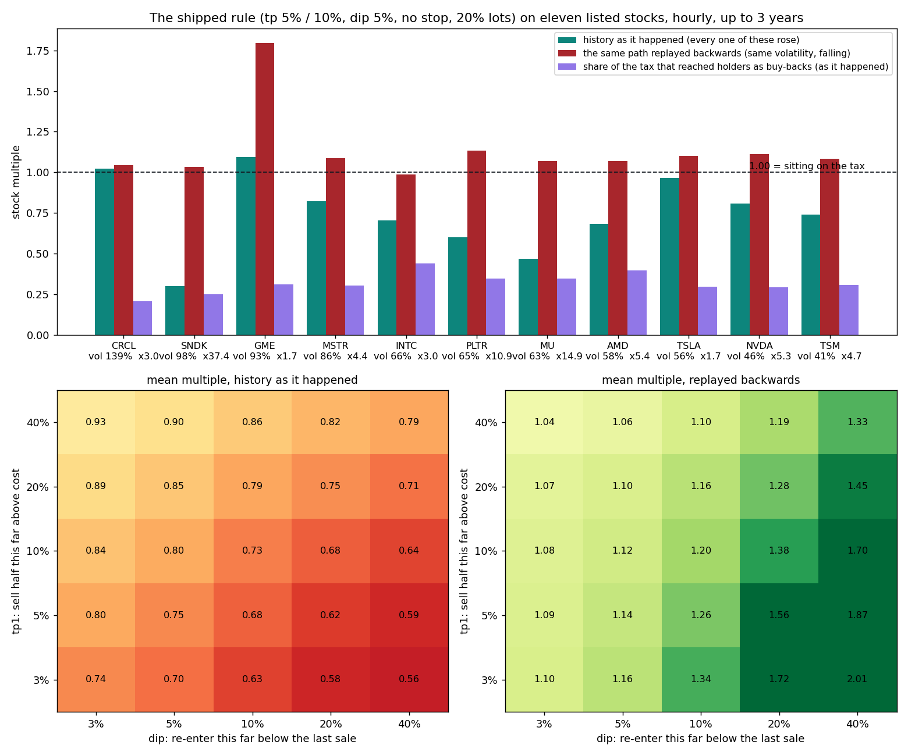
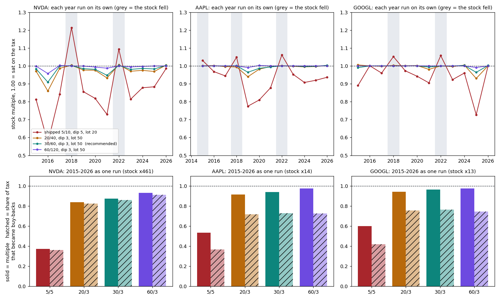
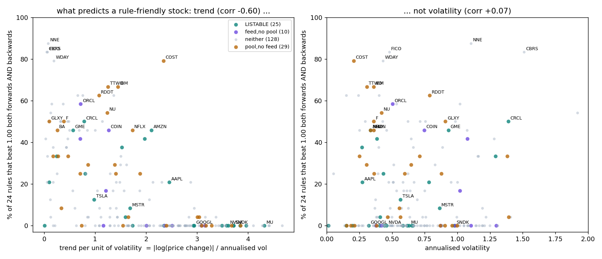

> Historical source record from `keyuyuan/hedgefund` at `48a41e2d53c8d24505e3313ae01a01c153b9e721`; see [archive scope](../../README.md). Dates, fee settings, permissions and validation results describe the original reviewed versions, not the current organization release.

# Rule backtest: eleven listed stocks, hourly, up to three years

`tools/rule_backtest.py` replays `HedgeFunTreasuryBase` (book / takeProfit / buyDip / stopLoss) over hourly closes and
scores it the way the contract does: stock held + stock spent on buy-backs + reserve at the last price, over stock
received. **1.00 is "sat on the tax".** The model's assumptions are in the tool's docstring; the important one is that
every ticker here ROSE (1.7x to 37x), so each path is also replayed backwards: same volatility, opposite drift.

What it says:

- **The rule is mean-reverting, so trend is what hurts it and volatility is what pays it.** On a stock that runs, it
  sells early and sits in USDG: the shipped 5/5 rule ends at 0.30 on SNDK (37x), 0.47 on MU (15x), 0.81 on NVDA (5x).
  On the same paths backwards every ticker but INTC finishes above 1.00.
- **Pick on volatility PER UNIT OF TREND, not on volatility.** GME (93% vol, 1.7x), CRCL (139%, 3.0x) and TSLA (56%,
  1.7x) are the only three at or near 1.00 in BOTH directions with the shipped rule: 1.09 / 1.80, 1.02 / 1.04,
  0.97 / 1.10. SNDK is as volatile as GME and is the worst row in the table.
- **tp1 and dip pull opposite ways and the direction decides which is right.** Wide tp1 + tight dip loses least in a
  trend (0.93); tight tp1 + wide dip earns most in a decline (2.01). Nothing in the grid wins both on average. 5/5 is a
  middling choice in both, which is an argument for it as a default and against reading much into it.
- **A stop helps only if the stock keeps falling** (mean 1.30 -> 1.77 backwards, 0.75 -> 0.64 forwards).
- **Below 1.00 is not "holders lost".** Sitting on the tax buys back nothing. The shipped rule turned 20-44% of all tax
  received into buy-backs on every ticker, including the ones where the multiple is 0.5. The multiple measures the
  treasury against holding the stock; the buy-back share is what reached the token.

## The deep pools: NVDA, AAPL, GOOGL

These are the first listings, and all three are trend stocks, which is what the rule is worst at. So a finer grid
(252 rules) was replayed on daily closes from 2015, **each calendar year on its own** -- twelve windows a ticker,
including 2018 and 2022 when all three fell -- plus the whole span as one run, plus three years of hourly bars forwards
and backwards. A rule is ranked by its WORST window, not its best.

| rule (tp1 / tp2, dip, stop, lot) | worst year N / A / G | 2015-26 as one run N / A / G | share of tax that became buy-backs, one run |
|---|---|---|---|
| shipped: 5 / 10, 5, none, 20% | 0.57 / 0.78 / 0.73 | 0.37 / 0.54 / 0.60 | 36% / 37% / 42% |
| 20 / 40, 3, none, 50% | 0.86 / 0.94 / 0.93 | 0.84 / 0.92 / 0.94 | 82% / 72% / 76% |
| **30 / 60, 3, none, 50%** | **0.91 / 0.97 / 0.96** | **0.88 / 0.94 / 0.96** | **86% / 73% / 76%** |
| 60 / 120, 3, none, 50% | 0.96 / 0.99 / 0.99 | 0.93 / 0.98 / 0.98 | 91% / 73% / 75% |

- **On a stock that trends, a wide take-profit is better on BOTH counts.** It gives away less stock (0.88-0.96 against
  0.37-0.60) and it buys back MORE, because what a sale sends to the buy-back is the profit share of the lot, and a lot
  sold at +30% carries about five times the profit share of one sold at +5%. The shipped 5% rule is the worst row on every
  ticker in every up year.
- **The optimiser's own answer is "barely trade"**: ranked purely by worst window the winner is tp 60%, which in a
  typical single year never fires at all (median 0 sales on AAPL and GOOGL). That is a rule that cannot lose because it
  does nothing. 30 / 60 is the widest rule that still trades every year on all three -- a judgment, not an optimum.
- **dip 3%, no stop, 50% lots** are consistent across every window: tighter re-entry and bigger lots get the USDG back
  into a rising stock sooner; a stop sells the dips these three have always recovered from (it lowers the one-run
  multiple from 0.55 to 0.39 on average).
- **The 5% rule's only wins are the years the stock fell** (2018, 2022: 1.05-1.21). A creator who believes in a
  sideways or falling tape should still pick it; nobody should pick it for NVDA on the record of the last decade.
- A 3% dip is close to the constructor's floor -- twice (maxSlippage + pool fee): 2.1% on these three pools' 0.05% tier,
  2.6% at 0.30%, 4% at 1%. `test_fork_deepPoolRule_isAcceptedAndTrades` launches exactly this rule against the live
  NVDA pool and walks a sale and a dip through it.

Daily bars are coarser than the hourly ones above: a trigger touched and lost inside a day is missed, which understates
how often a TIGHT rule trades and barely touches a wide one. `deep-pools.csv` has all 252 rules.

## The first batch: CRCL, USAR, GME, AMZN, META

Chosen from the listable stocks by the score above. Each rule is the centre of the most robust NEIGHBOURHOOD in a 336-rule
grid -- ranked by its worst window (hourly forwards, backwards, first half, second half, and every calendar year of daily
bars since 2015 where the stock has them), averaged with the rules one grid step away, so no pick is a lone peak.

| token | tp1 / tp2 | dip | stop | lot | worst window | median | as it happened / backwards | gate (deviation / slippage) |
|---|---|---|---|---|---|---|---|---|
| CRCL | 20% / 40% | 20% | none | 20% | 1.03 | 1.06 | 1.08 / 1.76 | 0.5% / 1% |
| USAR | 30% / 60% | 15% | none | 20% | 1.05 | 1.12 | 1.12 / 1.38 | 0.5% / 1% |
| GME (0.05% pool) | 30% / 60% | 8% | none | 50% | 0.95 | 1.01 | 1.00 / 1.33 | 0.5% / 1% |
| AMZN | 30% / 60% | 3% | none | 50% | 0.98 | 1.00 | 1.01 / 1.00 | 0.5% / 1% |
| META | 30% / 60% | 3% | none | 50% | 0.99 | 1.00 | 1.00 / 1.00 | 0.5% / 1% |

- **Two shapes.** The violent, range-bound pair (CRCL, USAR) wants a DEEP re-entry and small lots: their dips are 15-20%, and
  a 3% dip spends the reserve long before the bottom. The large caps want the opposite -- sell rarely, get back in at once,
  in size -- because what costs them is being out of a stock that keeps rising.
- **No stop on any of the five.** It lowered the worst window on every one (GME: 0.73 -> 0.38 averaged over the grid).
- **AMZN and META are honest about what they are**: about 1.00 everywhere. The rule neither earns nor gives away stock on
  them; what holders get is the buy-back (3-5% of the tax in a typical year). CRCL and USAR are where the rule earns.
- **CRCL and USAR have 15 and 36 months of history.** Their numbers are the least certain in the table.
- **For GME the pool matters more than the rule.** Its deepest pool ($976k) is the 1% tier, and nobody arbitrages inside
  a 1% fee: over 14 days it sat a median 56 bps from Chainlink (p90 96, max 122) against 15-17 on the 0.30% pools, so
  the shipped 0.5% gate was open 42% of the cash session -- a treasury asleep half the day. GME also has a 0.05% V3 pool:
  an eighth the size ($120k), ring 1860, median 15 bps from the feed, gate open 96%. A listing names one pool, so GME is
  listed on that one; every swap is cheaper there too (0.05% against 1%). The price of it is depth, which a first batch
  of small treasuries can afford and a large one could not. (V4 has hookless GME pools at 0.05% and 0.10% -- initialized
  and empty; the only V4 liquidity is again at 1%, about $5k per 1%.) The general lesson for listing: **check the basis
  of the pool you list, not just its depth** -- `tools/band_backtest.py sample` + `report` does it in ten minutes.
- `test/FirstBatchFork.t.sol` lists, launches and books all five against the live chain with exactly these numbers, and
  checks each pool's fee tier, pair and ring against what the backtest assumed.

## Every stock token in the registry (193 of 194), two to three years of hourly bars

24 rules each (tp1 5/10/20/30%, dip 5/10/20%, stop none/15%, 50% lots), forwards and backwards, each at its own
pool's fee tier (0.30% assumed where there is no pool). The score is the share of those 24 rules that finish above
1.00 in BOTH directions -- a stock where most rules win is one where the creator's exact choice matters least.

- **It is trend, not volatility.** Across 193 stocks the score correlates -0.60 with trend-per-unit-of-volatility and
  +0.07 with volatility itself. Below 0.5 of trend/vol the median stock has 42% of rules winning both ways; above 2.0,
  none. "Meme" is a fair proxy only because range-bound names are often memes; SNDK, QBTS, RKLB and AXTI are memes too
  and are the bottom of the table.
- **This window was a bull market and the table says so**: the median stock has 4% of rules winning both ways, and only
  13% of stocks reach one rule in two. Forwards, the shipped 5/5 rule's median is 0.90; backwards, 1.02.
- **Listable today** (feed + pool + ring), best first: CRCL 50%, AMZN 46%, GME 46%, META 42%, MSFT 38%, USAR 33%, BABA
  25%, then SPCX / AAPL 21%, TSLA 13%, MSTR 8%. NVDA, GOOGL, QQQ, SPY, MU, AMD, PLTR, INTC, TSM, DELL, SLV, SNDK: 0 of
  24 -- on those only a wide take-profit avoids giving stock away (see the deep-pool section).
- **The friendliest names mostly cannot be listed yet.** Stocks with a real pool and NO Chainlink feed have the best
  median (25%, against 0% for every other group): COST 79%, IBM / TTWO 67%, RDDT 63%, NU 54%, GLXY / F 50%.
  A pool-priced treasury is what would unlock them; it does not exist.

`all-stocks.csv` has every ticker: status, pool depth, fee tier, volatility, trend, the score, the shipped rule both
ways and the best rule. SATS has no price history upstream; SMR is dropped for a bad print in its series.

### The stop is a bet on the path, not a safety feature

On CRDO, RBLX, ALAB and RDDT with stops of 0 / 10 / 15 / 25%: RBLX went to 3.3x and came back to 1.1x, and a 10% stop
moves it from 27% of rules winning both ways to 95% (shipped shape: 0.90 / 0.92 -> 1.10 / 1.28). CRDO and ALAB ran 5.9x,
and any stop takes them from 0.82 to 0.56: every pullback stops the lot out and the run is missed. A stop earns its keep
on a stock that has round-tripped a large move and costs on one that only ever recovered. It stays `stopBps = 0` by
default and the creator's to set -- and on chain it fires less often than here, since `stopLoss` waits for a fresh
Chainlink print.

`eleven-stocks.csv` has every (ticker, tp1, dip, stop, lot) in both directions. The best cell per ticker is an
in-sample maximum over 100 combinations and should be read as such.

## How this sits next to the listing decision

This measures whether the *rule* does well on a stock's price path. It says nothing about whether the stock can be
**listed** — a Chainlink push feed, a live `<stock>/USDG` V3 pool, depth a lot does not move — which is
[`LISTING_CANDIDATES.md`](../../LISTING_CANDIDATES.md). The two lists barely overlap, and that is worth seeing
plainly: the first wave decided on 2026-09-20 is NVDA, AAPL and GOOGL, chosen for pool depth, and NVDA is a 0.81
here; the three names the rule likes in both directions — GME, CRCL, TSLA — sit in pools an attacker can walk 30% for
$1.4–1.6M, which is why they were left out.

That exclusion was about closure trading. A treasury born with `bandBpsPerHour = 0` — the only kind a stock with
`bandCeiling = 0` can have — never prices itself off the pool, so the pin that depth protects against does not reach
it. Whether a thin-pool, Chainlink-only listing is acceptable is therefore a narrower question than it was when the
first wave was chosen: what remains is execution price — a sale fills only as far as `maxSlippageBps` under the oracle
and keeps the rest, so on a thin pool a lot leaves slowly and near the limit unless the listing's `sellChunkUsdg` is
sized to the pool's depth — and that a listing is forever while depth is not. It is a decision for whoever signs the listing, not a conclusion of this
backtest.
