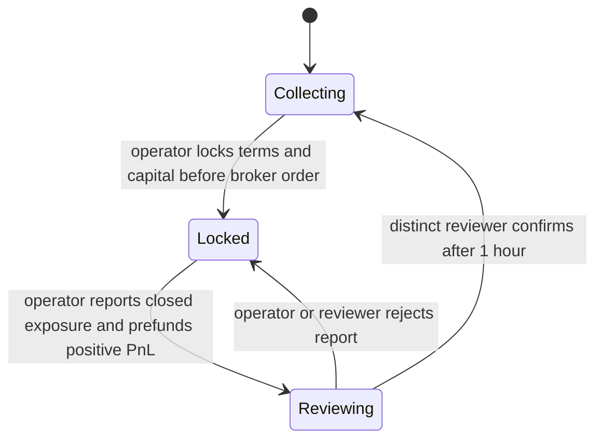

# BrokerEpochVault: weekly NVDA / USDG vault

Status: local experimental implementation and UI; not audited, deployed, connected to a broker, or listed on DefiLlama. Existing `EarnVault` / `PhysicalCallDesk` remain separate. Their chain-native physical option settlement is not suitable for an independently funded broker account.

## Product and accounting

Users deposit an eligible 18-decimal NVDA token. The vault issues non-transferable 18-decimal `bNVDA` shares when a queued deposit activates. Shares represent the remaining active NVDA, while positive settled option PnL is credited separately in 6-decimal USDG. No performance fee or automatic reinvestment is implemented. Share approvals cannot enable transfers.

The operator independently supplies broker margin, executes the committed OTM call, closes all obligations including any assigned equity, and reports net option PnL after execution/assignment costs. The vault does not recognize a broker balance as cash received. It does not send users' NVDA to IBKR, run orders, dynamically hedge, mint USDG, or prove the broker account's solvency. On-chain stock is not automatically recognized by a broker as covered-call collateral; the broker account must independently have the necessary permissions and resources. Do not assume Alpaca can execute an uncovered call.

For **positive** net PnL, the operator transfers the exact USDG amount into the vault when proposing settlement. It remains provisional and unclaimable until a different reviewer confirms after at least one hour. The reward index allocates it only to the old cohort. Existing rewards remain separately claimable through subsequent epochs and losses; integer rounding dust stays in reserve.

For **negative** net PnL, settlement transfers NVDA from the active cohort to a fixed settlement recipient. Raw stock debit is `ceil(lossUSDG_6 * 1e30 / freshPrice_18)`. It reimburses the operator in stock at the confirmation-time price, not at the option expiry price, and does not deliver dollars to the broker. The operator needs liquidity before reimbursement. Share backing decreases; queued deposits and previously reserved withdrawals/rewards cannot fund this loss. The debit is capped at the actual reported covered stock and must be strictly less than active backing. Larger losses require a corrected, independently reviewed report with excess borne by the operator; full insolvency resolution is not implemented. The vault itself cannot force the operator to fund or report honestly.

The existing `PriceOracle.price()` enforces market-open and freshness rules. A loss may therefore remain locked over the weekend until a valid price is available. A report may be rejected and resubmitted; rejection returns only its prefunded USDG, not user rewards.

## State transitions and user exits



1. `requestDeposit(amount)` adds cancellable pending stock. It never increases current locked capacity. During Collecting, anyone may call `processQueues()`; `lockEpoch()` also processes queues first.
2. Queue processing reserves outstanding withdrawals before activating new deposits. New shares use the post-settlement stock/share ratio. If all old shares exit, the final exit receives the residual stock rounding dust and the new cohort starts 1:1.
3. `lockEpoch(coveredStock, strike, minPremium, expiry, instructionHash)` records OTM terms, token multiplier, stock/share snapshots and coverage ceiling. Expiry must be 12 hours to 9 days away. The operator must wait for this transaction's finality before submitting broker orders.
4. `recordExecution(executionHash, filledStock, grossPremium)` records one consolidated execution. Filled quantity cannot exceed locked coverage; minimum premium scales with the fill. The executor must cancel unfilled remainders and reconcile company actions. The contract cannot verify broker share/option multipliers; quantities are token units, and strike is USDG per token.
5. While Locked or Reviewing, `requestRedeem(shares)` only queues an exit. Shares retain all current PnL. Neither reaching expiry nor waiting any number of days makes principal claimable. Pending deposits can still be cancelled. Requests can also be cancelled.
6. `proposeSettlement(netPnl, closedAt, evidenceHash)` requires expiry for a recorded trade. A no-trade abort can occur earlier only with no recorded fill, zero PnL, and the same separate-reviewer process. An unrecorded broker trade cannot be detected on-chain, so the reviewer must independently verify absence of exposure.
7. `confirmSettlement(digest)` confirms exactly the pending report after the review delay, applies the old cohort's PnL, then processes withdrawals and new deposits. Confirmation is atomic. Positive PnL cannot exceed reported gross premium.
8. `claimStock(to)` transfers reserved withdrawals/refunds. `claimRewards(to)` transfers confirmed earnings. No `withdraw` action can touch locked active capital. A failed token transfer preserves the claim, and an eligible alternative recipient can be used subject to issuer transfer rules.

Reports commit to chain ID, vault, epoch, nonce, trade terms, execution, PnL, close time and evidence hash. A rejected report cannot be replayed. These are attestations, not cryptographic proofs of broker execution. Evidence should contain reconciled fills, costs, cancelled orders, assignments, zero residual options/assigned-stock exposure, and settled cash. Keep private statements off public storage; publish an appropriately redacted report and define how its hash is reproduced.

## Roles, bounds and operational limits

Constructor: owner, stock, USDG, existing compatible oracle, operator, reviewer, settlement recipient. The two attestors must be different addresses. Use independently controlled signers; the contract cannot detect two addresses controlled by one person.

- Owner can change deposit eligibility and pause new deposits/opening. It cannot sweep backing or bypass settlement. Pending refunds, settlement, redemption requests and claims remain available when paused or eligibility is revoked, subject to token transfer restrictions.
- Operator/reviewer/recipient are immutable. There is no administrative timed unlock, key rotation, upgrade hook or emergency liquidation. Unavailable signers, frozen tokens, missing funding or inconsistent reports can lock capital indefinitely. Production recovery needs an explicit design, not an unsafe automatic unlock.
- Each pending deposit and redemption queue holds at most 64 distinct addresses between processing rounds. Cancellation retains its queue slot until processing. This bounded prototype is not a large-scale queue design; eligibility and cohort sizes must respect it.
- Minimum deposit: 0.000001 NVDA; aggregate managed stock cap: 1e30 raw; share supply cap: 1e36 raw. The latter limits reward precision loss. Exact-transfer checks reject transfer-tax/rebasing behavior during transfers. Supported token assumptions must be validated with the actual issuer contracts.
- No unbounded per-user distribution loop. USDG rewards use an index with per-account fractional carry. There is no admin recovery of donations/dust.

## Frontend and integration

`frontend/broker-vault` is a dependency-free frontend inspired by [Paradex's vault detail page](https://app.paradex.trade/vaults/dime-multistrategy-vtf-gigavtf). It provides deposit/redemption/claim flows, account holdings, epoch progress, positive/negative history and a transparent custody explanation. The default is an explicitly labelled in-memory demo. Its settlement control accelerates review for demonstration only.

`?mode=live` uses an EIP-1193 browser wallet and generated ABI/selectors, checks chain/address identity, and submits exact integer amounts. All deployment addresses default to null and real transactions are unavailable. The client supports user actions, not broker/operator automation. It requires a connected browser wallet even for live reads; it has no public RPC or backend credentials. It does not persist demo state. Live historical return percentages stay empty without historical opening valuations rather than using current prices.

After audited deployment and token/oracle validation, fill the explicit manifest, refresh the ABI/selectors and verify against that deployment. No keys belong in the frontend. A production executor/indexer, operational reconciliation, supported broker account, signer recovery policy and actual issuer transfer support remain integration work. Testnet demonstrations cannot establish mainnet NVDA composability.

The DefiLlama draft in `integrations/defillama` uses managed token balances only. On-chain gross TVL is not NAV; open broker liabilities are not subtracted. Submission needs verified production assets, supported prices and DefiLlama's review. No listing, APY or trading-volume claim is made by this implementation.

## Validation

Run from `contractV2`:

```sh
../.local/bin/forge test --match-path test/BrokerEpochVault.t.sol --offline
node --test integrations/defillama/adapter.test.cjs
```

Run from `frontend/broker-vault`:

```sh
npm test
npm run dev
```

Tests cover cohort isolation, loss allocation, prefunding, replay/delay/role controls, expiry lock, claim failure recovery, pause/eligibility exits, donations, and cross-epoch reward accounting. These tests are not a security audit or broker integration test.
