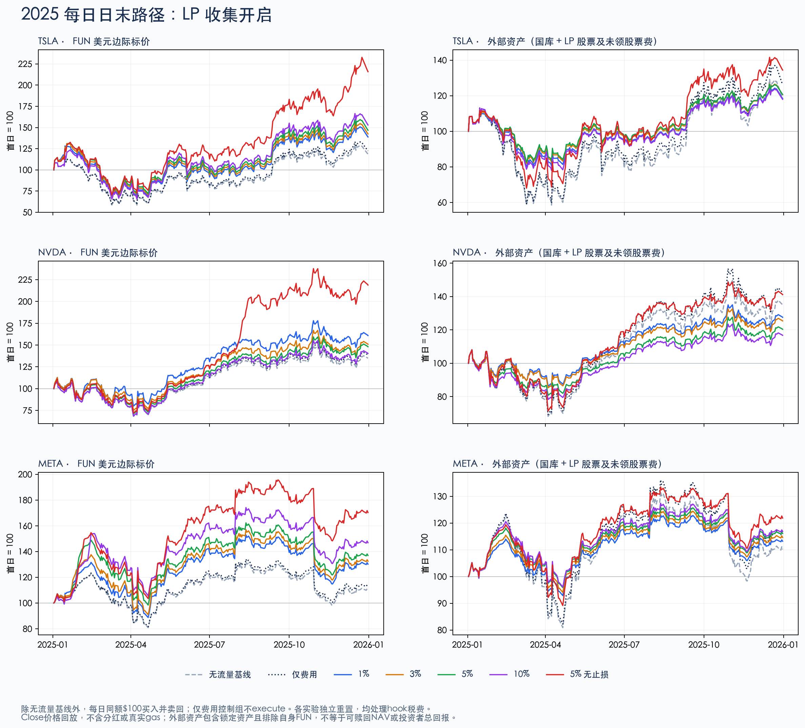
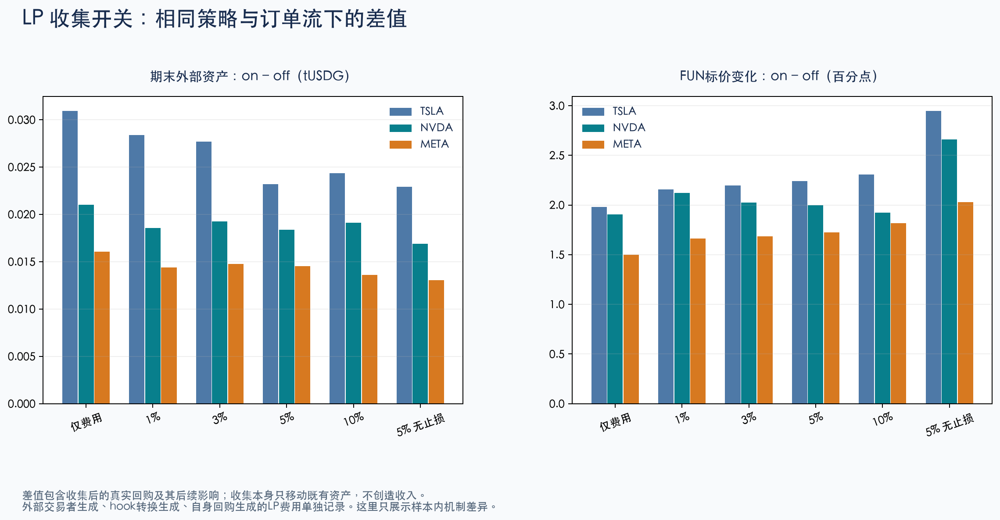

# 2025 日线：股票、策略参数与 LP 手续费回购

本轮使用 2025-01-02 至 2025-12-31 的日收盘价，筛选 TSLA、NVDA、META，运行 **39 组实际合约 fork 测试、9,750 个日末快照，39/39 通过**。测试包含真实模拟订单、V2 买卖税处理、LP 手续费领取、股票策略、回购及销毁；没有向公共链广播。

结论是：参数和 ticker 都影响结果；手续费领取回购提高了本情景的 FUN 边际标价，但几乎不改变包含自家 LP 股票资产的总外部资产。关闭止损在这一个年份的币价终值最高，却承受更大的国库资产回撤。不能把它称作已经验证的最优策略。

## 股票怎么选

从当前 creator Factory 启用的全部 8 股出发，用整年 2025 数据计算：每日 `Close × Volume` 中位数至少 20 亿美元，日对数收益样本波动率按 `sqrt(252)` 年化至少 30%；合格股票按波动率降序取前 3，不使用期末收益排名。

| 股票 | 日成交额代理中位数 | 年化日波动率 | 结果 |
|---|---:|---:|---|
| TSLA | $32.15B | 63.02% | 入选 |
| NVDA | $30.23B | 49.84% | 入选 |
| META | $8.88B | 37.78% | 入选 |
| AMZN | $8.60B | 34.33% | 合格，波动排名第 4 |
| GOOGL | $6.55B | 32.29% | 合格，波动排名第 5 |
| AAPL | $11.10B | 32.14% | 合格，波动排名第 6 |
| GME | $0.17B | 58.11% | 成交额不足 |
| MSFT | $9.30B | 24.08% | 波动不足 |

这是**用全年信息作的样本内筛选**，不是 2025 年初就已知的候选组合。股市成交额只用于股票筛选，不能当作链上深度。

另在测试网固定块 128288416 读取完整 listing、池状态和上市事件，验证启用集合确为这 8 股，并计算 48 个含池费的双向深度估计。回放使用较早的固定块 128172359，另外完成 **312 次真实 swap 深度探针**，覆盖每组 $100、$1,000、$2,000、$10,000 双向交易。各探针均完整成交，剔除池费后的平均冲击不超过 10 bps。这是测试网给定池状态的深度，不是历史美股订单簿或主网深度。

测试网 TSLA、META 的 V3 池费为 0.30%，NVDA 为 0.05%；跨 ticker 的结果包含该实际费用差异，没有把所有池人为改成相同费率。

## 同等条件与费用流程

每个样本从毕业完成时开始：国库约 $10,000 股票，LP 股票侧约 $10,000，LP 中还有本币 FUN。通过仅在本地调整 listing 起始价，使不同股票的初始美元资本相同。币排序固定，领取开关的配对样本使用相同 nonce、地址和初始经济状态。

外部测试钱包仅在开始时获得 100,000 tUSDG。除首日外，每个交易日用 100 tUSDG 经真实 V3/V4 路由买 FUN，随后卖回刚买到的净 FUN。每组有 249 次往返，累计买入预算 $24,900，未每日补钱。**这是手续费负载实验，不是历史 FUN 成交量，也不是用户需求预测或建议刷量。** 交易钱包的费用、滑点损失单独统计。

每日顺序固定为：

1. 已知当日股票 Close 后，在本地移动 V3 和 feed，等待 601 秒。
2. 执行上述外部往返订单。
3. `hook.sweep`，再由本地模拟 owner 调用 `convertFees` 把买税 FUN 转成股票，随后再次 `sweep`。转换有非零最低到账、deadline 和既有价格移动限制；没有放宽合约保护。
4. 仅在 harvest-on 组调用 `vault.collectFees`；股票侧手续费进入本币 `buybackStock`，FUN 侧手续费直接销毁。
5. 策略组至多尝试一次 `execute`；所有有流量组至多尝试一次 `buyback`。
6. 核对库存、外部钱包、费用来源、总供给、未领费用与 NAV。

LP 费分为外部订单、税费转换、回购自付三种来源；不会把回购自己支付给自己的 LP 费当成新增外部收入。V2 买税 FUN 不是 LP 的 FUN 手续费：前者需要 owner 转换且会形成卖盘，后者领取后直接销毁。初始曲线手续费仍保留未领取，单列余额；它不属于本轮毕业后费用处理预算。

策略参数为下表。所有组 lot=20%、tax=3%、creator 分成参数=10%；TP2 为 TP1 的两倍。百分比阈值作用于股票的批次成本/策略参考价格，不作用于 FUN 币价。

| 组 | TP1 | TP2 | dip | stop |
|---|---:|---:|---:|---:|
| 1% | 1% | 2% | 1% | 1% |
| 3% | 3% | 6% | 3% | 3% |
| 5% | 5% | 10% | 5% | 5% |
| 10% | 10% | 20% | 10% | 10% |
| 5% 无止损 | 5% | 10% | 5% | 关闭 |

每股 5 个策略 × 领取开关，加无股票策略但相同订单/税费处理的领取开关两组，以及零流量零策略基线：每股 13 组，共 39 组。调整的是成套参数，不是逐个参数的独立因果效应或全面参数优化。

## 币价结果

表中均为首个 Close 至最后一个 Close 的 **FUN 美元边际标价变化**。有流量的各行均开启 LP 领取。这里的价格不是持币者全量退出可兑现的收益；每年首日收盘起算也不同于以前一年最后收盘为基准的标准年度涨跌。

| 组 | TSLA | NVDA | META |
|---|---:|---:|---:|
| 零流量、零策略（等于股票价格变化） | +18.57% | +34.84% | +10.15% |
| 相同流量，仅处理费用、不执行股票策略 | +22.49% | +38.61% | +13.13% |
| 1% 策略 | +38.84% | +60.91% | +30.20% |
| 3% 策略 | +42.44% | +50.94% | +32.49% |
| 5% 策略 | +46.78% | +48.07% | +36.93% |
| 10% 策略 | +52.98% | +40.44% | +46.87% |
| 5% 无止损 | +115.90% | +118.91% | +70.31% |

仅比较开启止损的四档时，TSLA/META 的 10% 档币价终值较高，NVDA 的 1% 档较高；**不存在对三只股票都最好的同一档阈值**。收益路径、成本和触发顺序共同影响结果，不能据此宣布某 ticker 或参数未来更赚钱。

关闭止损虽然在本样本的币价终值最高，包含国库与 LP 股票资产的最大日末回撤更大：

| 股票 | 5% 策略外部资产最大回撤 | 5% 无止损外部资产最大回撤 |
|---|---:|---:|
| TSLA | 26.04% | 39.18% |
| NVDA | 25.24% | 33.94% |
| META | 18.83% | 25.34% |

国库保护并不能等比例保护 FUN：TSLA 5% 组的国库最大日末回撤约 6.08%，FUN 标价最大日末回撤仍约 47.10%。

资产表现也未随币价同比改善。例如 NVDA 5% 组的 FUN 标价上涨 48.07%，但总外部资产只增加 20.37%，低于同等流量、只处理费用组的 42.21%。回购将国库股票转入 LP 并销毁 FUN，币价、国库余额和总外部资产因此需要分别评估。



## LP 手续费回购到底增加了什么

18 对相同股票/参数/订单意图的领取开关对比中，开启领取使全年 FUN 标价变化提高 **1.50～2.95 个百分点**；年末总外部资产只相差 **+$0.013047～+$0.030929**。

以 5% 参数为例：

| 股票 | LP 股票侧已领取费用，按发生日标价 | 开启领取后 FUN 涨幅增加 | 年末总外部资产增加 |
|---|---:|---:|---:|
| TSLA | $77.82 | 2.24 个百分点 | $0.023202 |
| NVDA | $76.10 | 2.00 个百分点 | $0.018364 |
| META | $78.17 | 1.72 个百分点 | $0.014507 |

原因是领取把原已属于 LP 的费用转入国库；回购又把股票送入自家 LP，并买入销毁 FUN。**资产位置和 FUN 供给改变，不等于凭空新增同额的外部资产。** 上表已领取金额还包含转换/回购产生的费用，不能再加到 NAV 上当额外利润。

反过来，外部钱包支付的手续费确实是系统资金来源。本实验的各有流量样本，钱包全年实际损耗约 $1,628～$1,746；因此有流量组和零流量基线的差异不能全部归因于股票策略。相同流量的费用基准是更合适的对照。

“总外部资产”定义为国库/金库/本币 LP 内真实股票及未领股票手续费按 Close 估值，再加现金；不把自发行 FUN 再计为资产，不含初始未领取曲线费用。这包含永久锁定 LP 的股票资产，**不是可赎回 NAV，也不是币价承诺**。国库单独 NAV、FUN 标价、流量钱包损耗及两侧烧币分别报告。



## 假设与验证边界

- 真实的是 2025 股票 Close、当前部署核心和实际执行的 swap/费用路径。历史价格来自 Yahoo，所有 8 股原始响应、2,000 行输入及哈希已保留。
- NVDA/META 都有分红；使用已经拆股调整的 Close，不把 Adj Close 当可交易价格。模型没有分红支付或再投资，是价格路径实验。
- 股票 V3 仓位在本地扩成全范围，保持各自原 active liquidity 并逐日断言。扩宽需要额外测试库存，不能称同资本或历史深度重建。
- 市场日历模拟开市；日期间隔保留，但没有重建真实收盘后可交易性、盘中高低价、提前收市或 keeper 延迟。
- 每日只有一次策略/回购机会；新税费可形成新批次，占用后续动作机会。没有保证一天内所有到期动作全部执行。
- 手续费转换用本地 owner 调用。链上 LP 领取、策略和回购的 permissionless 特性，不代表转换无需管理员。
- gas 记录是含 harness 控制代码的估计，不是实际账单，未扣除美元 gas 费用。Foundry 的 `--gas-limit` 是年度测试函数的执行预算，不是链上单笔 gas limit。
- 筛选和参数比较均为样本内。所有外部 FUN 订单是预设费用负载，未模拟自然需求、套利者或竞品市场。

## 文件与复现

最终独立核验通过 99 类、1,779,681 次断言，覆盖全部 9,750 行原始及派生字段、39 组汇总、18 组 LP 开关配对、30 组策略/同流量控制比较。53 个 Python 工具测试通过。图表已视检；压缩日志重导出的 8 个核心证据文件与原导出逐字节一致。详见[运行清单](../deploy/equity-history-2025-2026-10-03/RUN_MANIFEST.json)及独立审查记录。

- [全部筛选数据](../data/equity-history-2025.json)、[筛选表](../data/equity-screening-2025.csv)、[链上深度快照](../data/equity-depth-snapshot.json)
- [39 组生成报告](../deploy/equity-history-2025-2026-10-03/GENERATED_REPORT.md)、[汇总结果](../deploy/equity-history-2025-2026-10-03/results.json)
- [全部参数图](../deploy/equity-history-2025-2026-10-03/charts/full-parameter-matrix.png)、[独立输入审查](../deploy/equity-history-2025-2026-10-03/independent-data-review.json)、[独立回放及导出审查](../deploy/equity-history-2025-2026-10-03/independent-review.json)
- [实际合约回放](../test/EquityHistoricalFeeReplayFork.t.sol)、[独立输入核验](../tools/verify_equity_history_data_independent.py)、[独立回放核验](../tools/verify_equity_history_replay_independent.py)
- [Long / StonkFun 机制对比](COMPETITOR_MECHANICS_2026-10-03.md)

```sh
# Python 3.11+；生成图表另需 Matplotlib。
python3 contractV2/tools/equity_history_data.py
mkdir -p artifacts/equity-fee-history-20261003
cd contractV2
EQUITY_FEE_REPLAY=true EQUITY_FORK_RPC=https://robinhood-testnet.drpc.org \
  ../.local/bin/forge test --offline --match-path test/EquityHistoricalFeeReplayFork.t.sol \
  --gas-limit 4000000000 --threads 4 -vv \
  > ../artifacts/equity-fee-history-20261003/forge.log 2>&1
cd ..
python3 contractV2/tools/equity_history_report.py
python3 contractV2/tools/verify_equity_history_data_independent.py
python3 contractV2/tools/verify_equity_history_replay_independent.py \
  --log artifacts/equity-fee-history-20261003/forge.log \
  --export-dir contractV2/deploy/equity-history-2025-2026-10-03
python3 -m unittest discover -s contractV2/tools/tests -p 'test_*.py'
```

回放需要能读取固定块历史状态的 archive RPC；只有本地 fork 发生价格、日历和权限模拟。本轮没有更改生产合约、ABI 或公共测试网行情。
