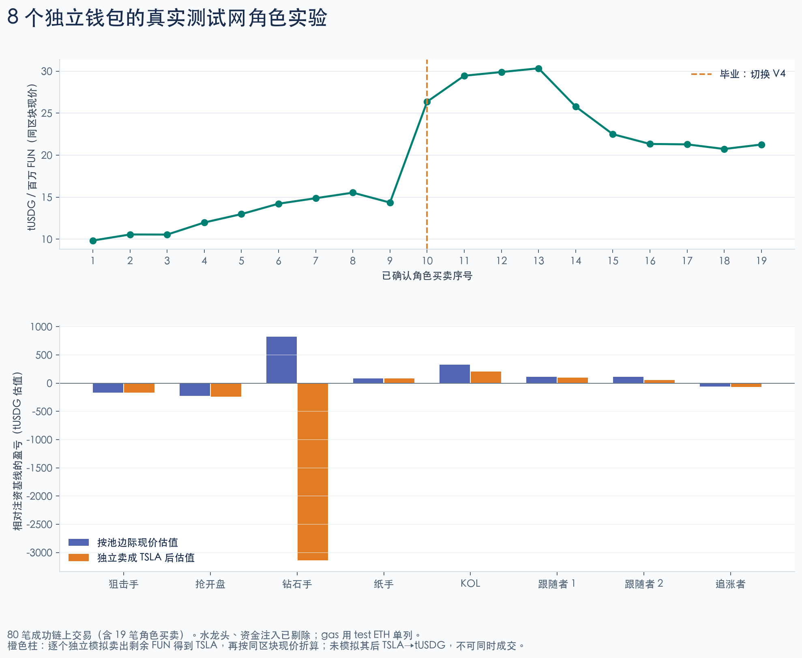
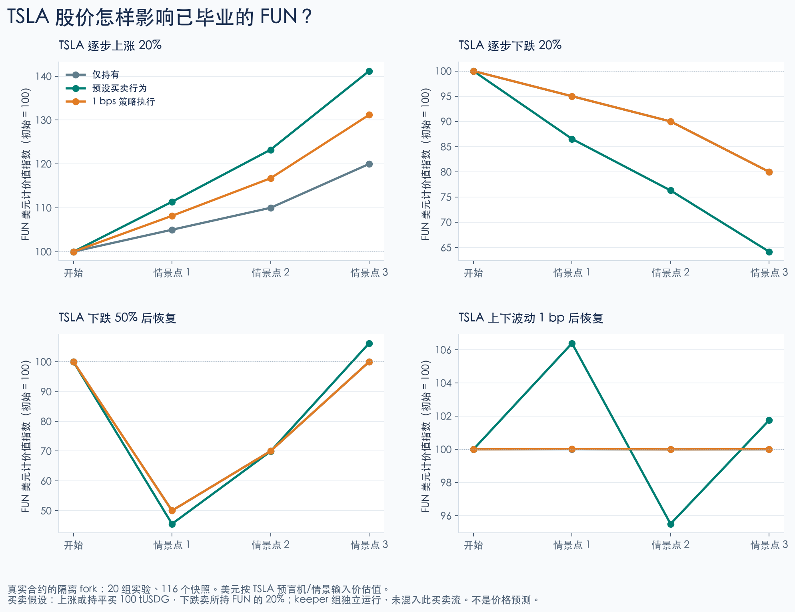
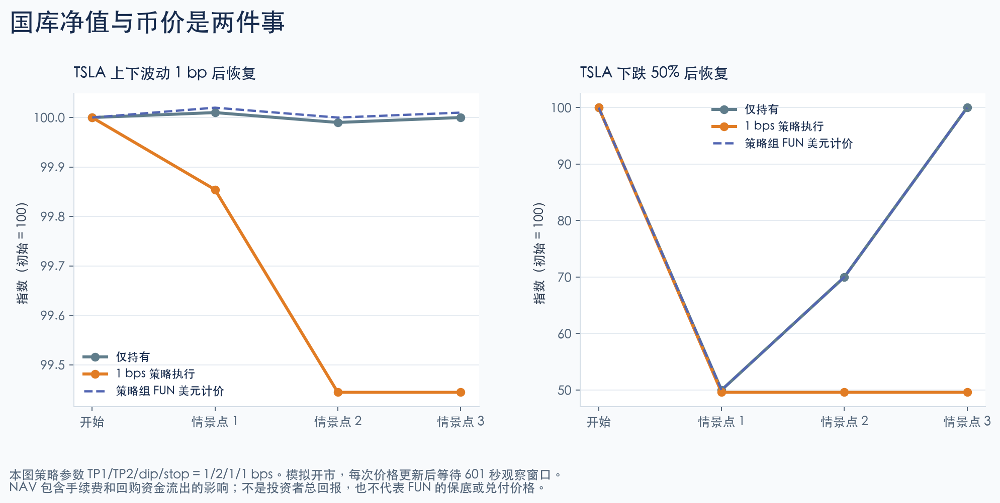

# 人格交易与 TSLA 价格路径实验

本次由三个 agent 分别设计角色计划、运行价格实验、独立审查资金与价格核算；主任务管理独立钱包并逐笔广播。公共测试网使用已验证的最新 creator 核心，价格路径使用同一核心的隔离 fork。模拟 KOL 仅为内部信号，不发布实际社交内容。

## 公共测试网已完成

**HFPERS2 / Strategy ID 3 已发射、毕业到 V4，并完成毕业后的买卖。** 8 个角色共执行 19 笔真实买卖、26 个计划动作；全部 80 笔链上交易成功、0 笔链上失败。80 笔包含资金准备、授权、清理及废弃首次发射的 3 笔成功交易，不等同于 80 笔角色买卖。

| 项目 | 地址或记录 |
|---|---|
| Token | `0x50be1af353c3a9d3732be8c03fe2b321812c6f3c` |
| Treasury | `0x4f283de372f7b4b7452f4737d83987e83ed07c82` |
| Curve | `0xb12fd0058ed769fbed328bd6cf75a5e9cd697ed4` |
| 发射交易 | [0x199cc20f…8730](https://explorer.testnet.chain.robinhood.com/tx/0x199cc20fccbe0e01dd8c60c8be0e5bcccf366bc0f141158f517ae7b69a808730) |
| 毕业交易 | [0xde15d345…aae2](https://explorer.testnet.chain.robinhood.com/tx/0xde15d345314f390fc6d74b8f5c05f21be31c6188c01cfe5cdfbad63a9fd4aae2) |
| 结果快照 | Block 128181690；完整 hash 见独立验收 JSON |

总 gas 为 **0.00027952274 test ETH**。分配给角色的 **0.00057 test ETH** 是钱包注资，不能全部记为 gas 消耗。各角色的路由授权已清零，router 无残留资产。此轮保留待结算费用以维持角色交易结束后的池价，没有执行 fee settlement；费用余额保存于 `journal.json` 的 `feesAtFinal`。

毕业时向 LP 和 treasury 分别分配约 **8.833333333333333332 / 8.833333333333333335 TSLA**，LP 配入约 1.2 亿 FUN，毕业烧毁约 4.8 亿 FUN。当天为周末，treasury stock 处于 unbooked 状态，策略需等待开市与预言机健康条件满足。

## 角色收益与退出冲击

狙击手在开盘后 **6 秒**成交，名义开盘费率 **95.80%**；抢开盘者在 **34 秒**成交，费率 **80.87%**。狙击手最终卖完，投入约 0.49665 TSLA，已实现亏损约 **94.65%**（gas 单列）。纸手分两次卖完，已实现盈利约 **0.224109 TSLA**。

| 角色 | 已实现收益（TSLA） | 现价估值收益（tUSDG） | 独立全量退出后估值收益（tUSDG） |
|---|---:|---:|---:|
| 狙击手 | −0.470073 | −168.41 | −168.41 |
| 抢开盘 | 0 | −223.95 | −237.55 |
| 钻石手 | 0 | +824.49 | **−3141.13** |
| 纸手 | +0.224109 | +80.30 | +80.30 |
| KOL | +0.345862 | +330.79 | +207.90 |
| 跟随者 1 | +0.182554 | +113.43 | +96.78 |
| 跟随者 2 | 0 | +113.40 | +56.50 |
| 后来追涨者 | −0.043226 | −56.98 | −64.84 |

已实现收益按实际买卖的加权平均成本计算。两列 tUSDG 收益以注资完成后的资产为基线，剔除水龙头注资，包含现金、TSLA 与剩余 FUN；gas 单列。末列将每个角色剩余 FUN 分别通过历史 `eth_call` 模拟卖成 TSLA，再按同区块 TSLA/tUSDG spot 估值，**没有实际卖出，也没有执行随后 TSLA → tUSDG 的兑换**，不包含该步的费用和滑点。不同人的退出报价不能假设可同时成交。

钻石手持有约 **2.734 亿 FUN**，因此现价乘持仓得到的账面盈利，明显高于浅池里全量卖出的结果。其 **−3141.13 tUSDG 是假设退出后的组合估值损益，并非已实现亏损**。前端应同时展示现价估值和指定数量的实际路由报价。



## 实验边界与参数

- 链：Robinhood testnet，46630；Factory `0x2363B102D37BBa1dc3f9aBEdC4d6121C8e90B9cF`，Trade router `0xEF6bE3C3A19F33C0F62beC3FFb37228e8c47F755`。
- 人格实验：8 个独立加密钱包，sniper、opening buyer、diamond hands、paper hands、KOL、2 followers、late FOMO。Creator 使用单独 owner 钱包；8 个角色均无开盘税豁免。
- 每个角色通过公开水龙头获得 15 test TSLA；两名需要 V3 路由的角色另领 tUSDG，实际只各交易 25 tUSDG。水龙头及 gas 注资不计入利润。
- 人格参数：TP1/TP2/dip/stop = 500/1000/500/500 bps，tax=300、creator=1000、lot=2000、sale=4000、opening window=180 秒。不修改 Factory 全局 defaults。
- 价格路径参数：1/2/1/1 bps，用于观察最新允许的参数下界，不是策略建议。分别测试 Active 和 Graduated；周末保护另测，策略实验明确模拟开市。
- 交易均顺序确认，并不证明 mempool 优先级、同区块抢跑或真实 MEV 获利。每笔实际开盘税以 receipt 的区块时间计算。

## 开盘预演发现与修正

第一次成功发射 HFPERSONA（ID 2）后，狙击手第一笔 0.49665 TSLA 的只读报价因整数舍入产生 **1 wei stock 退款**。`allowPartialFill=false` 导致 `PartialFill`，没有广播失败交易。发现时原定狙击时限已过，保留该未成交发射及全部交易回执，使用新 symbol **HFPERS2 / ID 3**、nonce **2026100304** 重新开始。

所有买入明确允许 stock 退款，同时保留绝对 `minFinalOut`、`minStockReceived` 和 deadline。新增回归用例精确复算该 1 wei 退款；角色计划共有 7 项测试通过，包括 100 个 seed 的资金与毕业预算。第一次发射的费用和 gas 保留在总支出中，不隐藏为“零成本重试”。

该发现属于执行计划对合约退款规则的适配问题，未修改合约源码。前端不能对所有 Active 买入强制 `allowPartialFill=false`，也不能为绕过错误把最低到账改为零。

## TSLA 价格实验结果

固定 fork 块 **128172359**，真实已部署 Factory/Router、真实 V3/V4 合约；6 项测试通过、20 组实验、116 个状态快照。每条路径从相同快照出发。TSLA 的四条输入路径分别为：

| 路径 | 输入价格（tUSDG/TSLA） |
|---|---|
| 上涨 20% | 358 → 375.9 → 393.8 → 429.6 |
| 下跌 20% | 358 → 340.1 → 322.2 → 286.4 |
| 暴跌并恢复 | 358 → 179 → 250.6 → 358 |
| 1 bp 来回噪声 | 358 → 358.0358 → 357.9642 → 358 |

每条路径分别运行被动持有、指定订单流、已毕业 keeper 策略。指定订单流在上涨或持平时买 100 tUSDG，下跌时卖当前 FUN 持仓的 20%；这是输入假设，不是对用户行为的预测。Keeper 组每个非初始点尝试一次 execute 和一次 buyback，不混入上述订单流。

| 已毕业情景 | 最终 FUN/TSLA 变化 | 最终 FUN 美元计价变化 |
|---|---:|---:|
| TSLA +20%，无 FUN 交易 | 0% | +20% |
| TSLA −20%，无 FUN 交易 | 0% | −20% |
| TSLA +20%，加指定买盘 | +17.6585% | +41.1902% |
| TSLA −20%，加指定卖盘 | −19.8009% | −35.8408% |
| TSLA +20%，执行 1 bps 策略 | +9.3261% | +31.1914% |



美元按 TSLA 预言机/情景输入价计价：`FUN/USDG = FUN/TSLA × TSLA/USDG`。原始结果额外给出同一时点的真实 V3 spot mark；两者最大偏差为 **0.435956 bps**，不混用口径。没有独立 FUN/USDG 交易场所，因此 TSLA 变化本身不会设定一个新的 FUN/TSLA 套利目标。

国库 NAV 与币价需要分开看：

- 在 1 bp 来回噪声路径中，1/2/1/1 bps 参数触发 2 次策略动作和 1 次回购，NAV 从 **3162.333333** 降到 **3144.758892**，约 **−0.55574285%**，烧毁约 **5921.443698 FUN**。这说明该参数和路径下的反复执行成本，不能泛化为所有路径必然亏损。
- 暴跌 50% 后恢复原价时，策略在低价止损，此后等待更低 dip，NAV 最终 **1568.506859**，较初始 **−50.40033122%**；同时 FUN/TSLA 未变，FUN 的美元计价回到起点。国库止损不等于持币者获得同样的保护或损益。
- NAV 包括交易成本和回购资金流出，不能直接当成投资者总回报；也不是 token 的兑付底价。



真实 20% 瞬时跳价被 TWAP 保护拒绝；模拟经过 601 秒并维护 observation 后恢复健康。恢复真实周末日历会阻止策略执行。所有价格移动、日历覆盖、资金 deal、owner impersonation 仅在临时本地 fork，不修改共用测试网 TSLA 行情。

## 证据与复现

[机器可读角色计划](../deploy/persona-2026-10-03/plan.json)、[公共钱包](../deploy/persona-2026-10-03/wallets.json)、[逐笔日志](../deploy/persona-2026-10-03/journal.json)、[独立验收](../deploy/persona-2026-10-03/independent-verification.json) 与 [价格实验原始结果](../deploy/persona-2026-10-03/price-impact/results.json) 均归档到本地分支。角色收益以注资完成后的快照为基线，区分按平均成本计算的已实现损益、剩余持仓现价估值和逐个独立的完整卖出模拟。不同人的清算报价不能假设可同时成交。

```sh
python3 -m unittest discover -s contractV2/tools/tests -p 'test_persona_scenarios.py' -v
cd contractV2
PERSONA_PRICE_FORK=true ../.local/bin/forge test --offline \
  --match-path test/PersonaPriceImpactFork.t.sol -vv > ../artifacts/persona-price-impact-20261003.log
python3 tools/persona_price_impact_report.py
python3 tools/verify_persona_campaign.py --rpc https://robinhood-testnet.drpc.org \
  --logs-rpc https://rpc.testnet.chain.robinhood.com
```

历史状态是否仍可查询取决于 RPC 保留窗口；日志同时保存了固定块 hash、源文件 hash 和完整回执。`persona_live.py` 仅服务此次明确授权的测试网钱包与 journal，不是可直接重跑的通用发币器。密钥以加密 keystore 保存在 `.local/`，密码单独保存在仅本机可读的文件；Git 只保存公共信息。

官方公共 RPC 曾对已完成交易的旧区块返回 `historical state ... is not available`；[官方连接文档](https://docs.robinhood.com/chain/connecting/)要求历史查询使用 archive endpoint。独立复核使用可读对应历史状态的 dRPC 节点，chain ID 与 canonical block hash 先与原官方回执核对；不把历史读失败替换成 latest。原始失败日志也保留。

独立验收最终为 **strict historical state and canonical receipts**：逐笔核对 80 笔 canonical receipts、nonce、调用参数、value、gas、Transfer 账本、curve 整数不变量、开盘烧毁、V4 hook 税、毕业分配和历史路由报价。没有发现本轮执行覆盖范围内的合约或会计不变量失败。

## 前端接入要点

1. 接入 HFPERS2 的上述地址与 PoolKey；机器可读信息见同目录的 `integration.json`。阶段已为 Graduated（2），展示完成的毕业进度及 V4 交易路由。
2. 买入允许 stock refund，保留明确的最低到账和 deadline，展示实际输入、实际到账、退款与费用。1 wei 舍入退款也不能被误报为不允许的部分成交。
3. 开盘报价必须按当前钱包是否豁免及实际时间计算；不能把 creator 的报价用于普通买家。
4. 分开展示 FUN/TSLA、FUN/tUSDG、treasury NAV、持仓现价估值与指定数量的退出报价，并注明价格来源和更新时间。
5. 公共角色币使用 500/1000/500/500 bps；隔离价格实验使用最新允许下界 1/2/1/1 bps。参数下界代表合约可接受范围，不代表推荐默认值。
6. 展示周末、预言机不健康、unbooked 等策略状态；原生 ETH 支付仍未接通，应保持不可用。

源码、测试、回执和图表保存于本地分支 `codex/testnet-persona-tsla-20261003`；未修改生产合约或 ABI。
