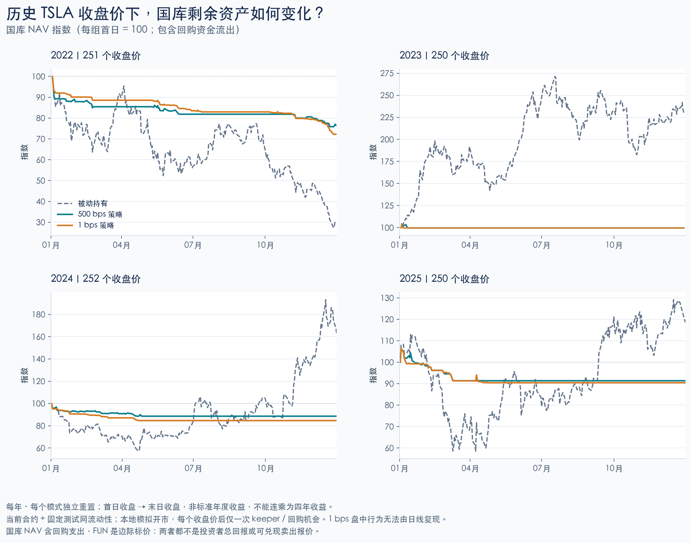
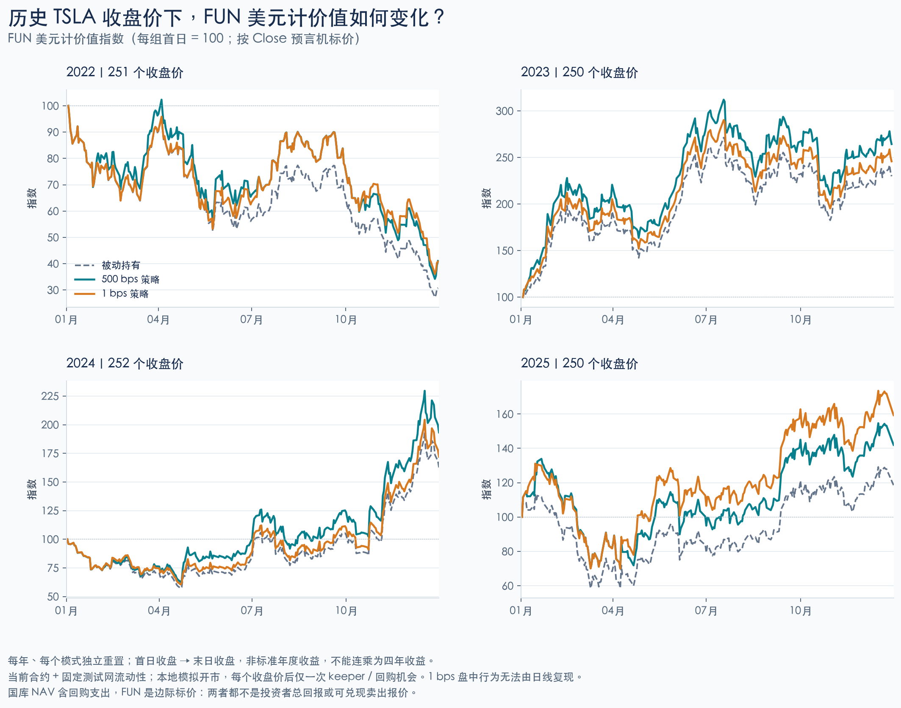

# TSLA 历史收盘路径驱动的合约回放

已将 **2022–2025 年 1,003 条真实 TSLA 日线**接入当前测试网部署合约的隔离 fork。4 个年份分别运行被动持有、500 bps 参数策略、1 bps 参数策略，共 **12 项合约测试、3,009 个日末快照，全部通过**。本轮没有签名或向公共链广播。

这是历史价格驱动的、每日采样的合约实验：价格来自历史，合约、池深、keeper 频率及执行条件是本次模拟设定。它不能证明历史上能获得同样的成交或收益。

## 主要结果

表内均为**每年首个交易日收盘至末个交易日收盘**的变化，每年独立重置。它不同于以上一年最后收盘为基准的标准年度收益，也不是连续四年复利。

| 区间 | TSLA / 被动 FUN 美元计价 | 500 bps 组 FUN 美元计价 | 1 bps 组 FUN 美元计价 | 500 bps 组国库 NAV | 1 bps 组国库 NAV |
|---|---:|---:|---:|---:|---:|
| 2022-01-03 → 2022-12-30 | −69.20% | −58.96% | −59.22% | −23.43% | −27.78% |
| 2023-01-03 → 2023-12-29 | +129.86% | +164.40% | +145.88% | −0.30% | −0.30% |
| 2024-01-02 → 2024-12-31 | +62.56% | +93.24% | +71.98% | −11.41% | −15.35% |
| 2025-01-02 → 2025-12-31 | +18.57% | +42.00% | +59.32% | −8.64% | −9.56% |

FUN 美元计价是 `FUN/TSLA 池边际价 × 当日 TSLA 输入价`，**不是全量卖出可兑现收益**。样本没有外部 FUN 买卖，只有国库回购影响 FUN/TSLA 池。实际价格中应有的卖盘、套利、新增用户和流动性变化没有被历史数据补齐。

可以从本次路径看到：

- **2022 下行路径：**500 bps 组国库日末最大回撤约 24.18%，被动组约 72.72%；但 FUN 美元现价仍跌约 58.96%。国库减仓不等于持币者获得同样的保护。
- **2023 上行路径：**500 bps 组在 1 月 4 日与 1 月 9 日分两次止盈，随后留存本金现金，并将获利 stock 用于回购。它全年只有两次策略执行；最终 NAV 接近初始值，不能把 NAV 变化解释为整套机制的总回报。
- **1 bps 参数组：**2022 年有 81 次策略执行，500 bps 组为 33 次；更多触发不保证更好的结果。这里只给每天一次机会，不能据此推断 1 bps 盘中规则的实际频率或绩效。

完整逐年指标、每日最大回撤、stock/现金余额、回购实际支出、烧币量和 keeper 奖励见 [生成报告](../deploy/tsla-history-2026-10-03/GENERATED_REPORT.md)及 [summary.csv](../deploy/tsla-history-2026-10-03/summary.csv)。





## 数据及防止提前使用未来信息

来源为 [Yahoo Finance 的 TSLA 历史数据](https://finance.yahoo.com/quote/TSLA/history/)，公开 chart 响应原文、下载 URL、SHA-256、OHLCV 与标准化价格全部保存。年份条数为 251 / 250 / 252 / 250；没有 null、重复日期或倒序时间。

使用 Yahoo **Close（已按拆股调整）**，本样本中每条 Close 与 Adj Close 都相等。2022-08-25 的 3:1 拆股也由 [Tesla 官方公告](https://ir.tesla.com/press-release/tesla-announces-three-one-stock-split)确认；当日输入相较上一日仅变化约 −0.345568%，不再除以 3，也不额外给模拟持仓增发三倍。为匹配测试 feed，价格按 half-even 四舍五入到 8 位小数，保留源值，最大误差小于 0.000000005 美元。

Yahoo 日线 timestamp 标的是纽约 **09:30 开盘**，当日 Close 那时尚不可知。因此测试只用交易日期与历日间隔，不把 timestamp 当成交时间。模拟含义是：**该日收盘价已知后，假设价格维持 601 秒，再给 keeper 一次执行和一次回购机会**。没有用次日数据决定当日动作。

EVM 时间映射到固定 fork 的未来，从首点起按真实日期差推进；周末没有补造日线。这个 synthetic 时钟不重建夏令时、节假日短市或真实收盘后的可交易性，市场日历在本地显式模拟开市。

## 固定的实验条件

- 固定 Robinhood testnet block **128172359**，chain ID **46630**，复用真实部署 Factory、Router、V3、V4 和国库逻辑。来源是当前部署的反事实回放，不是 2022 年链上状态。
- 三组均从已毕业池开始，初始国库约 **8.833333333333333335 TSLA**，初始 FUN/TSLA 经济价格、持币数量相同；不同 CREATE2 币排序会引入最多 2 wei FUN 的 LP/供给舍入差。所有比较都使用各自首点归一化。
- 参数 TP1/TP2/dip/stop 分别为 **500/1000/500/500 bps** 与 **1/2/1/1 bps**；tax 300 bps、creator 1000 bps、lot 2000 bps、sale 4000 bps、opening window 180 秒。参数预先固定，没有按每年结果挑选最优组合。
- 原 TSLA V3 LP 的 tick 范围 `[210540,224460]` 无法覆盖历史低价。仅在 fork 中移除原市场做市仓位，再以相同流动性参数 **L = 5405299530135571866** 建立全范围 `[-887220,887220]` 仓位。重建前后 active liquidity 精确相等，池地址与费率保留；扩展范围需要额外测试币库存，**不代表历史市场深度、订单簿或相同资本投入**。
- 每个日线点仅设置一次外生 TSLA 价格，真实 swap 同时移动 V3 池与测试 feed，等待 601 秒使 TWAP 健康。keeper 后不把其交易产生的 spot 偏移立即抹掉；下一日才引入下一条历史价格。
- 每个非首点至多一次 `execute()` 和一次 `buyback()`。`NotDue` 单独计数，其他拒绝使测试失败；不声称当天所有到期动作已执行完毕。
- 本地资金由 Foundry 提供，做市和测试 feed 权限只在 fork 中模拟。没有借用公共测试网角色钱包或移动共享行情。

## 如何读国库与持币结果

NAV 是国库剩余 stock 按当日价格的估值，加上 tUSDG 余额。回购实际花费的是 **TSLA stock → FUN**，不是直接花 tUSDG；导出记录实际 stock 支出及按发生日价格折算的 tUSDG 标值。利润用于回购会从国库流出，因此 NAV 下降不能直接当成持币者亏损，也不能简单加回回购支出后称总收益。

价格指标默认按历史输入价估值；结果另外保留操作后真实 V3 spot，便于复核计价偏差。FUN 标值与 LP 底层资产估值都不是退出报价。LP 未领取手续费未计入本金估值。记录的调用 gas 是含测试控制代码、排除交易基础费用的局部估算，**不是实际 gas 账单，也未从标值中扣除**。

被动组用于基准校验：FUN/TSLA、供给、持仓和国库存量不变，因此 FUN 美元计价与 TSLA 输入涨跌一致。策略组逐日核对 stock 账本、FUN 供给、路由余额、回购余额变化，以及成功动作与 `NotDue` 数量。

## 复现与证据

```sh
python3 contractV2/tools/tsla_history_data.py
python3 -m unittest discover -s contractV2/tools/tests -p 'test_tsla_history_data.py' -v
python3 -m unittest discover -s contractV2/tools/tests -p 'test_tsla_history_report.py' -v
mkdir -p artifacts/tsla-history-20261003
cd contractV2
HISTORICAL_REPLAY=true HISTORICAL_FORK_RPC=https://robinhood-testnet.drpc.org \
  ../.local/bin/forge test --offline --match-path test/TslaHistoricalReplayFork.t.sol -vv \
  > ../artifacts/tsla-history-20261003/forge.log
python3 tools/tsla_history_report.py --no-charts
```

`--no-charts` 仅依赖 Python 标准库，重新校验与导出 JSON/CSV。生成 PNG/SVG 需安装 Matplotlib 并提供中文字体；本机使用 `.local/chart-env/bin/python contractV2/tools/tsla_history_report.py`（从仓库根目录运行）。合并后的工具测试共 **42 项通过**，包括 8 项新数据校验和 7 项新导出语义测试。

回放需要对应历史状态可用的 archive RPC，或已缓存的该固定 fork。公共官方 RPC 对某些旧 storage slots 已不可读，首次探针因此失败，改用归档端点后完整通过。旧的人格实验和人造价格路径证据未被覆盖。

- [原始行情响应](../data/tsla-history-2022-2025-source.json)
- [标准化输入与数据口径](../data/tsla-history-2022-2025.json)
- [历史回放 Solidity](../test/TslaHistoricalReplayFork.t.sol)
- [完整执行日志](../deploy/tsla-history-2026-10-03/forge.log)
- [独立复核](../deploy/tsla-history-2026-10-03/independent-review.json)
- [数据与源码校验清单](../deploy/tsla-history-2026-10-03/manifest.json)

更细的下一轮需要分钟级价格、明确的开闭市与执行时点、keeper 延迟、实际池深或其情景范围，以及有边界的外部 FUN 买卖假设。日线结果不支持宣称真实可实现收益、胜率或已验证的最优参数。
