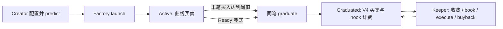

# V2 行为入口与 fork fuzz 路径图

这份文档按 **谁发起交易 → 进入哪个合约 → 调用哪些内部/外部组件 → 哪些状态和资产改变** 来读 V2。它供 fork 上的状态序列测试使用；单个函数的单测不能替代跨入口、跨阶段的断言。

## 范围与版本

- 基线是 `main` 的 V2 代码，包含已合并的 [#118 原生 ETH 发射并首购](https://github.com/keyuyuan/hedgefund/pull/118)、[#114 资产百分比引擎](https://github.com/keyuyuan/hedgefund/pull/114) 和 [#116 lot dust 修复](https://github.com/keyuyuan/hedgefund/pull/116)。**代码合并不等于链上部署或启用**；fork 测试须先读取目标链的真实地址、代码和 factory defaults。
- #114 是新的可选 treasury/policy schema，须另行部署、注册和核验；#116 修改了新编译的 lot treasury，旧部署不会自动升级。本分支补上 #116 合并后发现的两个边界，并以双币序回归测试验证。
- target [#12](https://github.com/0xHedgeHood/Hedgefun-trade/pull/12) 加入 source [#110](https://github.com/keyuyuan/hedgefund/pull/110) 的可选 Cycle lot 策略，并与当前 dust scheduler 集成。Cycle kind ID 由实际注册顺序决定；新 fund 才能选择，既有 fund 不自动切换。当前检查结果见 [集成记录](V2_CYCLE_INTEGRATION_REVIEW.md)。
- 本仓库没有 `CA.sol.create()`。对应的发射入口是 [`HedgeFunV2Factory`](../src/v2/HedgeFunV2Factory.sol) 继承的 `launch()` / `launchWithMetadata()`；“发射 + ETH 首购”入口是 [`HedgeFunV2LaunchNativeRouter.launchAndBuy()`](../src/v2/HedgeFunV2LaunchNativeRouter.sol)。
- 本文的 **stock** 是每个策略选中的股票/资产代币；**USDG** 是计价/结算代币；**FUN** 是该策略发行的 token。ETH 路由先转换支付资产，不改变 fund 的 stock 选择。

## 行为者与权限边界

| 行为者 | 可调用入口 | 不应假设的权限 |
|---|---|---|
| Creator | 为自己的 `(symbol, nonce)` 配曲线、免税名单与策略种类；预测地址；发射；买卖、编辑未锁定 metadata；否决 hook creator 收款人转移 | 不是 factory owner；不能改 listing、全局费率或已发射 fund 的不可变策略 |
| Trader / holder | 曲线或路由买卖；在 V4 阶段交易；自烧 FUN；领取属于自己的 hook 款项 | 没有 V2 fund 份额赎回或 LP 本金提取入口 |
| Factory owner | 设置未来发射默认值、上市资产、launcher、策略注册；少量已发射后的费用收款地址管理 | 无法修改已发射曲线条款、提走曲线储备或 V2 vault 的 LP 本金 |
| 测试网 synthetic operator | 按该测试资产/预言机的独立授权更新测试库存或 feed | 不是生产 V2 的通用 admin；是否与 factory owner 为同一 EOA 取决于部署 |
| Keeper（任意地址） | `graduate` 兜底、`book`、`execute`、`buyback`、LP 收费、向固定收款人推送已计提费用 | 不因能触发动作而能指定别人的收款地址；奖励只按真实成交或规则发放 |
| 外部依赖 | stock/USDG oracle、交易日历、V3 池、V4 PoolManager/hook、股票发行方 | 它们的暂停、价格、流动性和 callback 会影响路径，不由 factory 自动控制 |

### 入口速查

| 行为 | 外部调用入口 | 下一跳 |
|---|---|---|
| Create | user → `factory.launch()` / `launchWithMetadata()` | factory 校验/收费 → CREATE2 token、treasury、curve |
| Create + 首购 | user → `LaunchNativeRouter.launchAndBuy()` | factory launch → WETH → V3 路由 → curve buy，全部同笔 |
| Active 买卖 | user → `curve.buy/sell()`，或 `V2TradeRouter.buy/sell()` | 曲线库存、stock 费用；末笔 buy 同笔毕业 |
| Graduated 买卖 | user → `V2TradeRouter.buy/sell()` 或 V4 periphery | PoolManager swap → V2 hook 计费 |
| Creator 内容/收款保护 | creator/editor → `token.setMetadata()`；creator → `setEditor()/lock()`、`hook.vetoCreator()` | token metadata 状态或 hook creator 收款人提案状态 |
| Admin | owner → factory/deployer/hook/calendar 的受限 setter | 后续发射参数或已存在池的角色收款地址 |
| Keeper | 任意地址 → `book()` / `execute()` / `buyback()` / `collectFees()` / `sweep()` | 账本、V3/V4 成交、奖励与销毁；按 treasury kind 分叉 |

## 总状态图



`Ready` 通常只是末笔 `buy()` 交易中的瞬时状态：买入触发 `graduateCurve()`，毕业失败会回滚整个买入。不要在 fork 测试里假定成功交易结束后一定能观察到一个长期停留的 Ready fund。

## 1. Create：creator → factory.launch

**预配置（creator 本人）**

1. [`CurveDeployer.setCurveConfig()` / `setOpeningTaxExemptions()`](../src/v2/CurveDeployer.sol) 绑定 `(symbol, creator, nonce)` 的曲线参数与首购免税对象。
2. [`V2TreasuryDeployer.setStrategyKind()` / `setEngineConfig()`](../src/v2/V2TreasuryDeployer.sol) 选择已注册的 treasury kind / policy 配置。owner 注册种类，但这里的选择者是 creator。
3. 用户调用 [`factory.predict(q)`](../src/HedgeFunFactory.sol)（可另读 `predictCurve(q)`）取得预测 token/treasury/curve 地址与 `terms`。`terms` 涵盖部署地址和冻结的经济参数；变更后应重新预测。仅改 launcher/publicLaunch 或 listing 的 enabled gate 不一定改 `terms`，但仍可能使交易因权限或资格检查失败。

**状态变更交易**

```text
creator
  → HedgeFunV2Factory.launch(q, terms)
      或 launchWithMetadata(q, terms, info)
  → HedgeFunFactory._launch: 检查 publicLaunch / launcher、creator、listing、
      费率与滑点边界、expectedOpenPrice、terms、手续费支付
  → CREATE2 部署 token、treasury、bonding curve；V2 factory 接好对应关系
  → （若带 metadata）token.initMetadata(info)
  → FUN 总供应量先由曲线持有；此时还没有该 fund 的 V4 池
```

发射费可能是 Native、USDG、stock 或 None，取决于执行时的 [`Factory.Defaults`](../src/HedgeFunFactory.sol)。用户带 `maxFee`、预期价格和 `terms` 是防止管理员配置变化后以旧报价成交的约束。任何部署、收费或初始化失败都应整笔回滚，不能留下半个 fund 或已扣费状态。

**优先 fuzz**：同一 `(symbol, creator, nonce)` 重复 CREATE2，以及不同 creator 使用相同 symbol/nonce 时地址互不冲突；预测后分别改变 `terms` 内参数和纯权限 gate；费币种与 `msg.value` 错配、`maxFee` 太小、停用 public launch、未授权 launcher、metadata 失败后的原子回滚。断言余额、nonce、预测地址 code、曲线供应量与手续费收款同时一致。

## 2. Create + ETH 首购：creator → launchAndBuy

[`HedgeFunV2LaunchNativeRouter.launchAndBuy()`](../src/v2/HedgeFunV2LaunchNativeRouter.sol) 是 #118 增加的可选入口。它要求 factory 已将该 router 列为 launcher，当前发射费是 Native，并要求 `q.creator == msg.sender`、deadline 有效、首购数量和最低收到量非零、`msg.value == 发射费 + 首购 ETH`。

```text
creator -- ETH --> LaunchNativeRouter.launchAndBuy(q, terms, info, buy, path)
  → factory.launchWithMetadata(...)                  [收取原生发射费]
  → WETH.deposit{value: 买入额}()                   [只包装首购部分]
  → V2TradeRouter.buyFor(..., expectedStage=Active) [至多 3 跳规范 V3 路径]
  → stock 进入 bonding curve；FUN 直接给 creator
  → 多余 stock/WETH 退回；可转换的 WETH 退款解包为 ETH
```

V3 路径、报价、首购滑点、曲线阶段或退款任一环节失败时，**发射与购买一起回滚**。creator 的首购收款地址应按开盘 surcharge 免税规则核对。这里的“首购”金额并不自动等于发射费；当前 router 使用固定 Native 发射费，**不是首购额的 1%**。

**优先 fuzz**：`msg.value` 差 1 wei、deadline 边界、坏路径/重复 token/错误 fee tier、V3 短成交、曲线终点部分填单、`minStockReceived`/`minFinalOut` 边界、退款为 stock 或 ETH、回滚后 token/curve 地址仍无 code。测试链上当前 pool 是否存在；仅在明确标记的合成 fixture 中注入 ETH 或流动性。

## 3. Active：曲线买卖与费用

| 用户入口 | 执行路径 | 成功后应检查 |
|---|---|---|
| [`curve.buy()`](../src/v2/HedgeFunBondingCurve.sol) | `quoteBuyFor` 封顶 → 只从买家扣实际消耗的 stock → 扣 stock 费用、开盘 surcharge → FUN 给买家；未消耗的上限金额仍留在买家钱包 | 曲线 stock/FUN 储备、买家净到手、协议/creator/treasury 待领费、烧毁供应量 |
| `curve.sell()` | FUN 转入并计算 stock 输出 → stock 费用入账 → stock 给卖家 | 库存不透支，实际输出满足下限，收费与余额守恒 |
| [`V2TradeRouter.buy/buyFor/sell()`](../src/v2/HedgeFunV2TradeRouter.sol) | 用户 ERC20 → 规范 V3 exact-input 路径 → stock ↔ 曲线；路由检查 deadline、阶段、余额差与最低最终输出 | 每跳输入实际消耗，部分成交仅在选择允许时发生，不把合约已有余额当本次输入 |
| [`V2NativeRouter.buy/sell()`](../src/v2/HedgeFunV2NativeRouter.sol) | ETH ↔ WETH 包装/解包后进入同一路由 | 原生 ETH 与 WETH 退款、合约无滞留余额 |

路由的 `expectedStage` 要防止用户签名/报价时 fund 还在曲线、执行时已毕业，或反过来。V3 每跳需要完整 exact-input 成交；V4 阶段的部分成交另有明确选择。直接 `curve.buy()` 只扣实际消耗额，路由先收输入再退 `stockRefund`；两条路径最终应有相同的曲线记账结果。

**优先 fuzz**：买入恰好差一单位达到毕业阈值、税率/免税地址差异、买卖交错后的储备守恒、stock decimals、零输出舍入、路线中恶意 ERC20/reentrancy、阶段在相邻交易变化。

## 4. Active → Graduated：末笔买入的原子毕业

```text
curve.buy() 触及 minTokenReserve
  → status = Ready
  → factory.graduateCurve() 由调用者曲线反查 id
  → curve.release() 交出剩余 FUN / stock，并设置 status = Graduated
  → factory / CurveDeployer 建立并 seed V4 fee-only liquidity vault
  → V2 hook 注册该池；treasury 取得未 seed stock 并尝试 book
  → 未使用 FUN 烧毁
```

[`factory.graduate(id)`](../src/v2/HedgeFunV2Factory.sol) 允许任何人兜底触发 Ready fund 的毕业；正常末笔买入已在同一笔交易内完成。毕业后曲线 `buy/sell` 应拒绝；用户须走 V4 交易入口。毕业时 `book()` 的尝试失败不应让已完成的资产释放丢失，后续 keeper 可再 `book()`。

**优先 fuzz**：阈值 `-1 / = / +1`、hook/PoolManager/seed 失败导致末笔买入全回滚、曲线 release 与 vault seed 后 token/stock 总量、重复毕业、毕业前后路由 `expectedStage`、未 seed stock 与 treasury `booked/unbooked`。

## 5. Graduated：V4 交易、费用和领取

用户仍可经 [`V2TradeRouter.buy/sell()`](../src/v2/HedgeFunV2TradeRouter.sol) 交易，但路由改走 V4 PoolManager；直接 V4 periphery 交易也会穿过 [`HedgeFunV2Hook`](../src/hooks/HedgeFunV2Hook.sol)。hook 计算双侧费用。路由是便利入口，**不能把只测路由当成覆盖了所有 V4 交易**。

费用后续有四条独立入口：

1. [`curve.claimFees(recipient)`](../src/v2/HedgeFunBondingCurve.sol)：任意人可触发，但只能把曲线待领 stock 发给既定 recipient；给 treasury 的钱到账后仍须 `book()`。
2. [`hook.sweep(poolId)` / `claimFor(poolId, who)` / `claim(poolId, to)`](../src/hooks/HedgeFunHook.sol)：前两者是向固定收款人结算/推送；`claim` 仅可重定向**调用者自己的**角色款项。待领款按**角色**记账：协议或 creator 收款人合法变更后，未领取额度跟随角色到新地址，不归旧地址继续领取。受阻转账仍留在待领账本。
3. [`HedgeFunV2Hook.convertFees()`](../src/hooks/HedgeFunV2Hook.sol)：owner 才可把 token 侧费按价格保护转换为 stock，之后仍需结算；此动作有 minOut、限价和 deadline。
4. [`V2LiquidityVault.collectFees()`](../src/v2/V2LiquidityVault.sol)：任何人触发 V4 fee poke；FUN 侧 LP fee 销毁，stock 侧 fee 转 treasury 的 buyback 预算。vault 没有提走 LP 本金的入口。

FUN holder 可调用 [`HedgeFunToken.burn()`](../src/HedgeFunToken.sol) 自烧。Creator 可 `setEditor(editor)`；未锁定时 creator 或当前 editor 可 `setMetadata(...)`；只有 creator 可 `lock()`，而且锁定前必须清除 editor，锁定不可逆。测试 editor 切换/撤销、过长 metadata 使 `launchWithMetadata` 全回滚、锁定后任何编辑都失败。**V2 没有 holder 的份额 redeem/withdraw 路径**；别把 StockLend 或 EarnVault 的行为混进这一套测试。

**优先 fuzz**：V4 直接交换与路由交换的税账一致、部分成交退款、fee 转换滑点回滚、sweep/claim 的收款权限、失败转账后重试不得双领、LP fee 收取前后资产守恒且本金不可减少。

## 6. Keeper：从收入到账到策略执行

这里的 keeper 入口大多 **permissionless**，并非后台专属账户。奖励与效果由成交量和规则限定。

```text
curve/hook 到账、毕业余款或用户单向 stock 捐赠
  → treasury.book() [把未入账 stock 纳入对应 treasury 的账本]
  → kind 0: execute() [健康检查 → stop → TP → dip → V3 实际成交/奖励]
  → optional Cycle: execute() [同一 stop/TP/dust 优先级 → 原 dip 或一次受限 BuyRecovery=5]
  → schema-1 Engine: execute() [健康价 → policy intent → 固定 USDG 金额/日额度/冷却限制 → V3 实际成交记账]
  → schema-2 Engine: execute() [健康 NAV → policy intent → V3 买/卖 → 实际成交记账]
  → kind 1: 无 execute()，只维护 buyback 预算

vault.collectFees() → treasury.creditLiquidityFee() → buybackStock [无需 book]
任意有预算的 treasury.buyback() → V4 买 FUN → keeper 奖励 + 销毁
```

| 分支 | 入口和关键事实 |
|---|---|
| 当前 lot 策略（kind 0） | 新 fund 的默认 kind 0 creation code 是 [`HedgeFunV2AllInTreasury`](../src/v2/HedgeFunV2AllInTreasury.sol)，继承 [`HedgeFunV2Treasury.book/execute`](../src/v2/HedgeFunV2Treasury.sol)，并覆写部分 TP dust/stop gate 行为。`execute()` 把 stop 放在 TP 和 dip 前，直接调用 `stopLoss/takeProfit/buyDip` 会拒绝。真实成交走 [`HedgeFunTreasuryBase`](../src/HedgeFunTreasuryBase.sol) → [`HedgeFunTreasury._swapStock`](../src/HedgeFunTreasury.sol) → [`PoolTrader._swapBounded`](../src/PoolTrader.sol)。最多 128 lot；stop 后再次 BuyDip 有新 oracle report、时间和价格 gate，TP 可以先发生并清除该 gate。测试链上已部署 registry 时仍须核对实际 kind 映射。 |
| 可选 Cycle lot 策略（注册返回的 kind ID） | [`HedgeFunV2CycleTreasury.execute()`](../src/v2/HedgeFunV2CycleTreasury.sol) 继承 stop/TP 优先级和当前 dust 清理。足额实际 stock/USDG 销售建立回补锚点；至少 600 秒、更新的 stock report、达到锚点加 dipBps 后允许一次 `BuyRecovery = 5`。预算为 USDG reserve 比例与 sellChunkUsdg 的较小值，buybackStock 不参与。真正的后续 stop 更新独立恢复 gate；仅清 dust 不更新 sale、冷却或奖励。成功 dip/recovery 消费等待，失败不消费；`recoveryDue()` 仅是价格/时间/report 预检。 |
| 当前 buyback treasury（kind 1） | `book()` 把 stock 纳入回购预算，不创建 kind 0 的 stop/TP lot；`execute()` 拒绝，调用 `buyback()`。与 kind 0 的状态断言不能混用。 |
| kind 0 lot dust（已合并源码及本分支修复） | 无法经济性卖出的 stop 完整微 lot、TP 完整微 lot或 TP1 已卖过的最后微 tranche（阈值 **0.01 USDG**）退出相应 lot 账本，保留为 unbooked stock；不虚构 sale、keeper bounty、lastSale 或 stop gate。后续重记这些旧 stock 时，`totalStockReceived` 仅增加真正新到的部分。`execute()` 会继续找真正到期的动作，也可能只清 dust 后返回；即使 pending stock 补记后占满 128 个不同成本 lot，也保留清理与补记，不把无容量的 dip 回滚成全事务失败。stop dust 需 live oracle，profit dust 可走闭市的 pool-only 健康路径。旧部署的 treasury 不会自动变成此实现。 |
| schema-1 固定金额 engine | [`HedgeFunV2EngineTreasury.preview()/book()/execute()`](../src/v2/HedgeFunV2EngineTreasury.sol)：policy 提议动作，core 校验 configHash、nonce、codehash；额度来自配置的固定 USDG 金额，而非 NAV 百分比；V3 实际成交决定库存、turnover 和奖励。需部署并注册对应 engine/policy，仅影响新 launch。 |
| schema-2 资产百分比 engine | [`HedgeFunV2AssetPercentEngineTreasury.preview()/book()/execute()`](../src/v2/HedgeFunV2AssetPercentEngineTreasury.sol)：读取 PoolManager 已锁定时本 fund 的外部资产 NAV（含自有 LP 股票本金与未领取 stock 费用，FUN 不计），固定 policy 用 `STATICCALL` 给买卖 intent，core 校验固定 configHash、nonce、policy codehash 并施加比例/每日额度等风险上限。买入 turnover 取实际 USDG 支出；卖出按实际卖出 stock 加对应的保留 gain stock 的 oracle 价值记账；bounty 按实际 swap gross output 计算。`preview` 不是执行承诺。须先部署、注册新 policy/engine 并核验公开证明，且仅影响新 launch。 |

#116 合并后的两条回归路径已在本分支复现并修复：释放的 dust 再次 `book()` 不重复累计 `totalStockReceived`；128 个不同成本 lot 加 pending stock 时，清理后补记 lot 占满容量会保留清理结果，把 dip 留给后续有容量的调用。对应测试在 [`V2Execute.t.sol`](../test/V2Execute.t.sol) 覆盖 stop/profit dust、双币序、真实余额与无虚构 sale/bounty。源码和本地测试结果仍不等于目标链部署证明。

健康检查涉及 [`PriceOracle.tryPrice()`](../src/PriceOracle.sol) 的两路 feed 年龄、stock pause 和日历，以及 [`PoolTrader`](../src/PoolTrader.sol) 的 V3 现价/600 秒 TWAP、偏差、ring 观测和 swap callback。`buyback()` 是另一条 V4 PoolManager `unlock → callback → swap → settle/take → burn → hook.noteEvent` 路径；不要用 V3 执行成功代替 V4 回购验证。

### 可选 Cycle：creator 配置 → launch → keeper.execute

```text
admin → makeChunks(Cycle.creationCode) → registerKind() → 记录返回 kind ID
creator → setStrategyKind(symbol, nonce, kind ID) → predict() 重新取得 terms
creator → factory.launch() / LaunchNativeRouter.launchAndBuy()
  → curve 买卖 → 原子 graduate → Curve/Hook 收款 → Cycle.book()
任意 keeper → Cycle.execute()
  → 清理 stop dust → 真 stop 优先 → 清理 TP dust → 真 TP 优先
  → 原 dip 或满足等待/更新 report/回升阈值的一次 BuyRecovery=5
  → V3 实际成交 → lot/现金/奖励记账 → 成功买入消费回补等待
```

`setStrategyKind()` 是 creator 的选择，不是 admin 替用户选；换 kind 后旧 terms 应失效。以上 Native 入口说明预期调用链，是否已有对应链上部署和该组合的测试证据须单独核验。直接 `stopLoss/takeProfit/buyDip` 仍拒绝，只有 `execute()` 采用调度顺序。若本次只有 dust 清理，返回 `Stop`/`TakeProfit` 也不代表成交，应同时读真实余额及 sale/cleanup 事件。

## 7. Admin：配置、权限和应急

| Owner 入口 | 影响范围 | fork 中应断言 |
|---|---|---|
| [`HedgeFunFactory.setDefaults()` / `setPublicLaunch()` / `list()` / `setListingGates()` / `setBandCeiling()` / `setLauncher()`](../src/HedgeFunFactory.sol) | 后续 launch 的费用、上市、边界与允许的路由；`list` 核验 oracle/stock 和规范 V3 pool | 非 owner 拒绝；影响 `terms` 的参数变动使旧承诺失效，权限/资格 gate 单独验证；已存在 fund 的条款不变；暂停新发射不等于暂停交易 |
| [`V2TreasuryDeployer.setLpBps()` / `registerKind()` / `registerEngineKind()` / `registerPolicy()` / `disablePolicy()`](../src/v2/V2TreasuryDeployer.sol) | 后续创建可选的 treasury/policy 与 LP 比例；注册项不可随意替换 | 非 owner 拒绝；空 chunk、零依赖/审计 manifest 等无效输入拒绝；注册后派生的 codehash 正确。链上不会替审计者比对“预期”哈希，须另做链下核验；禁用只挡新 launch，不改变旧 fund |
| [`HedgeFunHook.setProtocol()` / `proposeCreator()` / `acceptCreator()`，creator 的 `vetoCreator()`](../src/hooks/HedgeFunHook.sol) | 已存在池的协议/creator 费用收款角色；creator 变更带延迟与 180 天 veto quiet period | 非 owner、提前接受、过期窗口、veto 后接受均拒绝；待领款随角色合法转移，旧地址不再有收款权；creator 即使无待处理提案也能 veto，owner 取消提案不产生 quiet period |
| [`HedgeFunV2Hook.convertFees()`](../src/hooks/HedgeFunV2Hook.sol) | 已累积 token 费用换 stock | 非 owner、坏 minOut/price/deadline 回滚；费用只扣一次 |
| [`TradingCalendar.setOverride()`](../src/TradingCalendar.sol) | 强制开/闭股票交易日 | 关市阻断需要健康股价的 treasury 路径；不误认为全局交易暂停；复市后额度日期正确 |
| [`HedgeFunTreasuryBase.setVoteDelegate()`](../src/HedgeFunTreasuryBase.sol) | 对固定 stock 尝试 delegation，无资产转移 | 非 owner 拒绝，不能借此挪走 stock |

factory 使用两步所有权转移，`renounceOwnership()` 被禁止。测试网 synthetic stock、feed 和可选 ETH 市场另有 operator 管理动作；当前测试部署可能让同一 EOA 兼任 factory owner，但两套权限在合约中分立。股票发行方的 pause、deny-list、admin burn 也在协议之外。生产 V2 没有独立 guardian 角色或一个能暂停所有现有交易的总开关。

## Fork fuzz 清单：测状态序列，而非仅测 revert

为每条路径固定 fork block、真实 factory/listing/pool 地址和代码哈希；如果要测试**已合并但目标链尚未部署**的 #114/#116 新实现，在 fork 上明确部署相应实现并注册/创建新 fund，不要把源码合并当作链上已升级。每次注入 `vm.deal`、mock feed、人工 V3 流动性或 storage 写入，应在测试名称与报告中标为合成条件。

| 优先级 | 序列与 fuzz 输入 | 主要不变量 / 失败后状态 |
|---|---|---|
| P0 | `configure → predict → admin 改配置/权限 → launch`；actor、nonce、fee、expected price | 影响 terms 的变动使旧承诺失效；仅改授权/eligibility 的 gate 单独拒绝或允许；失败后无部署/扣款，旧 fund 参数不变 |
| P0 | `launchAndBuy`：ETH 差 1 wei、deadline、V3 path、首购量、minOut、终点 cap | 发射与购买同成同败；首购 FUN/stock/ETH 退款守恒；无 router 残留 |
| P0 | 曲线多买卖接近毕业阈值，再 V4 买卖 | 只毕业一次；末笔交易失败全回滚；曲线关闭后拒绝旧入口；stage race 无错路由 |
| P0 | `curve/hook 到账 → book → kind0/Engine execute` 与 `vault.collectFees → buyback`，多 actor 交错 | 按收入来源走正确账本；收款人限制、真实 stock 覆盖账本、费用不双领、keeper 奖励按对应真实成交出 |
| P0 | kind 0 StopDustReleased/ProfitDustReleased：raw USDG 1/2/76、阈值 `−1/= /+1`、TP1 最后 tranche、128 lot 加 pending stock、短成交、dust 重新 book | 仅对 lot treasury 断言 `sum(lot.qty) == bookedStock`；dust 到 unbooked，无虚构 sale/bounty/cooldown，后续真 stop 仍优先；重记 dust 不重复累计总收款；补记后无买入容量时保留清理结果，dip 待容量腾出再执行。现有 AllIn 的其他 dust 事件另按 buybackStock 分支断言 |
| P0 | 可选 Cycle：真销售 → stop/TP dust → 恢复等待 → dip/recovery；阈值、时间/report 边界、128 lot 与 pending donation、双币序 | 清 dust 不 arm/refresh recovery，不虚构 sale/bounty/cooldown；真 stop 只按实际 fill 更新 gate，真 stop/TP 优先；满足恢复条件时可同笔继续，满容量时保留清理/补记与等待；成功买入恰好消费一次，旧 dust 重记不重复 totalStockReceived。参见 [`V2CycleDustFuzz.t.sol`](../test/V2CycleDustFuzz.t.sol) |
| P1 | oracle/feed 更新、stale、pause、V3 TWAP ring 不足、价格偏差、闭市/开市 | stock 交易的 `execute` 在 health/live gate 失败时不改交易状态；恢复后可继续。kind1 `book` 与闭市使用缓存价的 `buyback` 分别测，不误当作全局停止 |
| P1 | V4 直接 swap 与路由 swap、partial fill、fee conversion、collectFees | hook 双侧税一致；退款按实收；LP 本金不可提；fee 进入 buyback 不重复计 NAV |
| P1 | schema-2 NAV：treasury/vault stock、自己的 LP principal/fee、捐赠、tick 边界、0/1 bps creator band、日切与 DST | 只计本 fund 外部资产；FUN/他人 LP 不计；百分比与 daily cap 基于执行前健康 NAV；used 不因 NAV 缩小而清零 |
| P1 | schema-1 固定 USDG 金额与 schema-2 比例额度；policy 返回错误 hash/nonce/方向/长度、超额建议或 V3 部分成交 | 两种 engine 的上限分别来自固定配置和执行前 NAV；core 拒绝坏身份/方向的 intent；失败不推进 nonce/cooldown；turnover 按该方向实际经济量，bounty 按 gross swap output |
| P2 | 非 owner 调管理入口、两步移交、延迟 creator 收款人、veto | 权限拒绝无状态变化；待领费随角色而非旧地址转移；没有隐含的全局 pause |

测试断言优先读取 **交易前后真实余额、储备、lot 汇总、pending/claimed 账本、status、nonce、日额度**，事件用于辅助解释。对成功和预期 revert 都查余额差；不要仅凭 `preview`、事件或路由返回值判定经济效果。现有起点包括 [`V2Execute.t.sol`](../test/V2Execute.t.sol)、[`V2LaunchNativeRouterFork.t.sol`](../test/V2LaunchNativeRouterFork.t.sol)、[`TestnetV2EthBridgeFork.t.sol`](../test/TestnetV2EthBridgeFork.t.sol)、[`V2StrategyEngine.t.sol`](../test/V2StrategyEngine.t.sol)、[`V2StrategyEngineAccounting.t.sol`](../test/V2StrategyEngineAccounting.t.sol)、[`V2StrategyEngineGuards.t.sol`](../test/V2StrategyEngineGuards.t.sol) 和 [`V2AssetPercentEngine.t.sol`](../test/V2AssetPercentEngine.t.sol)。
