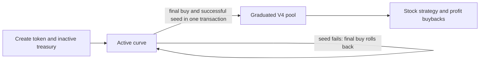

# V2 bonding curves and multi-asset trading

V2 is a separate deployment in `src/v2/`. Each launch starts with its own stock-denominated internal market,
graduates into a permanently locked Uniswap V4 pool, then activates its stock strategy treasury. The existing
V1 deployment is not upgraded. The broader asset-adapter and redemption roadmap remains separate.

## Lifecycle and ownership



`HedgeFunV2Factory.launch` and `launchWithMetadata` retain the V1 request and terms-commitment format. They
mint the entire supply to an independently deployed `HedgeFunBondingCurve`. No real stock needs to be supplied
by the platform at creation. The curve's stock reserve starts at zero; subsequent buyers fund it. Each curve
has separate token inventory, real stock principal and fee liabilities. There is no shared launch bankroll,
owner reserve withdrawal, rescue or discretionary cancellation.

`Status` is `Active = 0`, `Ready = 1`, `Graduated = 2`. Ready is transient inside the crossing buy: after the
trade lock is released, the curve calls the factory's authenticated `graduateCurve()`. The factory releases
only that curve's recorded reserves, initializes and seeds V4, and wires the treasury. The curve requires
Graduated before the buy returns. Any failure rolls back the entire final buy, including payments and burns;
previous holders can still sell to the Active curve if the stock itself remains transferable. The public
`graduate(id)` entry point cannot graduate an Active curve early or release another curve's reserves.

The canonical V4 pool uses a new singleton hook bound to the V2 factory. The factory registers a per-pool
`V2LiquidityVault` as the only initializer/seeder. That vault owns both the full-range position and a
single-sided surplus-token position in the same pool, and has no liquidity-removal, arbitrary-call or upgrade path; anyone may trigger fee-only collection. Deployed V1
factories, hooks, tokens and treasuries are unchanged. The V2 factory delegates its one-time graduation
execution to its bound `CurveDeployer` module because the inherited factory is near the EIP-170 limit;
the module accepts execution only in that bound factory's context.

## Frozen terms and curve math

Each curve and graduated pool use the same listed stock. Payment/receipt assets are a routing choice, not a
change to the pool's quote currency or to the treasury's strategy stock. Dollar prices in a UI are estimates;
the graduation condition is fixed in raw stock/token units and never depends on a manipulable displayed FDV.

The listing, treasury rule and execution bounds, supply, opening price, curve allocation, the creator's raise size
and opening window, fees and V4 pool settings are committed by `predict(Request)` and checked by `launch`. A
defaults change invalidates a pending launch quote. After launch, curve and fee terms remain frozen even if that stock is delisted or future defaults change.
The new default treasury starts with the committed strategy parameters but can later change logic through the
48-hour upgrade controller described below; its upgradeability is part of the chosen treasury code.
The protocol payout address inherited from V1 is immutable. Hook payout administration after graduation retains
V1's existing rules; curve-era fee recipients are immutable.

Let initial supply be `S`, virtual stock be `V`, and accounted token inventory be `T`:

- `V = ceil(openPriceE18 * S / 1e18)`; opening price uses raw stock units per token unit, scaled by 1e18.
- Fixed product `K = S * V`; effective stock `Y = ceil(K / T)`; real reserve `R = Y - V`.
- Minimum inventory `Tmin = floor(S * (10000 - saleBps) / 10000)`.
- `saleBps` is the creator's choice for their own launch, 1000 through 9000, and 7931 when they register none
  ([below](#raise-size-and-opening-window-the-creators-choice)).
- Terminal effective stock `Yg = ceil(K / Tmin)`; net stock graduation target `Rg = Yg - V`, which is
  `ceil(V * saleBps / (10000 - saleBps))` whenever `S * (10000 - saleBps)` divides by 10,000.

Buys are capped at the gross payment whose net principal reaches the terminal cost. Both sides are canonicalized
to `ceil(K/T)` so an integer-rounding surplus cannot be harvested by a later round trip. The base buy fee is
deducted from the actual stock payment and accrues to protocol, creator and treasury; only the opening premium
burns tokens. The sale allocation counts gross tokens including that opening burn. Sells return stock net of tax. Unsolicited
transfers do not move quotes, reserve accounting or graduation progress. Virtual stock is never spendable.

Graduation initializes V4 at the terminal curve price `Yg / Tmin`, rounded to its sqrt-price representation.
Only the **real** stock reserve `Rg` is capital: `floor(Rg * lpBps / 10000)` is the V4 stock budget and the balance
goes to the strategy treasury. `lpBps` is per stock in `V2TreasuryDeployer` (`setLpBps`, factory owner, 10–100%, default
50%), is part of a launch's `terms`, and is frozen per treasury at launch (`lpBpsOfTreasury`); neither the factory nor
the curve deployer has the bytes for it. The worked example below uses the 50% default. The vault refunds unused **stock** budget to the factory, which forwards it to the treasury.
At the terminal price, approximately `Tmin * floor(Rg / 2) / Yg` tokens enter the full-range LP. The remaining
tokens seed a second, single-sided position on the token-only side of spot in the same pool (`salt = 1`). The
nearest range boundary is the next usable tick above spot for token0, or the usable tick at/below spot for token1.
The far boundary is the corresponding usable extreme tick. Both positions belong to the immutable vault.
Tiny token rounding leftovers stay in `lockedSeedTokens`; they are neither refundable nor fee income.
**Graduation burns zero project tokens and performs no principal-funded buyback.** The `Graduated` event retains
its ABI and emits zero in its burn field. V4 positions are owned directly by the vault: there is no transferable
LP token to burn. Permanent inability to remove liquidity provides the intended LP lock.
The split and actual amounts are emitted in `GraduationCapitalSplit`. Preflight checks both positions against
the configured budget and their aggregate per-tick liquidity limit before launch.

For example, `S = 1,000,000`, `V = 100` stock and an 80% sale give `Tmin = 200,000`, `Yg = 500`, and
`Rg = 400` stock. At roughly `0.0025` stock/FUN, the split seeds about 200 stock with 80,000 FUN, sends
200 stock to the treasury, and deposits about 120,000 remaining FUN into the locked single-sided position.
Total supply remains 1,000,000 FUN, absent earlier opening-premium burns. Initial **spot** is preserved, while the
second position changes active liquidity as the price enters its range. It must be included in post-graduation
simulations and asset accounting. Execution includes the V4 LP fee and hook tax.

The following historical depth example used the former single-position/burn design and ignores fees and opening burns;
it is not a simulation of the new two-position pool. The pool opens with 200 stock against a
float of 800,000 FUN funded by 400 stock of net principal; base fees are additional payments. Selling 1% of that float
(8,000 FUN) into it returns about 18 stock and moves the price about −17%;
selling 10% moves it about −75%. The pool absorbs roughly 100 stock of selling before the price halves, so early
curve buyers holding a 5x paper gain are exiting into a pool that holds half of what they paid in. The LP share is a
per-stock listing decision, to be set from measured post-graduation selling; a launch UI must show these numbers.
The open-to-terminal multiple, `(1 / (1 - saleBps))^2`, is the larger lever: 80% is 25x, 70% is 11x. Both sweeps,
and the LP fee's effect on the real contracts, are in the [depth experiment](./V2_LP_DEPTH_EXPERIMENT.md).
That experiment also records a historical, now-disabled sell-spike scenario.

The curve snapshots the launch's buy-side snipe rate and duration: the rate is the factory owner's `snipeBps`, the
duration the creator's `snipeSeconds`. Its combined nominal buy rate falls linearly from
`snipeBps` to the flat tax over the full `snipeSeconds`, rounded up:
`taxBps + ceil((snipeBps - taxBps) * (snipeSeconds - elapsed) / snipeSeconds)` while `elapsed < snipeSeconds`, then
`taxBps`. The window therefore lasts the whole `snipeSeconds`, and every second inside it pays strictly more than the
flat tax. The base fee is stock income; the separate token burn is
`floor(grossTokens * (currentRate - taxBps) / (10000 - taxBps))`.
With the shipped 99% / 3-second defaults and a historical 10% test tax that is 99% in the launch second, 69.34% one second
later, 39.67% two seconds later, then 10% (at the 15% maximum tax: 99%, 71%, 43%, then 15%). Over a creator's
60-second window it is 54.5% at 30 seconds and 11.49% at 59; over 180 seconds, 98.51% at one second and 10.5% at 179.
A `snipeBps` at or below the tax, including 0, or a `snipeSeconds` of 0, means no opening premium: the flat tax from
the first second.
`quoteBuy()` includes the current rate and `buyRateBps()` exposes it.
Before 2026-09-28 the curve decayed the opening rate toward zero and only floored it at the tax, which ended the
window early, at `snipeSeconds * (1 - taxBps / snipeBps)`: 99% / 66% / 33% at the shipped defaults, and the flat 10%
from second 54 of a 60-second window. The deployed V1 hook keeps that formula; see
[the V1 opening window](./V2_DEPLOYMENT_REHEARSAL.md#deployment-parameters-decided-after-audit-round-4).
V2 creators can freeze up to 40 additional opening-premium exemptions; the creator is automatically exempt.
Use `quoteBuyFor(amount, recipient)` for recipient-specific output. Exempt recipients still pay the base stock fee;
see [the whitelist guide](./V2_OPENING_TAX_WHITELIST.md). The sell-side stock tax stays flat during this window. Graduation starts neither a second
snipe window nor a launch sell spike. Graduated V2 pools freeze `spikeBps = 0`: LP fees fund
permissionless buybacks, so buyback notifications cannot turn trading volume into a repeated sell spike.
This is trading friction rather than ordering protection: the [market scenarios](./V2_MARKET_SCENARIOS.md)
still produce profitable sandwiches at seconds 1 and 2 when a victim accepts wide slippage.

## Raise size and opening window: the creator's choice

Each V2 creator chooses two things for their own launch, before `predict`, on the curve deployer:

```solidity
CurveDeployer(factory.curveDeployer()).setCurveConfig(symbol, nonce, saleBps, snipeSeconds);
```

- **Raise size, `saleBps`, 1000 through 9000.** The share of supply sold on the curve. The graduation raise is
  `Rg = V * saleBps / (10000 - saleBps)` of the opening valuation `V`: at a $10k opening FDV, 1000 raises about
  $1.1k, 4400 about $7.9k, 6000 $15k, 8000 $40k and 9000 $90k. The open-to-terminal price multiple is
  `(10000 / (10000 - saleBps))^2`: 3.2x at 4400, 25x at 8000, 100x at 9000.
- **Opening window, `snipeSeconds`, 0 through 180.** How long the opening buy tax takes to decay to the flat tax, on
  the schedule above. 0 turns it off. The opening rate `snipeBps` stays the factory owner's default.

The bounds are validity bounds and nothing tighter: `MIN_SALE_BPS` and `MAX_SALE_BPS` are the curve constructor's
own, and the 180-second cap is the only limit on the window. The owner sets no per-stock limit on either choice, and
every listed stock is available. Until 2026-09-28 the factory owner set `saleBps` per stock (`setSaleBps`, default
8000). That setter, its mapping and its event are gone, which freed the factory bytes for the call that reads the
creator's choice.

**Nobody chooses for anyone else.** The registration is keyed by `keccak256(abi.encode(symbol, msg.sender, nonce))`,
the salt the factory derives from `(q.symbol, q.creator, q.nonce)`, the same pattern as `setStrategyKind` and
`setEngineConfig`. A registration from any other address lands under that address's own salt and reaches only a
launch in which it is the creator. A pending quote cannot be moved by a stranger.

**Defaults.** A launch whose creator registered nothing gets `DEFAULT_SALE_BPS = 7931` and the factory's
`Defaults.snipeSeconds` at quote time. `curveConfig(salt, defaultSnipeSeconds)` returns the values a launch is built
with; `curveConfigOf(salt)` returns the raw registration, where a `saleBps` of 0 means none. A registration can be
changed until the launch but not deleted: to return to the defaults, register 7931 and the factory's window.

**2026-10-03 fresh-deployment reference.** The default is now 79.31%; existing immutable deployments
and explicitly registered choices do not change. The frontend uses 79.31% for new drafts and keeps saved choices.
`DeployV2Testnet` calibrates its four initial stock listings for a **$50,000 post-graduation FDV** at their
reference mock stock prices, with 1 billion initial tokens, a 79.31% curve sale, 50% of net principal assigned to
LP, and no opening-surcharge token burn. This is not a hard USD cap or a live-oracle adjustment. Other sale/LP
choices, stock-price moves, or opening burns change the resulting FDV. Existing deployment address books and
the historical mainnet listing plan retain their original values; deploying this script is a separate action.

At this reference setting, terminal price and post-graduation FDV are about 23.360332 times their opening values.
79.31% of original supply is sold; all remaining 20.69% goes into the two locked LP positions and tiny locked
rounding residue. About 8.2046195% seeds the full-range position and about 12.4853805% seeds the single-sided
position. Graduation does not reduce total supply. Reference opening FDV is $2,140.3805; the test script calibrates
this from the configured $50,000 target and reference stock prices, without treating market cap as redeemable cash.
`test_default7931GraduatesNear50kAcrossReferenceStocks` verifies actual V4 seeding, total-supply conservation,
fees, terminal-price continuity and FDV for all four stock listings. It does not trade to a target valuation.

The 79.31% allocation matches the documented Pump ordinary-curve allocation (793.1 million of 1 billion) and
the StonkFun pricing API's `totalSellA / supply`. It does not copy their full curve: Pump's documented virtual
token reserve is 1.073 billion, whereas this curve starts with the actual 1 billion. Matching the sale fraction
does not match the opening-to-terminal price multiple, liquidity distribution or fee behavior.

**Both choices are in `terms`.** `_curveInit` is the one place a curve's parameters are assembled, and `predictCurve`,
`predict`, `_preflight` and `launch` all go through it, so they all read the same registration. V2's `_terms` hashes
`saleBps`, `snipeSeconds`, `virtualStock` and `lpBps` over V1's terms. The window has to be named: V1's terms cover
the hook's rates with the factory's default window, and the curve's own address, which does encode the creator's
window, is not part of the terms. Changing either choice after `predict` therefore makes `launch` revert `Restated`.
Registering the quoted values again makes the quote good again; terms cover the values, not the act of registering.
`_preflight` runs on the creator's values, so a choice that leaves the V4 seed empty or tiny, overflows or cannot
be priced is refused at `predict` and at `launch` with `Unseedable`.

**What the front end must show.** A raise larger than the stock's V3 pool can deliver can never graduate, and its
buyers can only sell back to the curve (audit round 3 M-3). Nothing on chain refuses such a launch. Rule 1(a) of
`tools/v2_launch_check.py` detects it before launch:

```sh
python3 tools/v2_launch_check.py --stock <T> --factory <V2 factory> --sale-bps <creator's saleBps>
```

The front end shows the check's PASS or FAIL to the creator as a warning, with rule 1(b) as well: a raise the pool
can deliver may still push its price outside every treasury's deviation gate. See the
[rehearsal record](./V2_DEPLOYMENT_REHEARSAL.md#raise-size-and-opening-window-decided-2026-09-28).

**Why the registry lives in `CurveDeployer`.** The factory had 25 bytes left under EIP-170 and its `Request` is V1's
launch ABI, so neither can carry the choice. The curve deployer is the curve's own bound deployer: the factory
already calls it at quote and launch with the same salt, and it had 8,864 bytes free. The registry is read only
through external calls, never inside `executeGraduation`'s delegatecall, where the deployer's storage slots would be
the factory's.

## Fees and treasury activation

Curve buy and sell base fees are denominated in stock and split between protocol, creator and treasury.
The fresh-deployment reference base fee is 1% with a 20%/10%/70% split. Opening buy premiums burn tokens separately.
These liabilities never count toward principal or LP. Anyone may call `claimFees(recipient)`;
funds can only go to that recipient. A blocked fee recipient cannot stop other claims or curve trades. Claims
continue after graduation. Both sides of stock transfers are checked, rejecting transfer fees and sender
surcharges instead of short-paying a user or consuming a donation.

Graduated pools use `HedgeFunV2Hook`: ordinary buy fees remain per-pool token claims until an owner-operated,
bounded conversion produces stock claims. Permissionless sweeping then applies the same split as sell fees,
with `sweepTipBps = 0`. Pending claims are not paid cash. See [V2 two-sided fees](./V2_TWO_SIDED_FEES.md)
for conversion guards, ABI semantics and fresh-deployment requirements.

V2 requires `V2TreasuryDeployer`; its new default deploys `HedgeFunV2UpgradeableTreasury` over the all-in strategy core. Before graduation, `health()` returns
`(false, 0)`: fees or direct donations may accumulate, but booking, take-profit, stop-loss and dip buying do not
run. `wire()` activates the strategy after pool initialization. It also records the deterministic graduation
price as the first buyback anchor, so the initial buyback does not accept a manipulated spot price simply
because the observation ring is young. Normal V1 TWAP and bounded anchor behavior then applies.

### Strategy kinds

The strategy a launch runs is chosen per launch in `V2TreasuryDeployer`; its `Request` retains the deployed V1 ABI.
New kind 0 is `HedgeFunV2UpgradeableTreasury` and needs no registration by the creator. A
creator picks another registered kind for their own upcoming launch with `setStrategyKind(symbol, nonce, kind)`;
the deployer derives the same `(symbol, msg.sender, nonce)` salt the factory uses, so nobody can choose for someone
else. The kind is part of the treasury's CREATE2 address and therefore of the `terms` a launch commits to: changing
it after `predict` reverts the launch `Restated`. The factory owner adds kinds with `registerKind(chunkA, chunkB)`
(`makeChunks(creationCode)` produces the two code blobs); kind registrations are append-only. Existing immutable treasuries do not gain an upgrade path.
Only kinds whose deployed code explicitly supports upgrades can change implementations.
A kind must take `HedgeFunV2Treasury`'s constructor arguments and serve the same surface the factory, hook, vault
and routers call. The constructor registers only kind 0; deployment scripts may append other kinds.
`allInTriggerCodeHash` now identifies the new default proxy creation code, including re-registrations of that
exact code. Creator-selected TP/dip/stop rungs remain available on that default; legacy kinds retain their own
constructor restrictions and registry validation.

### Treasury upgrades and LP isolation

Each new default treasury has its own implementation and ledger. The proxy delegates to the ordinary all-in
strategy; immutable asset, pool and factory identities are bound to a configuration hash. Future logic must
preserve the storage layout and append fields (or use namespaced storage). The initial implementation can only
initialize proxy parameters during proxy construction; post-deployment reinitialization is rejected.

`V2TreasuryUpgradeController` reads the current factory owner. That owner may schedule or cancel an upgrade
for a specific treasury. Execution is permissionless only after a fixed **48-hour delay** and must match the
announced implementation runtime hash and migration-calldata hash. The candidate must report the same config
hash and storage-schema identifier. An ownership handover invalidates proposals from the former owner. Failed
migration reverts the implementation change and proposal consumption together. Implementation pointers live in
the separate controller, so writing a proxy storage slot cannot bypass its upgrade path.

This is a governance trust boundary: an approved future implementation can change treasury custody and strategy
behavior. Hash/schema checks are identity checks, not proof of honest code or storage compatibility. Use a
reviewed upgrade and a suitable owner such as a multisig; no multisig deployment is performed by this change.
The permanently locked LP vault has no upgrade or removal path, even if treasury logic changes. Treasury upgrades
do not imply LP withdrawal authority. Revenue distribution/dividends are future extensions, not implemented or
claimable in this release. Already deployed immutable treasuries require an explicit future migration/relaunch;
they cannot be converted into these proxies by changing local source.

**Kind 1 (opt-in, `HedgeFunV2BuybackTreasury`; production registration requires a separate Safe transaction):** a pure buy-back treasury. Its factory-booked graduation share is protected as `protectedGraduationStock` and excluded from
`buybackStock`. Later income and voluntary donations can fund buybacks; it opens no stock lot and `execute()` reverts `UseBuyback`. Spending goes only through the inherited `buyback()`: one
`buybackChunkUsdg` per `buybackCooldown`, bounded by the pool TWAP/anchor and `maxBuybackImpactBps`, burning what
it buys. Graduation principal stays idle and cannot fund this buyback budget. A call still reverts `NotDue` if the impact-bounded fill is below `minLotUsdg`: seed depth,
`maxBuybackImpactBps` and the minimum lot must be calibrated together for every intended curve/LP configuration.
The creator's tp/stop/dip fields are accepted and ignored. Before
registering it, audit what the predictable stream invites: front-running each chunk (bounded by the anchor step),
pot crossing timed to the cooldown. `test/V2BuybackKind.t.sol` covers the deterministic lifecycle, and the fixed-block live-venue test covers
registration, selection, graduation and buyback against the real USDG/GME V3 contracts and deployed V4 manager.

After graduation, V2 stock trades use only `execute()`. It books eligible pending stock, then processes a due
stop before a due take-profit; only when neither sale is due may it buy a dip. The inherited
`stopLoss(id)`, `takeProfit(id)` and `buyDip()` selectors revert on V2. A short stop fill leaves its lot due,
so the next call continues selling rather than buying. After a stop, the FIRST re-entry also requires 600 seconds,
a newer stock report, and a further dip below the stop price. That gate is retired by the next take-profit or dip
buy: a later sale or purchase is a newer reference than the stop, and the dip rung is measured from it. Keeper operators should call `book()` separately:
an `execute()` that ends in `NotDue` rolls back its tentative booking. At 128 distinct-cost lots, new booking
and dip buys pause until a sale frees a slot; outstanding stops and profits remain executable. Monitor
`lotCount()` and `unbookedStock()`. A nonzero stop must exceed maximum slippage plus V3 fee plus caller bounty;
the V2 deployer rejects tighter settings during both quote and launch.

Booking is separate from fee claims, and an unavailable stock oracle does not block graduation. The calendar
continues to gate stock strategy execution after activation. If the oracle is stale or the market is shut,
the graduation stock remains in the treasury as `unbookedStock()` until anyone calls `book()` when a live
oracle is available. `stockEquivalentHeld()` includes pending stock when its health gate permits a quote;
indexers should also show `GraduationCapitalSplit.treasuryBooked` and the raw pending balance. See the
[V2 emergency scope](https://github.com/keyuyuan/hedgefund/blob/64c0adc602bbcbb70c0b4511ac67ee2aa40fceca/emergency/README.md).
Treasury funding remains a one-way contribution, not a redeemable deposit or backing claim for token holders.

V1 still enforces `lpFee = 0`. This dual-engine V2 requires a nonzero static V4 LP fee capped at 3000
(0.30% in V4 units); the fee is charged **on top of** the existing hook tax. `V2LiquidityVault.collectFees()`
uses zero-liquidity-delta operations against both of its own positions, so the principal cannot move.
`V2FundAssetReader` includes both positions’ current stock principal and accrued stock fees in fund assets.
Stock-side LP fees are pulled by the treasury into `buybackStock` for its existing paced/TWAP-protected buyback,
never booked as stock strategy cost basis. FUN-side LP fees are burned independently. If the issuer or treasury
rejects stock delivery after V4 collection, the vault keeps that fee and retries it on the next permissionless
`collectFees()` call; the token burn still completes. A stock transfer refused inside V4's `take` still reverts
that collection transaction. The vault checks exact transfer deltas,
clears its temporary treasury allowance and rejects callback reentrancy. These realized LP fees and strategy
profit are distinct flows; FUN ownership still carries no redemption claim.

## ERC20 entry and exit

Deploy `HedgeFunV2TradeRouter(factory)` for that V2 factory. Its `buy` and `sell` take `TradeParams` and `Hop[]`:

| Field | Meaning |
|---|---|
| `id` | Strategy ID on this factory |
| `asset` | Buy: payment ERC20; sell: desired output ERC20 |
| `amountIn` | Buy: payment asset raw units; sell: strategy token raw units |
| `minStockReceived` | Buy: minimum stock received from the payment route, including stock later refunded; ignored on sells |
| `minFinalOut` | Absolute minimum final output, after every swap and tax |
| `deadline` | Last permitted execution timestamp |
| `expectedStage` | Active (0) or Graduated (2), checked before pulling funds |
| `allowPartialFill` | Explicit acceptance of stock refunds on buys / strategy token refunds on sells |
| `Hop.pool`, `Hop.tokenOut` | Next canonical V3 pool and its output asset |

Buy routing is `payment -> up to 3 V3 hops -> stock -> curve or V4 -> strategy token`. Sell routing is the
reverse, ending in the chosen output token. Direct stock trades use an empty path. Routes must be continuous,
have no repeated assets, and use pools returned by this factory's configured V3 factory. The strategy token
itself cannot appear in the conversion path. Callbacks bind pool, input asset, direction and maximum debt;
external callers cannot select arbitrary execution targets or calldata. V4 uses the pool key stored by the treasury.

All V3 legs must fill entirely. Each transfer checks sender and recipient balance changes, every leg checks
actual input/output changes, and temporary curve approvals are cleared. Pre-existing balances are never swept
to the next caller. Fee-on-transfer, rebasing-during-execution and sender-surcharge assets are unsupported.
Every failure rolls the complete route back. A direct curve call also accepts an absolute output minimum and deadline.

### Partial fills and quotes

A capped final curve buy, integer rounding, or a V4 price limit can leave input unused. Buying with another asset
has already converted that asset to stock. Therefore the unused amount is returned in **stock**, not magically
in the original payment currency. The router returns and emits `stockRefund`; it requires `allowPartialFill` even
for rounding dust. A partially executed V4 sell returns unsold strategy tokens and emits `tokenRefund`.
`minFinalOut` is never scaled down proportionally. On buys, also set `minStockReceived` from the payment-to-stock
quote: a worse upstream exchange rate could otherwise reduce only the stock refund while delivering the same
capped strategy-token output. The two independent minima protect both legs, including refund value. A zero
stock minimum explicitly leaves that intermediate exchange rate unprotected. There is no automatic continuation into the new V4 pool after
a final curve buy and no second swap to convert its stock refund back to the payment asset.

Refund amounts in a simulation are estimates, not a separate quantity guarantee. A sell authorizes at most
`amountIn` strategy tokens for at least `minFinalOut` output; accepting partial fills does not fix how many tokens
will remain unsold. Use a smaller input budget or reject partial fills when that distinction matters.

Use `quoteBuy`/`quoteSell` for the direct curve. For a complete multi-hop route, discover available pools off chain
and simulate the actual router call from the funded/approved caller with the intended deadline, stage and input.
Display net output, both absolute minima, all taxes/fees and any refund denomination. An Active quote that finds
an already Graduated curve reverts `StageChanged`; obtain a fresh quote. A trade that itself completes graduation
is valid because the stage is bound at entry, not rechecked at exit.

“Any token” means a normal ERC20 with an executable path through the configured V3 venues on this chain. This
release does not implement cross-chain payment, arbitrary aggregator calls, V4 intermediate hops, or a route
discovery service, and does not assert liquidity for an unverified asset. One successful token transfer is not a
promise that its issuer cannot later pause/freeze it. No configured deployment addresses are included here.

## Native currency convenience

`HedgeFunV2NativeRouter(router, wrappedNative)` adds native currency payment and receipt around the same route.
Supply the actual chain's canonical wrapped-native contract at deployment; the constructor does not discover it.
The trade parameters still name the wrapped-native ERC20 in `asset` and paths. Native buys require
`msg.value == amountIn`, wrap exactly that amount, and forward strategy tokens to the user. Their stock refunds
remain stock; only a refund whose stock is itself wrapped-native is unwrapped. Native sells unwrap the quoted
output and return unsold strategy tokens separately. A rejected native payout reverts the entire trade.
Unsolicited native sends are rejected, while forcibly sent native currency and ERC20 donations remain isolated.

Indexers should attribute native trades using `NativeBought` / `NativeSold`, whose buyer/seller is the user.
The underlying router event names the native wrapper as caller: it is the same trade, not another trade to add
to volume. Curve, router and hook events are also layers of one execution. Keep historical graduation burns separate from opening-premium and income-funded buyback burns.
New graduations report zero project-token burn; locked LP allocation is not a supply reduction.

### Create and buy with one ETH payment

`HedgeFunV2LaunchNativeRouter(tradeRouter, wrappedNative)` gives a creator one payable `launchAndBuy` call.
The V2 factory owner must authorize this router with `setLauncher(router, true)` and configure future launch
defaults to `FeeCurrency.Native`. The creator pays exactly `launchFeeAmount + b.amountIn` in native ETH; the
factory receives the configured ETH fee, and the router wraps the rest into WETH, routes it through canonical
V3 pools to the selected stock, and buys directly for the creator on the newly opened curve. All steps,
including metadata initialization, revert together on a stale quote, bad route, failed buy or fee transfer.
The creator needs no USDG, stock token or ERC20 approval for this entry point; gas also uses native ETH.

Quote the launch with `factory.predict(q)` and pass a positive `b.amountIn` plus meaningful
`minStockReceived`, `minFinalOut` and `deadline` limits. The router uses the actual id assigned by the factory,
the deployed wrapped-native token as payment and the curve's Active stage; a concurrent launch cannot stale a
preselected global id. For a standard stock listing, the path is commonly
WETH → USDG → stock; a canonical direct WETH → stock pool also works. The router delivers tokens directly to
`q.creator`, so the creator's opening-surcharge exemption applies while the ordinary base buy tax still does.
`b.allowPartialFill` has its existing meaning: if a buy reaches the curve cap, unused *stock* is returned to
the creator (or unwrapped to ETH when the listed stock is WETH). Set it to false if a stock refund is
unacceptable; a capped buy then reverts the whole launch.

The factory still enforces its configured fixed launch fee on direct launches. A percentage of the first
purchase is **not** the fee rule here; charging that only in the optional router would let direct
`factory.launch` calls bypass it. The first curve buy also pays the launch's existing stock-denominated base
tax. Show the native launch fee, V3 route cost, curve tax and any stock refund separately in the quote.

## Deployment and frontend boundaries

Deploy fresh token/curve/V2-treasury deployers, mine a `HedgeFunV2Hook` address with the required permission bits, and create
the V2 factory, which binds them. Then configure verified stock listings, safe opening/curve parameters, a trade
router, and optionally the native wrapper. Use the matching generated [ABI surface](../abi/SURFACE.md).
Do not enable the V1 `HedgeFunLaunchRouter` for V2: its optional first buy goes straight to V4 and its booking
assumption is incompatible with the pre-graduation treasury. Deploy the separate V2 native launch router
for atomic create-plus-buy. Existing USDG-fee V2 factories do not change just because this source is deployed;
their owner must deliberately change the fee defaults and authorize the new router. A WETH-to-stock route
must have enough live liquidity before offering ETH launch. The base testnet V2 venue contains only USDG/stock
pools; the separate [ETH-market rollout](./TESTNET_V2_ETH_MARKET.md) supplies its WETH/USDG leg once verified.
The [native launch guide](./V2_NATIVE_LAUNCH.md) records the single-payment call and operator activation checks.

This change contains contracts and local integration tests, not a live deployment or frontend activation.
Pool availability, route quoting/indexing, production curve economics and a deployment rehearsal must be
validated for the intended chain before activation. The code does not spend funds, sign or broadcast on its own.

## Verification

The subsequent [adversarial review](./V2_ADVERSARIAL_REVIEW.md) adds multi-user transaction ordering,
callback-defense and independent accounting tests, plus a real-venue local fork. It records the distinction
between bounded execution and the remaining MEV/sustained-price economic risks.

The V2 suites exercise both token address orderings and 6/18-decimal stock, fixed-product rounding and solvency
fuzzing, donations and fee liabilities, direct and routed trades, real V4 graduation and permanent LP, failed
migration rollback, frozen terms, stage/deadline/minimum-output guards, explicit partial refunds, native payout
failures and donation isolation, malicious callbacks and nonstandard transfer rejection. V1 regression, emergency
calldata, public-chain fork, deployment-size and generated-document checks remain required repository gates.

The original stock-curve implementation is reviewed separately in [V2 adversarial review](./V2_ADVERSARIAL_REVIEW.md).
This dual-engine branch changes the capital split, V4 fee tier and position owner; the earlier review does not
constitute an audit of these changes. Run the whole test suite, live-venue fork, emergency profile and generated
documentation checks again for this branch before deployment. Local reviews are not a third-party audit.

Solidity 0.8.26, optimizer runs 1, Cancun, no metadata hash:

| V2 contract | Runtime bytes | Compiled initcode bytes before constructor arguments |
|---|---:|---:|
| HedgeFunBondingCurve | 7,887 | 10,634 |
| CurveDeployer | 19,329 | 30,444 |
| HedgeFunV2Hook | 22,605 | 22,942 |
| HedgeFunV2Factory | 24,501 | 28,763 |
| HedgeFunV2Treasury | 21,602 | 26,216 |
| HedgeFunV2BuybackTreasury | 14,883 | 19,380 |
| HedgeFunV2EngineTreasury | 22,353 | 29,029 |
| V2RebalancePolicy | 1,799 | 1,827 |
| V2TreasuryDeployer | 11,445 | 38,732 |
| V2LiquidityVault | 7,327 | 8,448 |
| HedgeFunV2TradeRouter | 11,966 | 12,494 |
| HedgeFunV2NativeRouter | 5,812 | 6,210 |

All fit the 24,576-byte runtime and 49,152-byte initcode limits. The factory has only 75 runtime bytes free;
future features need another size check. The CurveDeployer has 5,247: its original implementation had 12 until the curve's creation code
moved out of its runtime into a `V2InitCodeChunk` it creates in its own constructor (`curveChunk()`), which is why
its initcode, not its runtime, now carries the curve. `deploy` and `predict` hash the chunk's bytes, identical to
`type(HedgeFunBondingCurve).creationCode`, so curve addresses are derived exactly as before. The strategy engine has
2,223 runtime bytes free and the treasury deployer 13,131. The reference generator also checks the curve's bytecode directly
because Foundry's size table omits it due to its `invariant()` getter.
